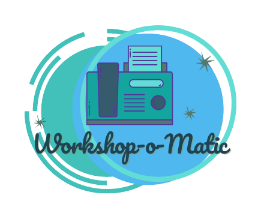

## Workshop Instructional Materials

Welcome to the [workshop-o-matic](presentation.pptx), built by Cloud Advocates in partnership with Microsoft Student Ambassadors. In this repo, you'll find grab-and-go resources to help you host your own workshop.

> Use the enclosed [Cheat Sheet](./cheat-sheet.md) to organize your workshop delivery

## Prepared workshops

Workshops that are ready to be used

| **Workshop Title**              | **Author(s)**  | **Duration** | **Link**                                  |
| ------------------------------- | ----------- | ------------ | -------------------------------------- |
Build a Machine Learning Model |Christopher Harrison | 1 hour | [Custom Vision Workshop](./custom-vision-workshop)
Explore COVID Scientific Papers | [Dmitry Soshnikov](http://soshnikov.com) | 1-1.5 hours | [COVID Paper Exploration Workshop](./covid-paper-exploration-workshop)

---

## Slides and courses on how to teach and mentor effectively

[Slides on how to mentor](https://github.com/FrontEndFoxes/art/blob/main/frontend-foxes-mentor-training.pdf) from Front-End Foxes School

[LinkedIn Learning Course](https://www.linkedin.com/learning/teaching-techniques-developing-curriculum/welcome?autoAdvance=true&autoSkip=false&autoplay=true&resume=true&u=3322) on how to develop curriculum

[LinkedIn Learning Course](https://www.linkedin.com/learning/presenting-technical-information-with-stories/storytelling-for-technical-presentations?autoAdvance=true&autoSkip=false&autoplay=true&resume=true&u=3322) on how to present technical topics with stories

