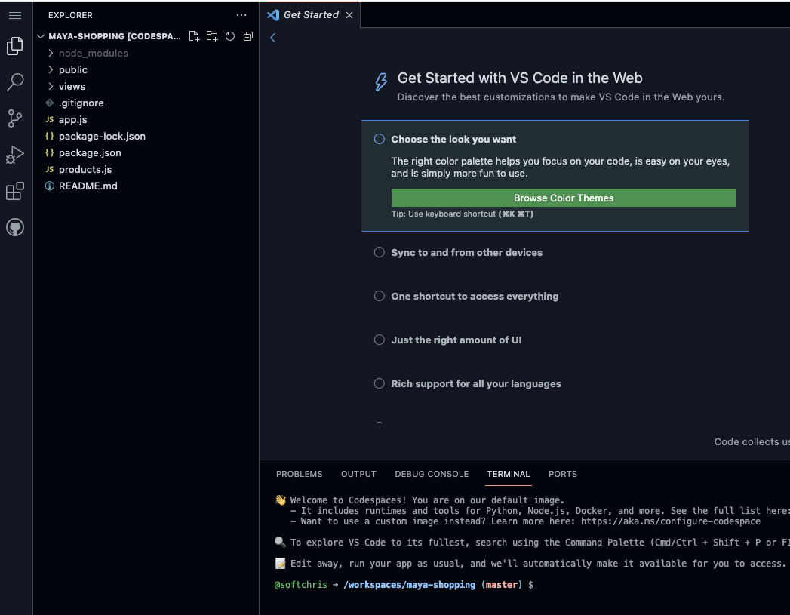
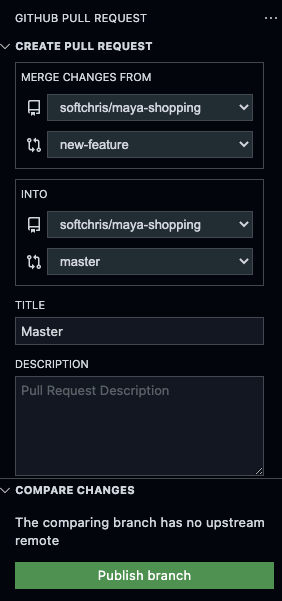
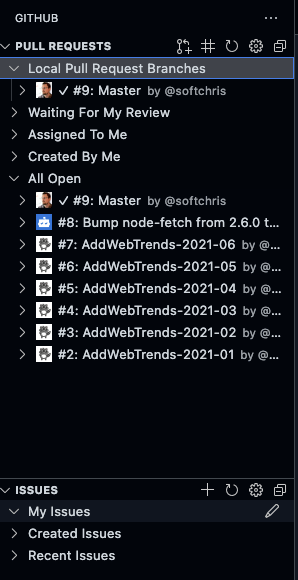

# Create a development environment in the cloud with Codespaces

## Introduction

## Scenario

## What will I learn?

## What is the main objective?


> Visual Studio Code backed by high performance VMs that start in seconds.

# What is Codespaces

Codespaces is a virtual machine running in the cloud that contains Visual Studio code. It allows you to create development environment you can run on any device.

## How it works

- **Full power of your IDE, in the Cloud**. Use the full power of Visual Studio Code, including the editor, terminal, debugger, version control, settings sync, and the entire ecosystem of extensions. Work in the browser or hand off to your desktop.
- **Virtual images that fits your need**. Spin up new dev environment for any sized project in seconds with prebuilt images. GitHub’s own 35GB dev image starts in under 10 seconds. Scale your cloud VMs up to 32 cores and 64GB of RAM. And with low-latency connections across four regions, you won’t even remember it’s not your local machine.
   - CPUs up to 32 cores
   - Memory up to 64 GB
   - Spin up <10 sec
- **Hot reload, instant previews** Preview your changes in the browser with instant reloads (websocket and HMR support)
- **Collaborate**. and share private and public ports with your teammates.

- **Cost**, cost is based on how much you need and how often you use it:

    *Isolated VMs billed per second*
    | Cores | RAM | Price |
    |--|--|--|
    |2 core| 4GB| $.18 per hour |
    |4 core 8GB| $.36 per hour |
    |8 core 16GB| $.72 per hour |
    |16 core 32GB| $1.44 |
    | 32 core 64GB | $2.88 per hour |
    
  Codespaces storage
  charged when inactive
  $0.07

## When do I use it

- **Onboarding of a new team member.** Join a new team and just start coding. Standardize environments, runtime requirements, hardware specs, extensions and editor settings in .devcontainer.json configuration files. Isolate dependencies between projects with containers and docker-compose.
- **Save money on a dev machine**. Gain a powerful dev machine, but it's in the Cloud
- **Casual usage from any device**. Edit your code from anywhere, your local machine, any browser, a table or your mobile phone - any device.

# Exercise - create my first codespaces environment

The easiest way to start a new codespace is to navigate to a repository on your GitHub

1. Select the **Code** button. 
1. Select **Codespaces** tab
1. Select **New codespace**

   > [!NOTE]
   > if there's no existing codespace machine for this repo it will provision one, if it exist, it will use that one.

   At this point, your virtual machine is being provisioned preloaded with the content of your Git repository. You should be faced with editor interface looking something like so:

   

   This is Visual Studio running in virtual image and it has all the things you can expect from it like the left navbar with file explorer, search, extensions, Run & Debug and so on.

## Verify creation of environment

To verify your development in the cloud is still there when you need it, you will close down your browser tab, but before that, let's do a change to your repo.

> [!NOTE]
> As Codespaces is operating on a repository in your GitHub account, Git is the way you would store changes and it's accessible from the terminal

### Create a change and persist it

1. Select **Explorer** in the left navbar.
1. Create a file *README.md*, and give it the following content:

   ```output
   Remember me
   ```

1. In the terminal run `git checkout` to create a new branch:

   ```bash
   git checkout -b new-feature
   ```

   > [!TIP]
   > A good practice when working others in a project is to create a branch to isolate your work. From that branch you can then create a pull request. By creating a pull request, your colleagues can now comment on it to ensure your code follows all the best practices and standards set out by the team.

1. In the terminal, in the bottom, run `git add`:

   ```bash
   git add README.md 
   ```

   Adding the file will make Git aware there's a change it should track.

1. Run `git commit`:

   ```bash
   git commit -m "changing readme"
   ```

   By committing, the change is persisted.

1. Via the Navbar on the left side, select the Git icon and at the top select **Create Pull Request** icon, this will bring up a user interface where your branch is compared to the primary branch and it also let you type a message. It should look something like so:

   

1. Enter a text message in the **DESCRIPTION** field and select **Publish branch**.

   > [!NOTE]
   > You only have to select **Publish branch** the first time to create an upstream connection

1. Select **Create** to create the pull request.

   Now you have a pull request, lets return to the GitHub extension main page by selecting the GitHub icon.

1. Select the GitHub icon, you should see your newly created pull request:

   

1. Expand the pull request item and select the **Description** item, this will present you with a dialog in the main area where you can merge or close the pull request to your liking.

1. Select **Merge the Pull request** in the main area and select **Create merge commit**, this will merge the code from the pull request into the primary branch.

This only scratched the surface of what this GitHub extension can do, you can view and comment on pull requests from collaborators and much more.

### Close Codespaces and reopen it

Now that you have performed a change, lets close down your development environment and reopen it via GitHub and ensure all changes are there.

1. Close the browser tab
1. Return to the browser tab containing your repo.
1. Select the **Code** button.
1. Select **Codespaces** tab
1. Select **New codespace**

   At this point, Codespaces will look for an existing development image and use that if it exist, or provision a new one

1. Locate the file *README.md*, your text additions should be in the text file as you've merged the pull request. Everything is as you left it.

Congrats! You now have your first development machine running in the cloud that you can access from anywhere as long as you are logged into your GitHub account.

# Configure your Codespaces environment

# Exercise - configure your Codespaces environment

# Knowledge Check 

# Summary
 fin 
