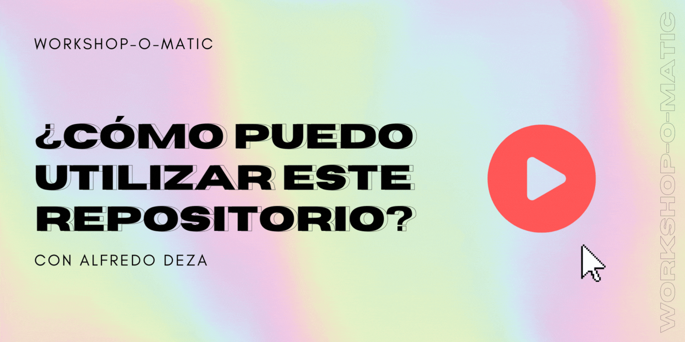

## Presentaciones listas para usar

¡Esta es una colección de presentaciones que puedes usar, adaptar, y modificar para *tu* propia presentación! Esta construida por Cloud Advocates de Microsoft en colaboración con los Microsoft Learn Student Ambassadors.

🚀 Presenta en 3 pasos sencillos:
1. Encuentra un tema que está listo para usar de [Inteligencia Artificial/Machine Learning](#-inteligencia-artificial-y-machine-learning), [Datos](#-Datos-y-Ciencia-de-Datos), [Desarrollo Web](#-Desarrollo-Web), o [Habilidades Blandas](#-habilidades-blandas). Por ejemplo: [Introducción a Aplicaciones Web Estáticas](./short/intro-static-web-apps/README.md)
1. Haz clic en el enlace para encontrar todos los recursos en una sola página incluyendo una presentación opcional de PowerPoint.
1. Selecciona y modifica el contenido acorde a tus necesidades y ¡preséntalo a tu audiencia!

## 🧐 Suena interesante, ¿qué necesito hacer?

Lo único que necesitas es: encontrar un título disponible de un tema que te guste y usar uno (o todos) los recursos disponibles para crear tu presentación. No es necesario conocer Git o GitHub, a menos que desees bifurcar (fork) este repositorio y realizar cambios (lo cual esta super bien ✅, si es lo que deseas)

## 🤔 Sigo sin comprender
Mira este video corto que explica como tú puedes utilizar estas presentaciones.

> 🎥 Haz clic en la imagen inferior para aprender como presentar un taller de esta librería

## 🧠 Inteligencia Artificial y Machine Learning

Desde construir modelos de Machine Learning utilizando Custom Vision hasta la creación de una aplicación web con Flask, esta categoría está llena de recursos útiles relacionados con Inteligencia Artificial y Machine Learning que puedes presentar. A continuación, haz clic en las presentaciones disponibles 👇:

  

    
Avanzado

  <ul>
      <li>
        <a href="../full/intro-nlp-tensorflow/translations/es/">Utiliza TensorFlow y Keras para el procesamiento del lenguaje natural</a>
      </li>
  </ul>

  

## 💿 Datos y Ciencia de Datos
Si te interesan los datos o ciencia de datos, ¡encontraras estas interesantes estas presentaciones! esta categoría cubre notebooks (cuadernos), manipulación de datos, exploración de datos y ¡mucho más! A continuación, haz clic en las presentaciones disponibles 👇:

<!-- -

    
Principiante

 - [Explore y analice datos con R](../full/explore-analyze-data-with-R/README.md)

-->

  
Intermedio

  <ul>
      <li>
        <a href="../full/intro-databricks/translations/es/">Lectura y escritura de datos con Azure DataBricks</a>
      </li>
  </ul>

## 🕸 Desarrollo Web
Si te gusta el desarrollo web, entonces ¡estas presentaciones listas para usar te ayudarán a presentar en poco tiempo! Incluso si tu audiencia recién está comenzando. Hay presentaciones sobre como configurar un entorno de desarrollo o crear proyectos simples como un sitio web para mostrar tu currículum. A continuación, haz clic en las presentaciones disponibles 👇:

  

    
Principiante

  <ul>
      <li>
        <a href="../short/intro-github-dev/translations/es/">Introducción a GitHub usando GitHub.dev</a>
      </li>
      <li>
        <a href="../short/intro-static-web-apps/translations/es/">Introducción a Azure Static Web Apps</a>
      </li>
      <li>
        <a href="../full/build-resume-website/translations/es/">Crea un sitio web para mostrar tu currículum</a>
      </li>
      <li>
        <a href="../full/power-platform-canvas-app/translations/es/">Construye una aplicación sin código con Microsoft Power Platform</a>
      </li>
          <li>
        <a href="../short/explore-art-rest-api/translations/es/">Explora el mundo del arte usando APIs RESTful</a>
      </li>
  </ul>
  ./

  

<!--
  

    
Intermedio

   - [Crea una API mínima con .NET 6](./full/intro-minapi/README.md)
   - [Introducción a React](./full/intro-react/README.md)
   - [Creación de lógica sin servidor con Azure Functions](./full/azure-functions/README.md)
   - [Introducción a Django](./full/django-get-started/README.md)
   - [Crea una aplicación web progresiva de Mood Journal](./full/mood-journal-progressive-web-app/README.md)
-->

## 🦉 Habilidades Blandas
A veces necesitas más que experiencia técnica para dar presentaciones útiles. En esta sección encontraras recursos para mejorar tus habilidades blandas como técnicas para hablar en público👇

  

    
Principiante

  <ul>
      <li>
        <a href="../short/public-speaking/translations/es/">Técnicas para hablar en público</a>
      </li>
  </ul>

  

## 🤩 Contribuciones y otros recursos

¿Estás buscando colaborar con una presentación o deseas obtener más información sobre la presentación y como presentarla a tu audiencia? ¡En esta sección encontraras más sobre ello!

- Utiliza el [Acordeon](./acordeon.md) para organizar la entrega/presentación de tu taller
- [Diapositivas sobre cómo ser mentor](https://github.com/FrontEndFoxes/art/blob/main/frontend-foxes-mentor-training.pdf) de la escuela Front-End Foxes
- [Curso de LinkedIn Learning](https://www.linkedin.com/learning/teaching-techniques-developing-curriculum/welcome?autoAdvance=true&autoSkip=false&autoplay=true&resume=true&u=3322) sobre cómo crear un curriculum
- [Curso de LinkedIn Learning](https://www.linkedin.com/learning/presenting-technical-information-with-stories/storytelling-for-technical-presentations?autoAdvance=true&autoSkip=false&autoplay=true&resume=true&u=3322) sobre como presentar temas técnicos como historias

Estas presentaciones listas-para-usar fueron creadas utilizando nuestra [plantilla](https://github.com/microsoft/workshop-template)
