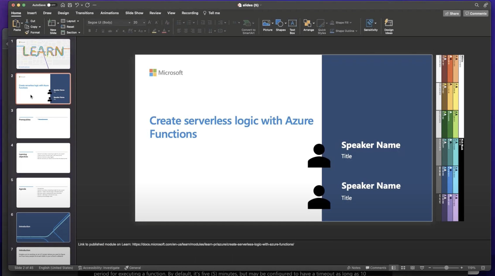

# Create Serverless Logic with Azure Functions

## Module Source

[Create serverless logic with Azure Functions](https://docs.microsoft.com/learn/modules/create-serverless-logic-with-azure-functions/?WT.mc_id=academic-56400-ornella)

## Goals

In this workshop, you will learn how to create, execute, monitor, and test Azure functions in the Azure portal.

| **Goal**              | Description                                    |
| ----------------------------- | --------------------------------------------------------------------- |
| **What will you learn**       | How to identify if an Azure function is right for your development needs, and how to create and use functions from the Azure portal.                                            |
| **What you'll need**          | A [Microsoft account](https://account.microsoft.com?WT.mc_id=academic-56400-ornella) |
| **Duration**                  | 45 min                                                                |
| **Slides** | [Powerpoint](slides.pptx) 
                         
## Video

> 🎥 Click this image to watch Ornella walk you through the workshop

## Pre-Learning

- [Create serverless applications](https://docs.microsoft.com/learn/paths/create-serverless-applications/?WT.mc_id=academic-56400-ornella)

## Prerequisites

This workshop will use the Azure sandbox environment within Microsoft Learn. In order to access the sandbox environment, you'll need to create a free [Microsoft account](https://account.microsoft.com?WT.mc_id=academic-56400-ornella) and sign in when prompted.

## What students will learn

Say you're working on an IoT project where you want to figure out how many people sit at each table in your school's cafeteria. You want to use infrared sensors at each table that provide you with data from all of the locations, and you want to develop a reusable service that can process the data from all of the different sources. With *serverless computing*, you can use a cloud provider, like Azure, to manage the infrastructure of your project. Azure Functions is a key component of the serverless computing offering from Azure that enables you to run pieces of code, or *functions*, written in the programming language of your choice, in the cloud.

## Decide if serverless computing is right for your project

In this section, you will learn all about serverless computing and Azure Functions, and understand the benefits and drawbacks of a serverless compute solution. With this knowledge, you can [decide if serverless computing is right for your project](https://docs.microsoft.com/learn/modules/create-serverless-logic-with-azure-functions/2-decide-if-serverless-computing-is-right-for-your-business-need?WT.mc_id=academic-56400-ornella).

## Create a function app in the Azure portal

Once you have decided that a serverless solution would best fit your needs, the workshop will walk you through how to [create a function app in the Azure portal](https://docs.microsoft.com/learn/modules/create-serverless-logic-with-azure-functions/3-create-an-azure-functions-app-in-the-azure-portal?WT.mc_id=academic-56400-ornella). You'll be able to choose if you want to code in JavaScript or PowerShell.

## Run your code on-demand with Azure Functions

Now that you have created a function app, you'll learn how to [build, configure, and execute a function](https://docs.microsoft.com/learn/modules/create-serverless-logic-with-azure-functions/4-creating-and-executing-an-azure-function?WT.mc_id=academic-56400-ornella). In this section, we also cover how to test your new Azure function.

## Add logic to the function app

Finally, we'll [add logic to the function app](https://docs.microsoft.com/learn/modules/create-serverless-logic-with-azure-functions/5-add-logic-to-the-function-app?WT.mc_id=academic-56400-ornella). For the purposes of this workshop, we will work with an example that checks for safe temperature levels.

## Quiz

[Summary and knowledge check](https://docs.microsoft.com/learn/modules/create-serverless-logic-with-azure-functions/6-summary?WT.mc_id=academic-56400-ornella)

## Next steps

- [Execute an Azure Function with triggers](https://docs.microsoft.com/learn/modules/execute-azure-function-with-triggers/?WT.mc_id=academic-56400-ornella)
- [Chain Azure Functions together using input and output bindings](https://docs.microsoft.com/learn/modules/chain-azure-functions-data-using-bindings/?WT.mc_id=academic-56400-ornella)
- [Develop, test, and publish Azure Functions by using Azure Functions Core Tools](https://docs.microsoft.com/learn/modules/develop-test-deploy-azure-functions-with-core-tools/?WT.mc_id=academic-56400-ornella)

## Practice

Now that you know how to create Azure functions from the Azure portal, try creating one using your [Azure for Students subscription](https://azure.microsoft.com/en-us/free/students/?WT.mc_id=academic-56400-ornella) and the [Azure Functions extension in Visual Studio Code](https://marketplace.visualstudio.com/items?itemName=ms-azuretools.vscode-azurefunctions)!

## Feedback

Be sure to give [feedback about this workshop](https://forms.office.com/r/MdhJWMZthR)!

[Code of Conduct](../../CODE_OF_CONDUCT.md)

