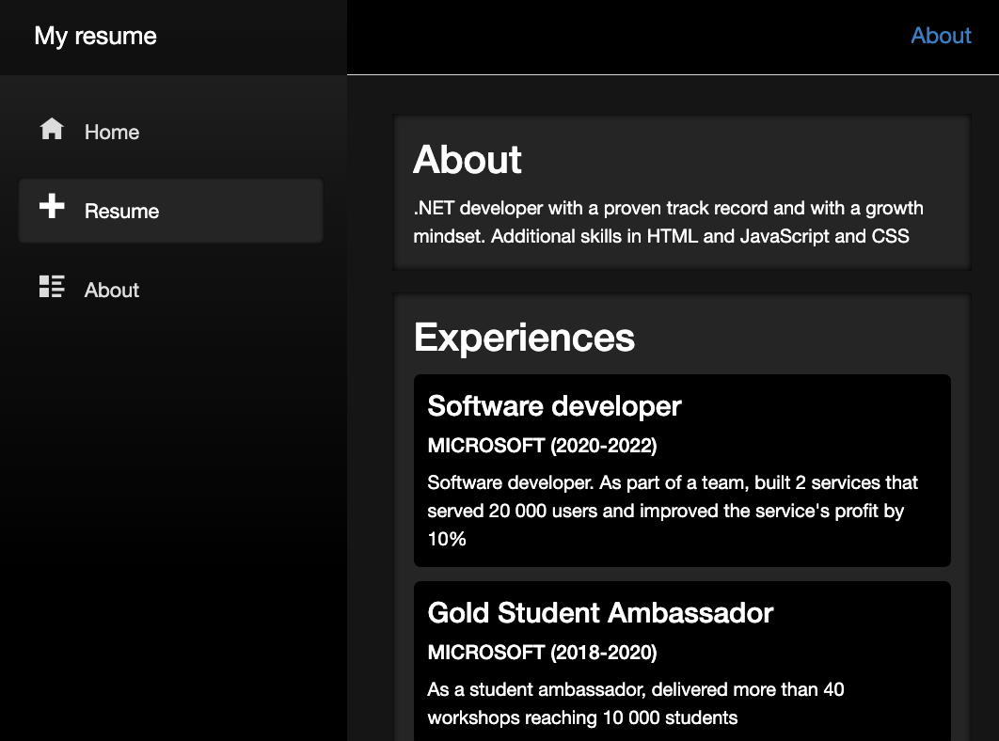

# Build your Resume with .NET Blazor

## Module Source Link

[Build your Resume with .NET Blazor](https://github.com/microsoft/dotnetconf-studentzone/tree/main/Build%20your%20Project%20Portfolio%20website%20with%20.NET)

## Goals

In this workshop, we will discuss how to create a resume website with .NET Blazor.

| **Goal**              | Create a resume website with .NET Blazor                                    |
| ----------------------------- | --------------------------------------------------------------------- |
| **What will you learn**       | .NET Blazor, building a web app with components, creating a navigation for your website, styling your resume website                                        |
| **What you'll need**          | [.NET SDK](https://dotnet.microsoft.com/download/dotnet/6.0?WT.mc_id=academic-78652-leestott), [Visual Studio](https://visualstudio.microsoft.com/?WT.mc_id=academic-78652-leestott) |
| **Duration**                  | 1 hour                                                                |
| **Microsoft Cloud Topics taught**                  | Azure                                                                |
| **Just want to try the app or see the solution?** | [Solution](solution)                          |
| **Slides** | [Powerpoint](slides.pdf) 
                         
## Video

[Train the Trainer Video](https://youtu.be/SCJu7YPNtdQ?t=2596).

## Pre-Learning

# Some Additional Resources for Blazor :fire:
- [Blazor Tutorial Build your first Blazor app](https://dotnet.microsoft.com/en-us/learn/aspnet/blazor-tutorial/intro?WT.mc_id=academic-78652-leestott)
- [What is Blazor WASM](https://preview.blazorise.com/blog/what-is-blazor-wasm)

## Prerequisites

* [Visual Studio](https://visualstudio.microsoft.com/?WT.mc_id=academic-78652-leestott)
* [.NET SDK 6](https://dotnet.microsoft.com/download/dotnet/6.0?WT.mc_id=academic-78652-leestott)
  
## What students will learn

Do you want to upgrade your resume and showcase your web skills at the same time? In this workshop, we will teach you how to create your very own resume website using .NET Blazor. You will walk away with a powerful resume website that you can customize and change!

## Workshop Milestones
- Milestone 1: Setup the page navigation
- Milestone 2: Modelling the resume data with JSON
- Milestone 3: Fetch the data from our JSON
- Milestone 4: Render the fetched data
- Milestone 5: Styling the resume site

## Next steps

[Build web applications with Blazor](https://aka.ms/BlazorWebApp)

## Practice

Practice the skills you learn in this workshop by making more web apps! Extend what you learn through different website customizations and really make each one your own.

## Feedback

Be sure to give [feedback about this workshop](https://forms.office.com/r/MdhJWMZthR)!

[Code of Conduct](../CODE_OF_CONDUCT.md)

