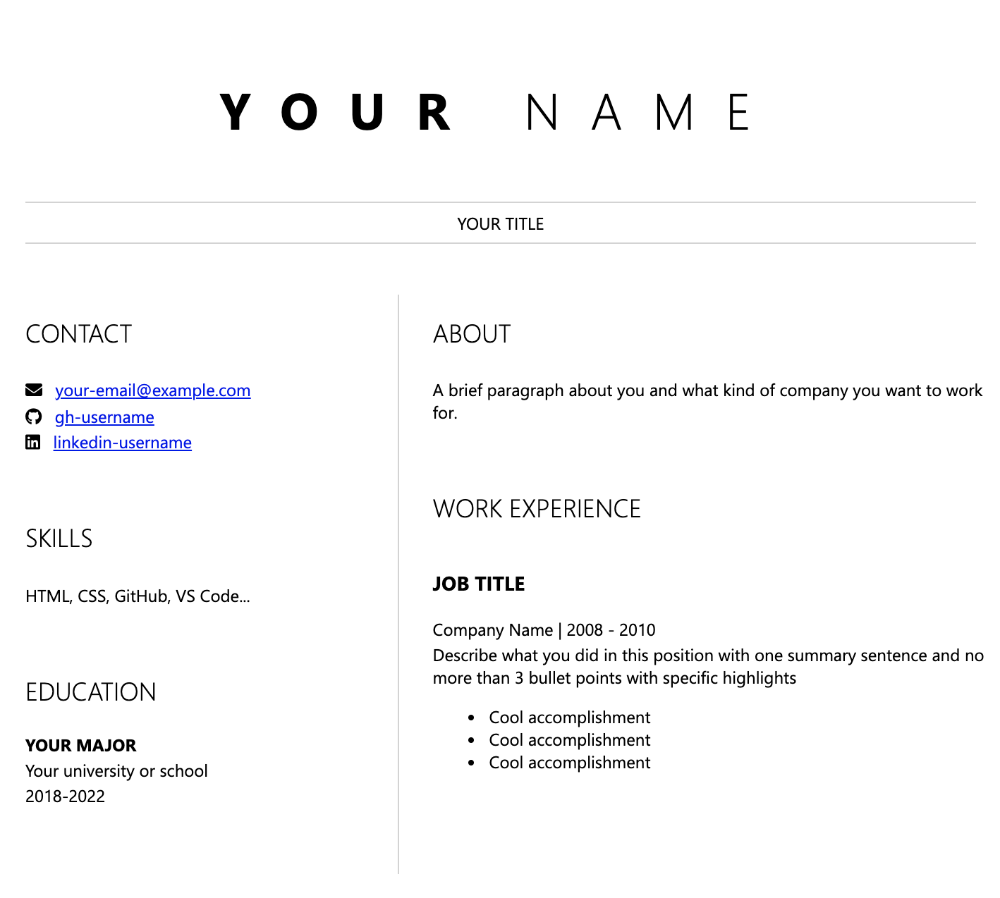

# Build a Website to Showcase your Resume

## Overview

Want to make your application stand out to recruiters and learn a few new skills in the process? This workshop will walk you through how to code a resume website. The best part is that you don't have to download any coding tools or know any programming languages to get started. 

Using the power of github.dev, a service that allows you to work with files in GitHub, and GitHub Pages, you'll code a resume website using only your browser window. By the end of the workshop, you'll be able to send anyone a link where they can view your resume online. 

| **Project Goal**              | Build a resume web site using HTML, CSS, and host it on GitHub pages                                    |
| ----------------------------- | --------------------------------------------------------------------- |
| **What will you learn**       | Basics of HTML and CSS to showcase your skills in an online resume                                        |
| **What you'll need**          | A modern web browser like [Microsoft Edge](https://www.microsoft.com/edge?WT.mc_id=academic-51109-ornella) or [Google Chrome](https://www.google.com/chrome/) and a [GitHub account](https://github.com) |
| **Duration**                  | 1 - 1.5 hour(s)                                                                |
| **Just want to try the app or see the solution?** | [Solution](./solution)                         |
| **Slides** | [Powerpoint](slides.pptx)
| **Author** | [Ornella Altunyan](https://aka.ms/ornelladotcom)

## Video walk-through

> 🎥 Click this image to watch Ornella and Burke as they walk you through the workshop

## Prerequisites
To create your resume website, you'll need to download a modern web browser like [Microsoft Edge](https://www.microsoft.com/edge?WT.mc_id=academic-51109-ornella) or [Google Chrome](https://www.google.com/chrome/). You'll also need a [GitHub account](https://github.com/join).

## Final Project
By the end of this workshop, you'll have created a resume web site that will look like this:

## Outline
In this workshop, you will: 
* [Set up your coding environment](0-setup.md)
* [Learn basic HTML to outline your resume](1-create-html.md)
* [Fill in your resume content](2-add-content.md)
* [Style your resume with CSS](3-add-style.md)
* [Create your resume website with GitHub Pages](4-creating-website.md)

Let's get started!

## Feedback

Be sure to give [feedback about this workshop](https://forms.office.com/r/MdhJWMZthR)!

[Code of Conduct](../../CODE_OF_CONDUCT.md)

