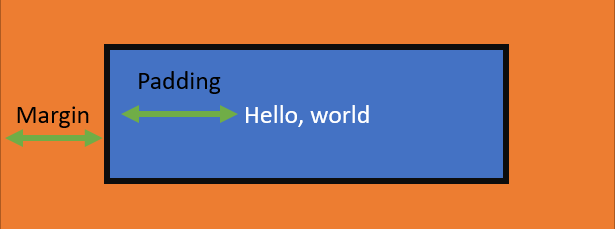

# Añadiendo estilos con CSS

Como ya vimos al principio del taller, [HTML es usado para estructurar el contenido](./2-anadir-contenido.md) de una página. CSS o Cascading Stylesheets (hojas de estilos en cascada), es usado para estilizar. CSS es usado para poner colores y fuentes, donde la información de la página será desplegada, y otros elementos decorativos. Para mantener HTML y CSS centrados en sus propósitos (a veces llamado separación de problemas), creas páginas que serán mucho más fáciles de modificar y mantener, y serán más accesibles para los usuarios.

## Introducción a los selectores

CSS usa **selectores** para indicar que modificar. Estos selectores pueden ser los nombres de los tags como `h1`, atributos como `class` o `id` - útil para modificar un grupo de elemntos o uno en específico, respectivamente- o ser elegante y mirar toda la estructura de la páhina para determinar qué modificar. Nos enfocaremos primero en usar los nombres de los tags como selectores.

Al usar el nombre de tags como selector, unicamente usarás ese nombre. Ten en cuenta que cuando usas el nombre d e un tag, este aplicará estilo a **todos** los elementos que tengan este tag.

> **Nota:** La palabra "cascading" (cascada) de Cascading Stylesheets (hojas de estilos en cascada) aplica cuando multiples estilos son usados para el mismo elemento.

## Añadiendo estilo a una página

Comencemos creando un archivo CSS para poner nuestro código, así podrás añadir estilos a tu páginas. Luego podrás añadir algunas propiedades al tag `body` para cambiar la fuente y el tamaño.

1. Ve hacia el nombre de tu repositorio, **currículum**, en el panel de exploración del lado izquierdo de tu pantalla, luego selecciona **Archivo con el ícono +**. Nómbralo **style.css**.
1. Dentro de **style.css**, añade el siguiente CSS para escoger la fuente y el tamaño

    ```css
    body {
        font-family: 'Segoe UI', Tahoma, Geneva, Verdana, sans-serif;
        font-size: 12px;
        max-width: 960px;
        margin: auto;
    }
    ```

Nota que `font-family`, es usado para seleccionar la fuente. Hay 5 fuentes listadas. En caso de que algunos usuarios no tengan una fuente en específico instalada, CSS ofrece la posibilidad de cambiar a la aisguiente fuente de la lista. En este caso le estás diciendo al navegador que pruebe con Segoe UI primero, luego Tahoma si es que el primero no está instalado, y así sucesivamente. 

Hay algunas otras reglas que aplican a todo lo que está dentro del tag `body`, que es toda la página:

* `font-size` - define el tamaño de la fuente a 12 pixeles
* `max-width` - define el ancho máximo de la página, así no se ve raro en pantallas grandes. 960 pixels es el ancho común para muchas páginas.
* `margin` - define el margen como auto. Cuando está combinado con la propiedad `max-width`, este centra el contenido de la pantalla horizontalmente.

## Dimensionamiento

CSS ofrece diferentes maneras de indicar tamaños. En el ejemplos anterior, usaste `12px`. `px` hace referencia a pixeles, y es una medida absoluta - siempre será 12 pixeles sin importar la pantalla que uses. El problema de usar medidas absolutas es que las modificaciones de tamaño requieren actualizaciones a varios estilos. Para usar tamaños relativos, se usa una sola base; las actualizaciones a la base y luego al resto de la página.

Para nuestro ejemplo usaremos `em`. `em` indica el tamaño de fuente en el elemento raíz - `body` en nuestro ejemplo. `em` es un valor en base 1, donde `1em` ies el tamaño del elemento raíz, `1.5em` es uno y medio del tamaño , and `.25em` es un cuarto del tamaño. 

Definamos el tamaño de nuestros tres elementos diferentes en header. 

1. Al final de **style.css**, añade lo siguiente...

    ```css
    h1 {
        font-size: 3em;
        letter-spacing: .6em;
        padding-top: 1em;
        padding-bottom: 1em;
    }

    h2 {
        font-size: 1.5em;
        padding-bottom: 1em;
    }

    h3 {
        font-size: 1em;
        padding-bottom: 1em;
    }

    
    ```

1. La página se actualiza con las nuevas medidas.

Puedes notar de que no solo podemos definir el tamaño del texto, sino también podemos cambiar el espaciado entre letras con la propiedad `letter-spacing`. Podemos añadir un margen a un elemento con la propiedad `padding`. Todas estas propiedades soportan el tamaño relativo `em`.

## Creado una grilla

CSS grids son una característica relativamente nueva. Como el nombre lo dice, una grilla te permite situar elementos en una página casi como si pusieras cosas en una mesa. Puedes usar las grillas para crear columnas y filas para tus elementos.

> **Nota:** Por fines de accesibilidad, deberías evitar usar una tabla para estructurar una página a menos que vayas a desplegar datos tabulares.

Revisemos la estructura de nuestra página:

    ```html
    <main>
        <article>
            Información de contacto
        </article>
        <article>
            Sobre tí y experiencia
        </article>
    </main>
    ```

Queremos crear dos columnas, una para el primer `article` con tu información de contacto, habilidades y educación, y el segundo `article` con tu experiencia laboral. Fíjate que ambos elementos `article` están dentro de un solo elemento `main`. Usaremos el elemento `main` como un contenedor para nuestra grilla. Configuraremos `main` para alojar la grilla, y configuraremos dos plantillas para columnas - una para cada article.

    ```css
        main { 
            display: grid;
            grid-template-columns: 40% 60%;
            margin-top: 3em;
        }
    ```

Esto separará el elemento `main` en dos columnas. El primer elemento debajo de `main` que es un `article` será la primera clumna y tomará un 40% del espacio disponible. El segundo elemento debajo de `main` (también un `article`) tomará el 60% restante de espacio.

## Controlando el espaciado con el modelo de caja

CSS usa lo que es conocido como el modelo de caja. El modelo de caja controla cómo la información puede ser desplegada en un elemento, y que tan cerca unos de otros pueden estar situados. Existen tres propiedades claves - `margin`, `border`, y `padding`. El siguiente diagrama explica como controlan el situado de contenido.



En este diagrama, el contenido es **Hello, world**. `padding` es el espacio entre el texto y el borde negro `border`. Y `margin` es el espacio entre `border` y el elemento siguiente.

Añade el resto de reglas de estilo para añadir algo de padding alrededor de los elementos en tu página:

    ```css
    header {
        text-align: center;
        margin: auto 2em;
    }

    section {
        margin: auto 1em 4em 2em;
    }

    i {
        margin-right: .5em;
    }

    p {
        margin: .2em auto
    }

    hr {
        border: none;
        background-color: lightgray;
        height: 1px;
    }

    h1, h2, h3 {
        font-weight: 100;
        margin-bottom: 0;
    }
    ```
    
* Estamos centrando el texto en el elemento `header` element y añadiendo un margen de 2em a la izquierda y a la derecha, así las líneas de `hr` no se van del todo al borsw, pero tienen un poco de relleno o padding.
* El elemento `section` da algo de margen, es por eso que cada sección (SOBRE TÍ, CONTACTO, HABILIDADES) tienen espacio alrededor. El elemento `p` también da algo de margen. 
* El elemento `i` da algo de espacio a la derecha. Estos son íconos que serán añadidos después. 
* El elemento `hr` se volvió una línea gris delgada quitando su borde dándole un color de fondo y una altura.
* Reducimos el `font-weight` o "espesor" de la fuente de los tags de nuestro header para que no sean tan bloqueadas. 

> **Nota:** Fíjate que somos capaces de modiciar múltiples elementos enlistándolos con comas: `h1, h2, h3`. También, `margin-top` y `margin-bottom` definen el margen de la parte superior y la parte inferior respectivamente. Puedes usar `margin-left` y `margin-right` para definir estos valores, o hacer lo mismo usando `margin`.

## Seleccionando un elemento por su ID

A veces quieres añadir estilo a un elemento en específico en la página. Por ejemplo, queremos aladir una línea delgada gris entre dos columnas. Podemos hacer eso añadiendo un borde a la derecha a la columna de la izquiera, pero ambas columnas son elementos `article`. Cómo podríamos seleccionar correctamente el de la izquierda

Fíjate que cada uno de los elementos `article` tiene un ID - "mainLeft" y "mainRight". Podemos seleccionar estos elementos por su ID en el CSS y estilizarlos. Así que, para añadir un borde solo a la columna izquierda, añade esta regla final a tu hoja de estilos:

    ```css
    #mainLeft {
        border-right: 1px solid lightgray;
    }
    ```

Tu currículum se vera mucho mejor ahora. Sin embargo, siguen faltando algunos íconos en la sección de CONTACTO. Para ello, necesitaremos añadir una fuente de íconos.

## Añadiendo una fuente de íconos

Una fuente de íconos es aquella que contiene símbolos y glifos. En otras palabras, ¡es una fuente que contiene íconos! Existen muchas fuentes gratuitas que puedes usar, una de las más populares se llama "Font Awesome". Esa es la que añadiermos a nuestra página.

1. En el archivo **index.html**, añade la siguiente líena al elemento `head`...

    ```html
        <link rel="stylesheet" href="https://cdnjs.cloudflare.com/ajax/libs/font-awesome/5.15.4/css/all.min.css">
    ```

1. Esto cargará la fuente de íconos Font Awesome. Ahora podrás visualizar algunos íconos ingeniosos para tu información de CONTACTO.

## Resumen y siguientes pasos

Has añadido de forma exitosa estilos a tu currículum. ¡Aprendiste a usar selectores, tamaños, grillas, espaciados y fuentes de íconos para que tu currículum resalte!


Para completar tu currículum, [aprenderás como hostear o alojarlo en una página web](./4-creando-una-pagina-web.md).