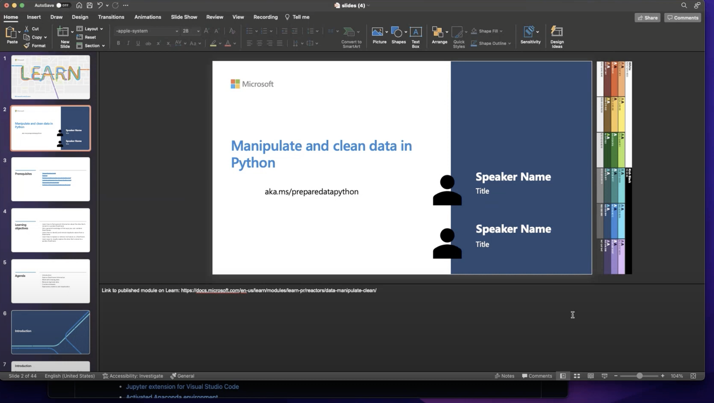

# Prepare your data using Python and VS Code

## Module Source

[Manipulate and clean data in Python](https://docs.microsoft.com/learn/modules/data-manipulate-clean/?WT.mc_id=academic-56265-ornella)

## Goals

In this workshop, you will learn how to use Python, and popular libraries like NumPy and pandas, to manipulate and clean data to prepare it for analysis.

| **Goal**              | Description                                    |
| ----------------------------- | --------------------------------------------------------------------- |
| **What will you learn**       | How to find information about, clean, and prepare data that's stored in a pandas DataFrame.                                       |
| **What you'll need**          | [Visual Studio Code environment set up to run Python and Jupyter notebooks](https://docs.microsoft.com/learn/modules/python-data-science/1-introduction?WT.mc_id=academic-55190-ornella) |
| **Duration**                  | 1 hr 20 min                   |                     
| **Just want to try the app or see the solution?** | [Solution](solution/)                          |
| **Slides** | [Powerpoint](slides.pptx) 
             
            
## Video

> 🎥 Click this image to watch Ornella walk you through the workshop

## Pre-Learning

- [Introduction to Python](https://docs.microsoft.com/learn/modules/python-data-science/?WT.mc_id=academic-55190-ornella)
- [Introduction to the NumPy and pandas libraries for data science](https://docs.microsoft.com/learn/modules/pandas-data-science/?WT.mc_id=academic-55190-ornella)

## Prerequisites

- [Visual Studio Code](https://code.visualstudio.com?WT.mc_id=academic-55190-ornella)
- [Python](https://www.python.org/downloads/)
- [Python extension for Visual Studio Code](https://marketplace.visualstudio.com/items?itemName=ms-python.python)
- [Jupyter extension for Visual Studio Code](https://marketplace.visualstudio.com/items?itemName=ms-toolsai.jupyter)
- [Activated Anaconda environment](https://code.visualstudio.com/docs/datascience/jupyter-notebooks?WT.mc_id=academic-55190-ornella)
- [A data science environment in VS Code](https://code.visualstudio.com/docs/datascience/data-science-tutorial?WT.mc_id=academic-55190-ornella)

## What students will learn

Say you want to perform some analysis on a dataset that you find interesting -- like the [squirrel population of Central Park](https://www.thesquirrelcensus.com/), or [various types of French cheese](https://www.kaggle.com/mathurinache/french-cheese-detection). The first thing you'll need to do with any dataset is to clean it up. Many datasets have missing information, or won't be formatted in the exact way you'd like. In this workshop, you will learn how to use data science libraries to prepare your data for analysis and visualization.

## Introduction

In this section, you'll review an [introduction](https://docs.microsoft.com/learn/modules/data-manipulate-clean/1-introduction?WT.mc_id=academic-55190-ornella) and make sure that your data science environment is set up correctly before continuing on to the next part of the workshop.

## Explore DataFrame information

Next, you will learn how to use Python libraries to [explore an iconic dataset](https://docs.microsoft.com/learn/modules/data-manipulate-clean/2-explore-dataframes?WT.mc_id=academic-55190-ornella). You will be able to understand how to use pandas DataFrames to get an immediate idea about the size, shape, and content of a particular dataset. 

## Work with missing data

Now that you know how to get an overall sense of the dataset you are working with, you will learn [how to identify and  deal with missing values](https://docs.microsoft.com/learn/modules/data-manipulate-clean/3-missing-data?WT.mc_id=academic-55190-ornella).

## Remove duplicate data

Another common thing you'll have to do with most datasets you encounter is [remove duplicate data](https://docs.microsoft.com/learn/modules/data-manipulate-clean/4-duplicate-data?WT.mc_id=academic-55190-ornella). In this section of the workshop, you will learn how to use pandas to detect and remove duplicate entries.

## Combine datasets

Sometimes, you will need to combine datasets together. Luckily, there are several methods available in pandas to [merge and join datasets](https://docs.microsoft.com/learn/modules/data-manipulate-clean/5-combine-datasets?WT.mc_id=academic-55190-ornella).

## Exploratory statistics and visualization

So far, you've learned how to use pandas methods to examine some aspects of a DataFrame, and fill in, remove, and combine data. The final way we will seek to understand our data is by [creating visualizations](https://docs.microsoft.com/learn/modules/data-manipulate-clean/6-exploratory-statistics-visualization?WT.mc_id=academic-55190-ornella).

## Next steps

- [Explore and analyze data with Python](https://docs.microsoft.com/learn/modules/explore-analyze-data-with-python/?WT.mc_id=academic-55190-ornella)
- [Introduction to machine learning
](https://docs.microsoft.com/learn/modules/introduction-to-machine-learning/?WT.mc_id=academic-55190-ornella)
- [Discover the role of Python in space exploration](https://docs.microsoft.com/learn/paths/introduction-python-space-exploration-nasa/?WT.mc_id=academic-55190-ornella)

## Practice

To test your knowledge, try downloading a free dataset from [Kaggle](https://www.kaggle.com/datasets) that you find interesting. Use the techniques that you learned in this workshop to manipulate and clean your data!

## Feedback

Be sure to give [feedback about this workshop](https://forms.office.com/r/MdhJWMZthR)!

[Code of Conduct](../../CODE_OF_CONDUCT.md)

