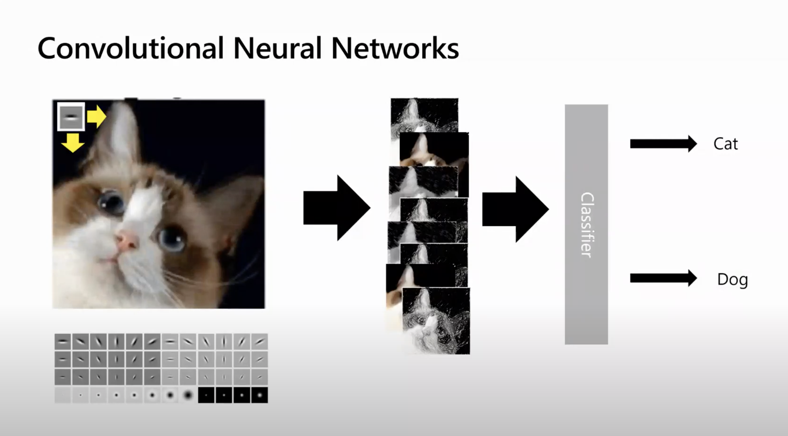
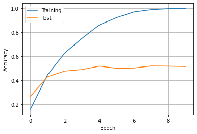

# Introduction to Deep Learning for Computer Vision

In this workshop, you will learn the basics of Deep Learning for Computer Vision using one of the popular frameworks: [PyTorch](http://pytorch.org) or [Tensorflow](http://tensorflow.org). You can chose one of the frameworks that you will use.

<table border="0"><tr><td></td><td></td></tr>
<tr><td>
One of the first deep learning frameworks, and thus it is currently widely used in the industry. It also includes simplified Keras framework, which makes training neural networks much easier.
</td><td>Great deep learning framework that is quickly gaining popularity. It first introduced the notion of *dynamic computational graph*, and gained huge momentum since then.</td></tr></table>

## Module Source Link

The workshop is based on the following Learn Modules (you will be using one of them according to the framework of your choice):

* [Introduction to Computer Vision with PyTorch](https://docs.microsoft.com/learn/modules/intro-computer-vision-pytorch/?WT.mc_id=academic-56313-dmitryso)
* [Introduction to Computer Vision with Tensorflow](https://docs.microsoft.com/learn/modules/intro-computer-vision-tensorflow/?WT.mc_id=academic-56313-dmitryso)

## Goals

In this workshop, we will learn how to determine the breed of a dog or a cat from a photograph using neural networks. It is an example of more general task called **image classification**.

| **Goal**              | *Learn how to train neural network to classify cat/dog breeds* |
| ----------------------------- | --------------------------------------------------------------------- |
| **What will you learn**       | *You will learn about Deep Learning using one of the most popular frameworks, and about Computer Vision*                                        |
| **What you'll need**          | *No tooling necessary, you will write your solution directly on Microsoft Learn* |
| **Duration**                  | *1 hr*                                                                |
| **Just want to try the app or see the solution?** | *Face Classification [in PyTorch](solution/Faces-PyTorch.ipynb)/[in Tensorflow](solution/Faces-TensorFlow.ipynb), optional Transfer learning [in PyTorch](solution/Pets-PyTorch.ipynb)/[in Tensorflow](solution/Pets-TensorFlow.ipynb)* |
| **Slides** | [Powerpoint](DeepLearningCV.pptx), [PDF](DeepLearningCV.pdf), [Online](https://speakerdeck.com/shwars/deep-learning-for-computer-vision-workshop) 

## Video

[](https://youtu.be/9tW-KuQ6sEA "workshop walk-through")
> 🎥 Click this image to watch Dmitry walk you through the workshop

## Pre-Learning

If it is the first time you hear about **neural networks** and frameworks such as PyTorch or Tensorflow - we recommend taking one of the introductory modules on Microsoft Learn:
* [Introduction to PyTorch](https://docs.microsoft.com/learn/modules/intro-machine-learning-pytorch/?WT.mc_id=academic-56313-dmitryso)
* [Introduction to TensorFlow using Keras](https://docs.microsoft.com/learn/modules/intro-machine-learning-keras/?WT.mc_id=academic-56313-dmitryso)

You can also read this [short introduction to Neural Networks](https://soshnikov.com/education/very-quick-intro-to-neural-networks/) instead.

## Prerequisites

You do not need anything installed on your machine, as you will be using Microsoft Learn Sandbox to carry out the exercise. 

## What students will learn

Imagine you need to develop and application for pet nursery to catalog all pets. One of the great features of such an application would be automatically discovering the breed from a photograph. This can be successfully done using neural networks.

We will use the [Oxford-IIIT](https://www.robots.ox.ac.uk/~vgg/data/pets/) pets dataset that contains 35 different breeds of dogs and cats, and build a model that can recognize breed from the picture.


## Milestone 0 (optional): Get Introduced to Deep Learning

If you are completely new to Deep Learning, you may want to go over [short introduction to Neural Networks](https://soshnikov.com/education/very-quick-intro-to-neural-networks/). To gain even deeper understanding of what does on, you may take one of the courses depending on the framework that you chose to use:

* [Introduction to PyTorch](https://docs.microsoft.com/learn/modules/intro-machine-learning-pytorch/?WT.mc_id=academic-56313-dmitryso)
* [Introduction to TensorFlow using Keras](https://docs.microsoft.com/learn/modules/intro-machine-learning-keras/?WT.mc_id=academic-56313-dmitryso)

It is not strictly necessary to follow the workshop, but you will feel much more confident. It is better that you do it before the workshop as pre-reading, since that takes around 1 hour.

## Milestone 1: Start the Sandbox

Depending on the framework of your choice, start one of the Learn Modules:

* [Introduction to Computer Vision with PyTorch](https://docs.microsoft.com/learn/modules/intro-computer-vision-pytorch/?WT.mc_id=academic-56313-dmitryso)
* [Introduction to Computer Vision with TensorFlow](https://docs.microsoft.com/learn/modules/intro-computer-vision-tensorflow/?WT.mc_id=academic-56313-dmitryso)

You may read through the first few units, up to and including the unit **Use convolutional neural network**.

> Going through the module includes starting the **Jupyter Notebook sandbox**. Feel free to start the sandbox, but be aware that the virtual machine is allocated for a limited amount of time (around 2 hours). After this time, or in case of long inactivity time, your changes will be lost, and you would have to start from scratch, including downloading the dataset.

Stop at the unit **Use Convolutional Neural Network**, go to the end of the notebook sandbox, and make sure that you can create new cells and execute code.

**We suggest you write your solution inside the sandbox**, using the cells at the end of the notebook. Learn Jupyter Sandbox supports GPU, which makes training your model faster. Also, you can always refer to the code in the cells above, in case you need to copy-paste parts of the code. 

> If you want to work on the solution on your own machine, you can use [Faces.ipynb Notebook](Faces.ipynb) as a starting point, and [Pets.ipynb] for final optional milestone. However, having a GPU is heavily recommended.

## Milestone 2: Getting the Data

For our first task, we will use simplified **PetFaces** dataset, which was derived from original [Oxford-IIIT Pets Dataset](https://www.robots.ox.ac.uk/~vgg/data/pets/) by cutting out the pet's face, and arranging all files for each breed to be in a separate directory.

To download the dataset onto the sandbox, use the following code (copy-paste it into Jupyter cell and run it):

```python
!wget https://mslearntensorflowlp.blob.core.windows.net/data/petfaces.tar.gz
!tar xfz petfaces.tar.gz
!rm petfaces.tar.gz
```

This will create a directory called `petfaces` on your sandbox virtual machine.

You can try to plot the dataset at this point. Feel free to use the following code to display the list of images:

```python
import matplotlib.pyplot as plt

def display_images(l,titles=None,fontsize=12):
    n=len(l)
    fig,ax = plt.subplots(1,n)
    for i,im in enumerate(l):
        ax[i].imshow(im)
        ax[i].axis('off')
        if titles is not None:
            ax[i].set_title(titles[i],fontsize=fontsize)
    fig.set_size_inches(fig.get_size_inches()*n)
    plt.tight_layout()
    plt.show()
```

Next, try to use functions from PyTorch/Tensorflow frameworks to load images from disk and prepare them for classification. There are functions that can take a directory with image files (where each class of images is in its own subdirectory) and return the dataset together with classes:
* `torchvision.datasets.ImageFolder` for PyTorch
* `tf.keras.preprocessing.image_dataset_from_directory` for Tensorflow/Keras

You also need to split the original dataset into two datesets: `train` (that contains 80% of data) and `test` (that contains 20%). Functions above handle dataset splitting automatically. When creating datasets, you can also divide images into minibatches, of 16-64 images.

While loading images, you also need to take a few additional steps:

* Resize all images to the same size. Since most of the images are close to square aspect ratio, select square image size, eg. 128x128 or 224x224.
* Convert all images to tensors
* Normalize all images, so that input data is in the range [0..1]. This is a standard step in preparing data for neural network training. In the simplest case, we can assume that all pixel intensities are within 0..255 range, so we just need to divide by 255 (converting to float datatype before that). In PyTorch, normalization is automatically handled by `ToTensor` transform.

> Most of those steps in PyTorch can be implemented using **transformations** ([learn more](https://docs.microsoft.com/learn/modules/intro-machine-learning-pytorch/3-data?WT.mc_id=academic-56313-dmitryso)), while in Tensorflow you can just specify different parameters for `image_dataset_from_directory` function.

At the end, you might want to plot the first few images of the minibatch to make sure that everything is loaded correctly. You can use the same `display_images` function, which accepts tensors as input.

## Milestone 3: Define and Train Neural Network

Now that we have the data, it's time to define neural network architecture and train it. You can take the inspiration from the code you have in Microsoft Learn module, keeping in mind the following things:

* Since the initial image size is rather big (suggested size 128x128), you need a few convolutional layers (at least 3).
* Use combination of convolution - max pooling
* You can have 1 or 2 final Dense layers

In order for the training to work correctly, we need to be especially careful about using the right combination of final activation function and loss function. While on the diagram above we indicate that **softmax** is used to normalize network outputs to produce probabilities before feeding them into loss function, some frameworks (eg. PyTorch) include softmax normalization into the loss function itself. In particular:

* In PyTorch, final layer does not need an activation function, and you can use `CrossEntropyLoss` as a loss function. It also expects **class number**, and not one-hot encoded vector as target label.
* In TensorFlow, use `softmax` as activation function, and `sparse_categorical_crossentropy` as a loss function. The term **sparse** means that it expects a class number as a target, while `categorical_crossentropy` expects one-hot encoded vectors.

Next, train the neural network for a few epochs (~10), observing both training and validation accuracy during training. 

> For PyTorch, feel free to use the `train` function defined in the learn module to train your network. If you want deeper understanding of how PyTorch training works, you can define your own `train` function from scratch using [the one from Learn Module](https://github.com/MicrosoftDocs/pytorchfundamentals/blob/main/computer-vision-pytorch/pytorchcv.py) as an inspiration. Also, keep in mind that you need to move both the model and data to GPU during training using `.to()`, in order to take advantage of GPU acceleration. 

You can them plot the graph of training and validation accuracy, which should look something like this:



> What can you say from this graph about overfitting? What is the accuracy of your model according to the graph?

We have done the main part of our tutorial - we now have the model that can classify a pet into 35 different categories with relatively high accuracy! Note that even the accuracy around 50% is not too bad - blind guessing would give us less than 3% accuracy.

> You can save the model in order to use it later without re-training.

## [Optional] Milestone 4: Compute Top-K Accuracy

When classifying for large number of classes, it often happens that some classes are quite similar to each other. For example, if a model makes a mistake classifying British cat for a Russian Blue, it is not a very big deal, because even human beings often make this mistake. However, confusing a Siamese and Persian cat is not such a light error.   

Thus, plain accuracy might not be the best indicator of model's performance. We can also calculate **top-k accuracy**, i.e. percentage of cases where correct label is within top k predictions. For example, if for a British cat the model predicted Russian Blue as the top result, and British as a second one - it would be considered a correct case.

Try to calculate top 3 accuracy of the model and see how good it is. Some hints:

* In Tensorflow, use `tf.nn.in_top_k` function to see if the `predictions` (output of the model) are in top-k (pass `k=3` as parameter), with respect to `targets`. This function returns a tensor of boolean values, which can be converted to `int` using `tf.cast`, and then accumulated using `tf.reduce_sum`.
* In PyTorch, you can use `torch.topk` function to get indices of classes with highers probabilities, and then see if the correct class belongs to them. See [this](https://gist.github.com/weiaicunzai/2a5ae6eac6712c70bde0630f3e76b77b) for more hints.

> This exercise requires better understanding of tensor operations, so do not worry if you cannot figure it out. Searching on the internet for the solution might help.

## [Optional] Milestone 5: Classifying original images using Transfer Learning

The images that we were classifying were nicely framed to include just the face of a pet. In real life, we want to create an application that will take a normal photo of a pet and be able to classify it as well. Let's take the original Oxford Pets dataset and see how accurate the model can get.

> There are solution notebooks available for [PyTorch](solution/Pets-PyTorch.ipynb) and [TensorFlow](solution/Pets-Tensorflow.ipynb).

Before starting the exercise, study the next unit on **Transfer learning** in the Learn module. Do this exercise at the end of the sandbox notebook in Transfer Learning section.

Use the following code to download the dataset:

```python
!wget https://mslearntensorflowlp.blob.core.windows.net/data/oxpets_images.tar.gz
!tar xfz oxpets_images.tar.gz
!rm oxpets_images.tar.gz
```

Notice that all files are in one `images` directory, but they include the class name in the file name. To use the same loading code as in the previous section, we need to move file into different directories per class. If you are not sure how to do it, refer to the solution files.

If you try to train the model using the neural network from the previous section, you are likely go get low accuracy (you can try it if you want). In cases like this, it makes sense to use **pre-trained networks** and **transfer learning**.

Both TensorFlow/Keras and PyTorch allow you to easily load pre-trained network models, such as VGG-16 or ResNet 50, which can be used as feature extractors. In this case, pre-trained model weights are automatically loaded from the Internet.

> **Note**: When running in the Microsoft Learn sandbox, access to arbitrary Internet resources is limited. You can use the following code to load pre-trained ResNet-50 model in Tensorflow. You may also look at the original Microsoft Learn content to see how they handle loading pre-trained networks.

```python
!wget https://mslearntensorflowlp.blob.core.windows.net/models/resnet50_weights_tf_dim_ordering_tf_kernels_notop.h5"
resnet50 = tf.keras.applications.ResNet50(
             include_top=False,
             input_shape=(224,224,3),
             weights='resnet50_weights_tf_dim_ordering_tf_kernels_notop.h5')
```

You can construct one neural network for transfer learning, but keep in mind the following:

* In most of the cases, you need to do some pre-processing for the images, which may be different from just normalization. You can either pre-process all original images before training, or add a pre-processing layer as the first layer in the network
  - In TensorFlow/Keras, use `tf.keras.resnet50.preprocess_input` (substitute `resnet50` for the network you are using)
  - In PyTorch, use the code for preprocessing provided in the Learn module
* You need to **freeze the weights** of the pre-trained network, otherwise the weights would be destroyed by the first passes of back propagation

With transfer learning, you should be able to achieve the accuracy around 80-90% on the raw data without much fine-tuning of the model.


## Next steps

In this workshop, we have learnt about Deep Learning application to computer vision and image classification. Here are some ideas for further exploration:

* Explore how neural networks can be used for other computer vision tasks - object detection, instance segmentation, etc.
* Explore how neural networks can be used to deal with text - here are corresponding modules for [PyTorch](https://docs.microsoft.com/learn/modules/intro-natural-language-processing-pytorch/?WT.mc_id=academic-56313-dmitryso) and [TensorFlow](https://docs.microsoft.com/learn/modules/intro-natural-language-processing-tensorflow/?WT.mc_id=academic-56313-dmitryso)
* Think about how you can deploy your model to use it from mobile application

## Optional Transfer Knowledge activity

Now that you have trained the model, you can try to build a complete mobile application that will recognize the breed of cats/dogs. There are two possible ways to implement it:

  - Use the same transfer learning approach to train lightweight mobilenet model that can be deployed directly on mobile device
  - Deploy the model to Azure as a REST service, and have your mobile application call it to perform inference. You can use [Azure Functions](https://docs.microsoft.com/learn/modules/explore-azure-functions/?WT.mc_id=academic-56313-dmitryso) or [Azure ML Cluster](https://docs.microsoft.com/learn/modules/register-and-deploy-model-with-amls/?WT.mc_id=academic-56313-dmitryso)

## Feedback

Be sure to give [feedback about this workshop](https://forms.office.com/r/MdhJWMZthR)!

[Code of Conduct](../../CODE_OF_CONDUCT.md)