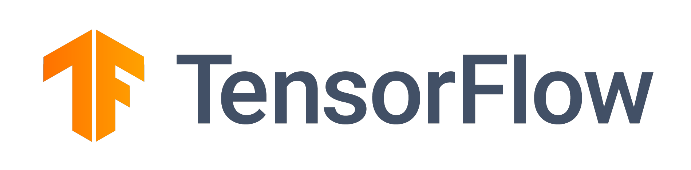
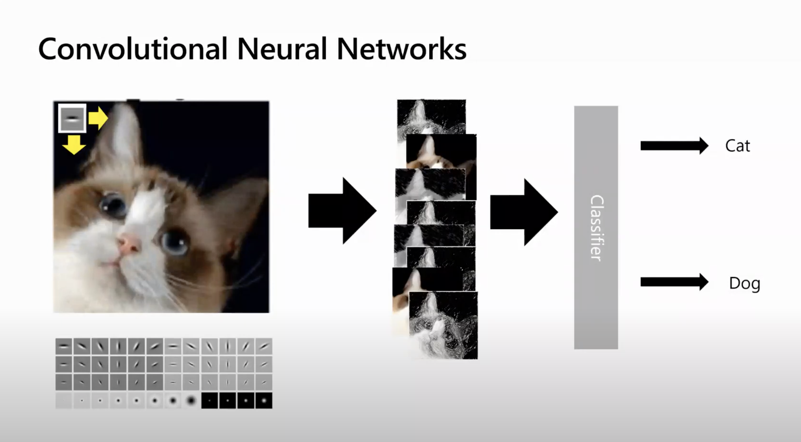
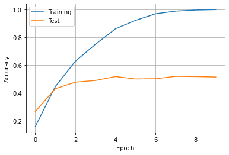

# Introducción al Deep Learning para Computer Vision

En este taller, aprenderás los fundamentos del Deep Learning para Computer Vision utilizando uno de los frameworks más populares: [PyTorch](http://pytorch.org) o [Tensorflow](http://tensorflow.org). Puedes elegir uno de los frameworks que vas a utilizar.

<table border="0"><tr><td></td><td></td></tr>
<tr><td>
Es uno de los primeros frameworks de Deep Learning que actualmente se utiliza mucho en la industria. También incluye el framework Keras simplicado, lo que hace que entrenar redes neuronales sea mucho más fácil.
</td><td>Es un gran framework de Deep Learning que está ganando popularidad rápidamente. Introdujo por primera vez el concepto de *grafo computacional dinámico*, y ha cobrado un enorme impulso desde entonces.</td></tr></table> 

## Módulos de referencia

El taller se basa en los siguientes Módulos de Aprendizaje (utilizarás uno de ellos según el framework que elijas):

* [Introducción a Computer Vision con PyTorch](https://docs.microsoft.com/learn/modules/intro-computer-vision-pytorch/?WT.mc_id=academic-56313-dmitryso)
* [Introducción a Computer Vision con Tensorflow](https://docs.microsoft.com/learn/modules/intro-computer-vision-tensorflow/?WT.mc_id=academic-56313-dmitryso)

## Objetivo

En este taller aprenderemos a determinar la raza de un perro o un gato a partir de una fotografía utilizando redes neuronales. Es un ejemplo de una tarea más general denominada **clasificación de imágenes**.

| **Objetivo**              | *Aprenda a entrenar una red neuronal para clasificar razas de perros y gatos* |
| ----------------------------- | --------------------------------------------------------------------- |
| **Qué aprenderás**       | *Aprenderás sobre Deep Learning utilizando uno de los frameworks más populares, y sobre Computer Vision*                                        |
| **Lo que necesitarás**          | *No necesita herramientas, escribirá su solución directamente en Microsoft Learn* |
| **Duración**                  | *1 hora*                                                                |
| **¿Solo quiere probar la aplicación o ver la solución?** | *Clasificación facial [en PyTorch](../../solution/Faces-PyTorch.ipynb)/[en Tensorflow](../../solution/Faces-TensorFlow.ipynb), Transfer learning (opcional) [en PyTorch](../../solution/Pets-PyTorch.ipynb)/[en Tensorflow](../../solution/Pets-TensorFlow.ipynb)* |
| **Diapositivas** | [Powerpoint](./DeepLearningCV.pptx), [PDF](DeepLearningCV.pdf), [Online](https://speakerdeck.com/shwars/deep-learning-for-computer-vision-workshop) 

## Video

[](https://youtu.be/9tW-KuQ6sEA "workshop walk-through")
> 🎥 Haga clic en esta imagen para ver cómo Dmitry le guía por el taller

## Pre-Aprendizaje

Si es la primera vez que oyes hablar de **redes neuronales** y frameworks como PyTorch o Tensorflow - te recomendamos que realices uno de los módulos introductorios en Microsoft Learn:
* [Introducción a PyTorch](https://docs.microsoft.com/learn/modules/intro-machine-learning-pytorch/?WT.mc_id=academic-56313-dmitryso)
* [Introducción a TensorFlow mediante Keras](https://docs.microsoft.com/learn/modules/intro-machine-learning-keras/?WT.mc_id=academic-56313-dmitryso)

También puede leer esta [breve introducción a las Redes Neuronales](https://soshnikov.com/education/very-quick-intro-to-neural-networks/) como alternativa.

## Requisitos previos
 
No necesita tener nada instalado en su máquina, ya que utilizará Microsoft Learn Sandbox para realizar el ejercicio.

## Lo que aprenderán los estudiantes

Imagina que necesitas desarrollar una aplicación para guarderías de mascotas que catalogue a todas las mascotas. Una de las grandes características de esa aplicación sería descubrir automáticamente la raza a partir de una fotografía. Esto puede hacerse con éxito utilizando redes neuronales.

Utilizaremos el conjunto de datos de mascotas  [Oxford-IIIT](https://www.robots.ox.ac.uk/~vgg/data/pets/) que contiene 35 razas diferentes de perros y gatos, y construiremos un modelo que pueda reconocer la raza a partir de la imagen.


## Paso 0 (opcional): Introducción al aprendizaje profundo

Si eres completamente nuevo en el Deep Learning, puede que quieras repasar [breve introducción a las Redes Neuronales](https://soshnikov.com/education/very-quick-intro-to-neural-networks/). Para obtener una comprensión aún más profunda sobre lo que hace, puedes tomar uno de los cursos dependiendo del framework que elijas utilizar:

* [Introducción a PyTorch](https://docs.microsoft.com/learn/modules/intro-machine-learning-pytorch/?WT.mc_id=academic-56313-dmitryso)
* [Introducción a TensorFlow mediante Keras](https://docs.microsoft.com/learn/modules/intro-machine-learning-keras/?WT.mc_id=academic-56313-dmitryso)

No es estrictamente necesario seguir el taller, pero te sentirás mucho más seguro. Es mejor que lo hagas antes del taller como lectura previa, ya que toma alrededor de 1 hora.

## Paso 1: Iniciar el Sandbox

Dependiendo del framework que elija, inicie uno de los Módulos de Aprendizaje:

* [Introducción a Computer Vision con PyTorch](https://docs.microsoft.com/learn/modules/intro-computer-vision-pytorch/?WT.mc_id=academic-56313-dmitryso)
* [Introducción a Computer Vision con TensorFlow](https://docs.microsoft.com/learn/modules/intro-computer-vision-tensorflow/?WT.mc_id=academic-56313-dmitryso)

Puede leer las primeras unidades, hasta la unidad **Utilizar red neuronal convolucional**.

> El módulo incluye el inicio de **Jupyter Notebook sandbox**. Siéntete libre de iniciar el sandbox, pero ten en cuenta que la máquina virtual está asignada por un tiempo limitado (alrededor de 2 horas). Transcurrido este tiempo, o en caso de inactividad prolongada, los cambios se perderán y tendrás que empezar desde cero, incluida la descarga del conjunto de datos.

Detente en la unidad **Utilizar Red Neuronal Convolucional**, ve hasta el final del sandbox del cuaderno, y asegúrate de que puedes crear nuevas celdas y ejecutar código.

**Le sugerimos que escriba su solución dentro del sandbox**, utilizando las celdas al final del cuaderno. Learn Jupyter Sandbox soporta GPU, lo que hace que el entrenamiento de tu modelo sea más rápido. Además, siempre puedes consultar el código en las celdas de arriba, en caso de que necesites copiar y pegar partes del código.

> Si desea trabajar en la solución en su propia máquina, puede utilizar [Faces.ipynb Notebook](Faces.ipynb) como punto de partida, y [Pets.ipynb] para el paso final opcional. Sin embargo, se recomienda encarecidamente disponer de una GPU.

## Paso 2: Obteniendo los datos

Para nuestra primera tarea, utilizaremos el conjunto de datos simplificado **PetFaces**, derivado del original [Oxford-IIIT Pets Dataset](https://www.robots.ox.ac.uk/~vgg/data/pets/) recortando la cara de la mascota y organizando todos los archivos de cada raza en un directorio independiente.

Para descargar el conjunto de datos en el sandbox, utilice el siguiente código (copie y pegue en la celda Jupyter y ejecútelo):

```python
!wget https://mslearntensorflowlp.blob.core.windows.net/data/petfaces.tar.gz
!tar xfz petfaces.tar.gz
!rm petfaces.tar.gz
```

Esto creará un directorio llamado `petfaces` en su máquina virtual sandbox.

En este punto puede intentar representar gráficamente el conjunto de datos. Siéntase libre de utilizar el siguiente código para mostrar la lista de imágenes:

```python
import matplotlib.pyplot as plt

def display_images(l,titles=None,fontsize=12):
    n=len(l)
    fig,ax = plt.subplots(1,n)
    for i,im in enumerate(l):
        ax[i].imshow(im)
        ax[i].axis('off')
        if titles is not None:
            ax[i].set_title(titles[i],fontsize=fontsize)
    fig.set_size_inches(fig.get_size_inches()*n)
    plt.tight_layout()
    plt.show()
```

A continuación, intente utilizar funciones de los frameworks PyTorch/Tensorflow para cargar imágenes desde el disco y prepararlas para la clasificación. Hay funciones que pueden tomar un directorio con archivos de imagen (donde cada clase de imágenes está en su propio subdirectorio) y devolver el conjunto de datos junto con las clases:
* `torchvision.datasets.ImageFolder` para PyTorch
* `tf.keras.preprocessing.image_dataset_from_directory` para Tensorflow/Keras

También es necesario dividir el conjunto de datos original en dos conjuntos de datos: `train` (que contiene el 80% de los datos) y `test` (que contiene el 20%). Las funciones anteriores gestionan automáticamente la división de los conjuntos de datos. Al crear conjuntos de datos, también puede dividir las imágenes en pequeños lotes de 16-64 imágenes.

Al cargar las imágenes, también hay que seguir algunos pasos adicionales:

* Redimensionar todas las imágenes al mismo tamaño. Dado que la mayoría de las imágenes tienen una relación de aspecto cercana al cuadrado, seleccione un tamaño de imagen cuadrado, por ejemplo 128x128 o 224x224.
* Convertir todas las imágenes en tensores
* Normalizar todas las imágenes para que los datos de entrada estén en el rango [0..1]. Este es un paso estándar en la preparación de datos para el entrenamiento de redes neuronales. En el caso más simple, podemos asumir que todas las intensidades de los píxeles están dentro del rango 0..255, por lo que sólo tenemos que dividir por 255 (convirtiendo antes al tipo de datos float). En PyTorch, la normalización es manejada automáticamente por la transformación `ToTensor`.

>La mayoría de estos pasos en PyTorch pueden ser implementados usando **transformaciones** ([aprende más](https://docs.microsoft.com/learn/modules/intro-machine-learning-pytorch/3-data?WT.mc_id=academic-56313-dmitryso)), mientras que en Tensorflow puedes simplemente especificar diferentes parámetros para la función `image_dataset_from_directory`.

Al final, es posible que desee trazar las primeras imágenes del minilote para asegurarse de que todo se ha cargado correctamente. Puede utilizar la misma función `display_images`, que acepta tensores como entrada.

## Paso 3: Definir y entrenar la red neuronal

Ahora que tenemos los datos, es el momento de definir la arquitectura de la red neuronal y entrenarla. Puedes inspirarte en el código que tienes en el módulo de Microsoft Learn, teniendo en cuenta lo siguiente:

* Dado que el tamaño inicial de la imagen es bastante grande (tamaño sugerido 128x128), se necesitan varias capas convolucionales (al menos 3).
* Use combinación de convolución - max pooling
* Puede tener 1 o 2 capas densas finales

Para que el entrenamiento funcione correctamente, debemos ser especialmente cuidadosos a la hora de utilizar la combinación correcta de función de activación final y función de loss. Mientras que en el diagrama anterior indicamos que **softmax** se utiliza para normalizar las salidas de la red para producir probabilidades antes de introducirlas en la función de loss, algunos frameworks (por ejemplo, PyTorch) incluyen la normalización softmax en la propia función de loss. En particular:

* En PyTorch, la capa final no necesita una función de activación, y se puede utilizar `CrossEntropyLoss` como función de loss. También espera **número de clase**, y no un vector codificado como etiqueta de destino.
* En TensorFlow, utilice `softmax` como función de activación, y `sparse_categorical_crossentropy` como función de loss. El término **sparse** significa que espera un número de clase como objetivo, mientras que `categorical_crossentropy` espera vectores codificados de un solo golpe.

A continuación, entrene la red neuronal durante unas pocas épocas (~10), observando la precisión tanto del entrenamiento como de la validación durante el entrenamiento.

> Para PyTorch, siéntete libre de usar la función `train` definida en el módulo learn para entrenar tu red. Si quieres entender mejor cómo funciona el entrenamiento en PyTorch, puedes definir tu propia función `train` desde cero usando [la del módulo Learn](https://github.com/MicrosoftDocs/pytorchfundamentals/blob/main/computer-vision-pytorch/pytorchcv.py) como inspiración. Además, ten en cuenta que necesitas mover ambos, el modelo y los datos a la GPU durante el entrenamiento usando `.to()`, para aprovechar la aceleración de la GPU.

A continuación, puede trazar el gráfico de la precisión de entrenamiento y validación, que debería tener un aspecto como el siguiente:



> ¿Qué puedes decir de este gráfico sobre el sobreajuste? ¿Cuál es la precisión de tu modelo según el gráfico?

Hemos completado la parte principal de nuestro tutorial: ahora tenemos el modelo que puede clasificar una mascota en 35 categorías diferentes con una precisión relativamente alta. Tenga en cuenta que incluso la precisión en torno al 50% no está tan mal: adivinar a ciegas nos daría menos de un 3% de precisión.

> Puede guardar el modelo para utilizarlo más adelante sin necesidad de volver a entrenarlo.

## [Opcional] Paso 4: Calcular la precisión Top-K

Cuando se clasifica para un gran número de clases, suele ocurrir que algunas clases sean bastante similares entre sí. Por ejemplo, si un modelo se equivoca al clasificar un gato británico por un azul ruso, no es un gran problema, porque incluso los seres humanos cometen a menudo este error. Sin embargo, confundir un gato siamés con un gato persa no es un error tan leve.  

Por lo tanto, la precisión simple puede no ser el mejor indicador del rendimiento del modelo. También podemos calcular la **precisión top-k**, es decir, el porcentaje de casos en los que la etiqueta correcta se encuentra dentro de las k primeras predicciones. Por ejemplo, si para un gato británico el modelo predijo Azul Ruso como primer resultado y Británico como segundo, se consideraría un caso correcto.

Intenta calcular la precisión de los 3 mejores modelos y comprueba lo bueno que es. Algunas pistas:

* En Tensorflow, utiliza la función `tf.nn.in_top_k` para ver si las `predicciones` (salida del modelo) están en top-k (pasa `k=3` como parámetro), con respecto a los `targets`. Esta función devuelve un tensor de valores booleanos, que pueden convertirse a `int` mediante `tf.cast`, y luego acumularse mediante `tf.reduce_sum`.
* En PyTorch, puedes usar la función `torch.topk` para obtener índices de clases con probabilidades más altas, y luego ver si la clase correcta pertenece a ellas. Consulte [esto](https://gist.github.com/weiaicunzai/2a5ae6eac6712c70bde0630f3e76b77b) para más pistas.

> Este ejercicio requiere una mejor comprensión de las operaciones tensoriales, así que no te preocupes si no puedes resolverlo. Buscar la solución en Internet puede ayudarte.

## [Opcional] Paso 5: Clasificación de imágenes originales mediante Transfer Learning

Las imágenes que estábamos clasificando estaban bien enmarcadas para incluir sólo la cara de una mascota. En la vida real, queremos crear una aplicación que tome una foto normal de una mascota y sea capaz de clasificarla también. Tomemos el conjunto de datos original de Oxford Pets y veamos qué tan preciso puede ser el modelo.

> Hay notebooks de solución disponibles para [PyTorch](../../solution/Pets-PyTorch.ipynb) y [TensorFlow](../../solution/Pets-Tensorflow.ipynb).

Antes de empezar el ejercicio, estudia la siguiente unidad sobre **Transfer Learning** en el módulo de aprendizaje. Haz este ejercicio al final del cuaderno sandbox en la sección Transfer Learning.

Utilice el siguiente código para descargar el conjunto de datos:

```python
!wget https://mslearntensorflowlp.blob.core.windows.net/data/oxpets_images.tar.gz
!tar xfz oxpets_images.tar.gz
!rm oxpets_images.tar.gz
```

Observe que todos los archivos están en un directorio `images`, pero incluyen el nombre de la clase en el nombre del archivo. Para utilizar el mismo código de carga que en la sección anterior, tenemos que mover los archivos a diferentes directorios por clase. Si no está seguro de cómo hacerlo, consulte los archivos de la solución.

Si intentas entrenar el modelo utilizando la red neuronal de la sección anterior, es probable que obtengas una precisión baja (puedes intentarlo si quieres). En casos como este, tiene sentido utilizar **redes preentrenadas** y **Transfer Learning**.

Tanto TensorFlow/Keras como PyTorch permiten cargar fácilmente modelos de red preentrenados, como VGG-16 o ResNet 50, que pueden utilizarse como extractores de características. En este caso, los pesos del modelo preentrenado se cargan automáticamente desde Internet.

> **Nota**: Cuando se ejecuta en el sandbox de Microsoft Learn, el acceso a recursos arbitrarios de Internet está limitado. Puede utilizar el siguiente código para cargar el modelo preentrenado ResNet-50 en Tensorflow. También puede mirar el contenido original de Microsoft Learn para ver cómo manejan la carga de redes pre-entrenadas.

```python
!wget https://mslearntensorflowlp.blob.core.windows.net/models/resnet50_weights_tf_dim_ordering_tf_kernels_notop.h5"
resnet50 = tf.keras.applications.ResNet50(
             include_top=False,
             input_shape=(224,224,3),
             weights='resnet50_weights_tf_dim_ordering_tf_kernels_notop.h5')
```

Puedes construir una red neuronal para el Transfer Learning, pero ten en cuenta lo siguiente:

* En la mayoría de los casos, es necesario realizar un preprocesamiento de las imágenes, que puede ser distinto de la normalización. Puede preprocesar todas las imágenes originales antes del entrenamiento o añadir una capa de preprocesamiento como primera capa de la red
  - En TensorFlow/Keras, usa `tf.keras.resnet50.preprocess_input` (sustituye `resnet50` por la red que estés usando)
  - En PyTorch, utilice el código para el preprocesamiento proporcionado en el módulo Learn
* Es necesario **congelar los pesos** de la red preentrenada, de lo contrario los pesos serían destruidos por las primeras pasadas de propagación hacia atrás.

Con el transfer learning, la precisión debería rondar el 80-90% en los datos sin procesar y sin necesidad de ajustar mucho el modelo.


## Próximos pasos

En este taller, hemos aprendido sobre la aplicación de Deep Learning a la visión por ordenador y la clasificación de imágenes. Aquí tienes algunas ideas para seguir explorando:

* Explorar cómo se pueden utilizar las redes neuronales para otras tareas de visión por ordenador: detección de objetos, segmentación de instancias, etc.
* Explora cómo se pueden utilizar las redes neuronales para trabajar con texto - aquí tienes los módulos correspondientes para [PyTorch](https://docs.microsoft.com/learn/modules/intro-natural-language-processing-pytorch/?WT.mc_id=academic-56313-dmitryso) y [TensorFlow](https://docs.microsoft.com/learn/modules/intro-natural-language-processing-tensorflow/?WT.mc_id=academic-56313-dmitryso)
* Piensa en cómo puedes desplegar tu modelo para utilizarlo desde una aplicación móvil

## Actividad opcional de transferencia de conocimientos

Ahora que has entrenado el modelo, puedes intentar construir una aplicación móvil completa que reconozca la raza de los gatos/perros. Hay dos formas posibles de implementarlo:

  - Utiliza el mismo enfoque de transfer learning para entrenar un modelo mobilenet ligero que pueda desplegarse directamente en el dispositivo móvil
  - Implemente el modelo en Azure como un servicio REST y haga que su aplicación móvil lo llame para realizar la inferencia. Puede utilizar [Azure Functions](https://docs.microsoft.com/learn/modules/explore-azure-functions/?WT.mc_id=academic-56313-dmitryso) o [Azure ML Cluster](https://docs.microsoft.com/learn/modules/register-and-deploy-model-with-amls/?WT.mc_id=academic-56313-dmitryso)

## Feedback

¡Asegúrate de dejarnos [comentarios sobre este taller](https://forms.office.com/r/MdhJWMZthR)!

[Código de conducta](../../CODE_OF_CONDUCT.md)