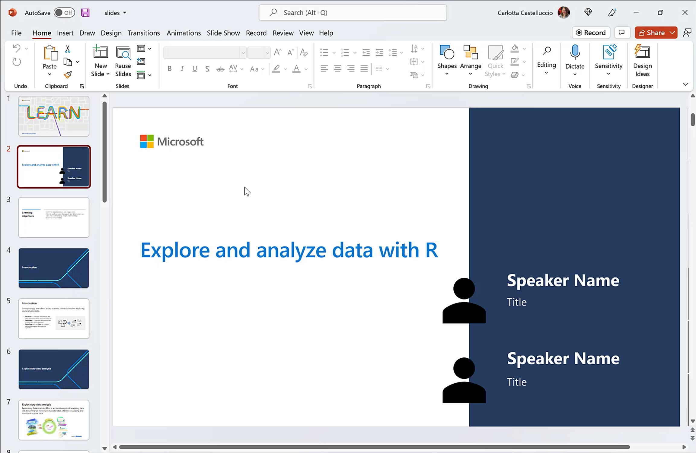

# Explore and analyze data with R

## Module Source
[Explore and analyze data with R](https://docs.microsoft.com/en-us/learn/modules/explore-analyze-data-with-r/?WT.mc_id=academic-59300-cacaste)

## Goals

Hello and welcome to this learning adventure! In this folder, you will find a Data Exploration Notebook. This is an autograding guided assessment notebook that will help you test your understanding in using R to explore and analyze data! We hope that you will find that R, is at its heart, a beautiful and elegant language for Data Science.

| **Goal**                      | Description                                    |
| ----------------------------- | -----------------------------------------------|
| **What will you learn**       | How to use R to explore and analyze data           |
| **What you'll need**          | [Visual Studio Code](https://code.visualstudio.com?WT.mc_id=academic-59300-cacaste), [Docker Desktop](https://www.docker.com/products/docker-desktop), [Remote Developer Extension](https://aka.ms/vscode-remote/download/extension) and [Git](https://git-scm.com/downloads) |
| **Duration**                  | 2 hours                                      |
| **Slides**                    | [Powerpoint](./slides.pptx)                                |

## Video

> 🎥 Click this image to watch Carlotta walk you through the workshop material and to gain some tips about delivering this workshop.

## Pre-Learning

This workshop allows learners to use the skills learnt in the module [Explore and analyze data with R](https://docs.microsoft.com/en-us/learn/modules/explore-analyze-data-with-r/?WT.mc_id=academic-59300-cacaste) to perform data analysis and visualization. As such, learners are encouraged to go through the module beforehand so as to be conversant with some of the concepts covered in this workshop.

## Prerequisites

To get you up and running and writing R code in no time, we have containarized this workshop such that you have a ready out of the box R coding environment.

### Setting up the development container

A **development container** is a running [Docker](https://www.docker.com) container with a well-defined tool/runtime stack and its prerequisites. You can try out development containers with **[GitHub Codespaces](https://github.com/features/codespaces)**, **[Binder](https://mybinder.org/)** or **[Visual Studio Code Remote - Containers](https://aka.ms/vscode-remote/containers)**.

#### GitHub Codespaces
Follow these steps to open this workshop in a Codespace:
1. Click the Code drop-down menu and select the **Open with Codespaces** option.
2. Select **+ New codespace** at the bottom on the pane.

For more info, check out the [GitHub documentation](https://docs.github.com/en/free-pro-team@latest/github/developing-online-with-codespaces/creating-a-codespace#creating-a-codespace?WT.mc_id=academic-59300-cacaste).

#### Binder
This workshop is also available on Binder. To open the notebook in a Binder environment, just click the button below.

#### Learn Sandbox
You can go through this challenge also leveraging on the Learn Sandbox environment, provided by [Unit 9](https://docs.microsoft.com/en-us/learn/modules/explore-analyze-data-with-r/9-challenge-data-exploration?WT.mc_id=academic-59300-cacaste) of the MS Learn module -  Explore and analyze data with R. Just sign in with your Microsoft or GitHub account and click on **Activate sandbox** to start.

#### VS Code Remote - Containers
Follow these steps to open this workshop in a container using the VS Code Remote - Containers extension:

1. If this is your first time using a development container, please ensure your system meets the pre-reqs (i.e. have Docker installed) in the [getting started steps](https://aka.ms/vscode-remote/containers/getting-started).

2. Press <kbd>F1</kbd> select and **Add Development Container Configuration Files...** command for **Remote-Containers** or **Codespaces**.

   > **Note:** If needed, you can drag-and-drop the `.devcontainer` folder from this sub-folder in a locally cloned copy of this repository into the VS Code file explorer instead of using the command.

3. Select this definition. You may also need to select **Show All Definitions...** for it to appear.

4. Finally, press <kbd>F1</kbd> and run **Remote-Containers: Reopen Folder in Container** to start using the definition.

This definition includes some test code that will help you verify it is working as expected on your system. Open the `all-systems-check` folder where you can choose to run the `.R`, `.Rmd` or `.ipynb` scripts. You should see "Hello, remote world!" in an R terminal window (for `.R` and `.Rmd`) or within a Jupyter Notebook (for `.ipynb`) after the respective script executes.

At some point, you may want to make changes to your container, such as installing a new package. You'll need to rebuild your container for your changes to take effect. 

## What you will learn

Let's say the Department of Transportation is considering the addition of a new airport. As the incredible data scientist you are, you have been requested to explore existing data. The results of your analysis might form the basis of a report or a machine learning mode.

In this challenge, you'll explore a real-world dataset containing flights data from the US Department of Transportation.

## Milestone 1: Clean the data

Rarely we find data in the right form for analysis. As such, once you’ve imported your data, a good place to start your analysis is by answering to the question: "Is the data accurate and appropriate for your desired analysis?". Cleaning data to handle errors, missing values, and other issues pays off in the long run and allows for easier and more accurate Exploratory Data Analysis.

In this section you will:

- Identify any null or missing data, and impute appropriate replacement values.

- Identify and eliminate any outliers in the DepDelay and ArrDelay columns.

## Milestone 2: Exploratory Data Analysis (EDA)

Exploratory data analysis (EDA) is used by data scientists to analyze and investigate data sets and summarize their main characteristics (e.g distribution), often by visualizing and transforming data. 

In this section you will:

- View summary statistics for the numeric fields in the dataset.

- Determine the distribution of the DepDelay and ArrDelay columns.

### More EDA

The goal of EDA is to develop a better understanding of your data. More often than not, EDA will involve formulating some probing questions about your data, searching for answers by visualizing and transforming data and finally using the understanding gained to refine questions, drop the questions entirely and/or generate new questions.

In this section, you will:

- Use statistics, aggregate functions, and visualizations to answer the following questions:

    - What are the average (mean) departure and arrival delays?

    - How do the carriers compare in terms of arrival delay performance?

    - Is there a noticeable difference in arrival delays for different days of the week?

    - Which departure airport has the highest average departure delay?

    - Do late departures tend to result in longer arrival delays than on-time departures?

    - Which route (from origin airport to destination airport) has the most late arrivals?

    - Which route has the highest average arrival delay?

## Quiz

Test your knowledge with [a short quiz](https://docs.microsoft.com/en-us/learn/modules/explore-analyze-data-with-r/8-knowledge-check?WT.mc_id=academic-59300-cacaste)!

## Next steps

Congratulations on finishing this challenge 🏅!

There are other workshops around using R for Data Science. In this workshop, we learnt how to clean data, visualize data and transform data to derive insights and knowledge. The next set of workshops will show you how to [create regression models](../intro-regression-R-tidymodels), [create classification models](../intro-classification-R-tidymodels) and create clustering models (coming soon!). Be sure to check them out!

## Practice

In this workshop, you used already provided questions to guide your EDA. Sometimes this is not the case. Try generating questions of your own and answering them using the data visualization and transformation skills you have acquire in this module. What new insights do you reveal?

## Feedback

Be sure to give [feedback about this workshop](https://forms.office.com/r/MdhJWMZthR)! Happy Learning!

[Code of Conduct](../../CODE_OF_CONDUCT.md)

