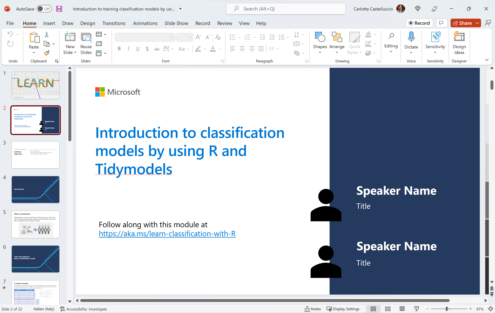

# Introduction to classification models by using R and Tidymodels

## Module Source
[Introduction to classification models by using R and tidymodels](https://docs.microsoft.com/en-us/learn/modules/introduction-classification-models/?WT.mc_id=academic-59300-cacaste)

## Goals

Hello and welcome to this learning adventure! In this folder, you will find a Classification Challenge Notebook. This is basically an autograding guided assessment notebook that will help you test your understanding in using R to create models that predict which category an item belongs to. So grab your wand and let the adventure begin!

| **Goal**                      | Description                                    |
| ----------------------------- | -----------------------------------------------|
| **What will you learn**       | How to create classification models in R           |
| **What you'll need**          | [Visual Studio Code](https://code.visualstudio.com?WT.mc_id=academic-59300-cacaste), [Docker Desktop](https://www.docker.com/products/docker-desktop), [Remote Developer Extension](https://aka.ms/vscode-remote/download/extension) and [Git](https://git-scm.com/downloads)   |
| **Duration**                  | 1.5 to 2 Hours                                         |
| **Slides**                    | [Powerpoint](./slides.pptx)                                 |

## Video

> 🎥 Click this image to watch Carlotta walk you through the workshop material and to gain some tips about delivering this workshop.

## Pre-Learning
This workshop allows learners to use the skills learnt in the module [Introduction to classification models by using R and tidymodels](https://docs.microsoft.com/en-us/learn/modules/introduction-classification-models/?WT.mc_id=academic-59300-cacaste) to create their own classification models. As such, learners are encouraged to go through the module beforehand so as to be conversant with some of the concepts covered in this workshop.
This workshop is the third of a series designed to get started with data science in R. So you may also want to have a look to the [first](../explore-analyze-data-with-R) and [second](../intro-regression-R-tidymodels) workshops of the series, dealing with exploratory data analysis and regression.

## Prerequisites

To get you up and running and writing R code in no time, we have containarized this workshop such that you have a ready out of the box R coding environment.

### Setting up the development container

A **development container** is a running [Docker](https://www.docker.com) container with a well-defined tool/runtime stack and its prerequisites. You can try out development containers with **[GitHub Codespaces](https://github.com/features/codespaces)** or **[Visual Studio Code Remote - Containers](https://aka.ms/vscode-remote/containers)**.

#### GitHub Codespaces
Follow these steps to open this workshop in a Codespace:
1. Click the Code drop-down menu and select the **Open with Codespaces** option.
2. Select **+ New codespace** at the bottom on the pane.

For more info, check out the [GitHub documentation](https://docs.github.com/en/free-pro-team@latest/github/developing-online-with-codespaces/creating-a-codespace#creating-a-codespace?WT.mc_id=academic-59300-cacaste).

#### Binder
This workshop is also available on Binder. To open the notebook in a Binder environment, just click the button below.

#### Learn Sandbox
You can go through this challenge also leveraging on the Learn Sandbox environment, provided by [Unit 9](https://docs.microsoft.com/en-us/learn/modules/introduction-classification-models/9-challenge-classification?WT.mc_id=academic-59300-cacaste) of the MS Learn module - Introduction to classification models by using R and tidymodels. Just sign in with your Microsoft or GitHub account and click on **Activate sandbox** to start.

#### VS Code Remote - Containers
Follow these steps to open this workshop in a container using the VS Code Remote - Containers extension:

1. If this is your first time using a development container, please ensure your system meets the pre-reqs (i.e. have Docker installed) in the [getting started steps](https://aka.ms/vscode-remote/containers/getting-started).

2. Press <kbd>F1</kbd> select and **Add Development Container Configuration Files...** command for **Remote-Containers** or **Codespaces**.

   > **Note:** If needed, you can drag-and-drop the `.devcontainer` folder from this sub-folder in a locally cloned copy of this repository into the VS Code file explorer instead of using the command.

3. Select this definition. You may also need to select **Show All Definitions...** for it to appear.

4. Finally, press <kbd>F1</kbd> and run **Remote-Containers: Reopen Folder in Container** to start using the definition.

This definition includes some test code that will help you verify it is working as expected on your system. Open the `all-systems-check` folder where you can choose to run the `.R`, `.Rmd` or `.ipynb` scripts. You should see "Hello, remote world!" in an R terminal window (for `.R` and `.Rmd`) or within a Jupyter Notebook (for `.ipynb`) after the respective script executes.

At some point, you may want to make changes to your container, such as installing a new package. You'll need to rebuild your container for your changes to take effect. 

## What you will learn

Let's say we are Data Scientists in a wine making company. Your company wants to produce the best wine and you are tasked with working with the company's wine records and wine expert to realise this. 

In this challenge, you will train a classification model to analyze the chemical and visual features of wine samples and classify them based on their cultivar (grape variety).

## Milestone 1:  ‍️Tidy the data.

Rarely do we find data in the right form for analysis. A great way of starting your data analysis is to clean your data to make it consistent with the functions you'll use in your analysis pipeline.

In this section you will:

- Import the data and identify the `features` (predictors) and `label` (outcome) variables that you'll be working with.

- Encode the outcome column to a categorical variable.

## Milestone 2: Visualize the data

The goal of data exploration is to try to understand the `relationships` between its attributes; in particular, any apparent correlation between the features and the label your model will try to predict. One way of doing this is by using data visualization. Data visualization enables you to identify trends and raise new questions about the data. 

In this section you will:

- Restructure the data such that you can easily plot the data as facets: subplots that each display one subset of the data

- Visualize and explore the relationship between the outcome and each feature using boxplots.

## Milestone 3: Data budgeting

Now, time to train some models. It’s best practice in supervised learning to split the data into two subsets; a (typically larger) set with which to train the model, and a smaller “hold-back” set with which to validate the trained model. This enables us to evaluate how well the model performs in order to get a better estimate of how your models will perform on new data.

In this section you will:

- Create a data splitting specification - i.e. what proportion goes to training and what goes to testing.

- Extract the training and testing sets.

## Milestone 4: Create a model specification, a recipe, a workflow, and then train a model.

Now that we have a set of training features and corresponding training label, we can fit a multiclass classification algorithm to the data to create a model. A recipe is an object that defines a series of steps for data processing. In practice, it's common to perform some preprocessing of the data to make it easier for an algorithm to fit a model to it.

In this section, you will:

- Create a multinomial model specification.

- Create a recipe that specifies that all the numeric predictors should be normalized.

- Bundle the model specification and recipe into a workflow.

- Fit the entire workflow to the data, so that the model encapsulates all of the preprocessing steps as well as the multinomial model.

## Milestone 5: Evaluate model performance.

Once you have a trained model using the training set, you will want to evaluate how well (or not) it will perform on new data.

In this section, you will:

- Use the trained model to make wine variety predictions and generate their corresponding probability predictions for the `test set`.

- Evaluate model performance using a `confusion matrix`.

- Evaluate model performance using other metrics that arise from the confusion matrix such as: `accuracy`, `precision` and `recall`.

- Evaluate model performance using the `ROC curve` and `ROC Area Under Curve`.

Overall, did your model do a great job in classifying the wine varieties?

## Milestone 6: Use the model for inferencing

If you are satisfied with the model performance, you can save it to be used later. You can then load it whenever you need it, and use it to predict labels for new data. This is often called scoring or inferencing.

In this section you will:

- Save your trained model, and then use it to predict the variety for the following wines:

 | **alcohol** | **malic_acid** | **ash** | **alcalinity** | **magnesium** | **phenols** | **flavanoids** | **nonflavanoids** | **proanthocyanins** | **color_intensity** | **hue** | **OD280_315_of_diluted_wines** | **proline** |
|---------------------|----------------|--------------|--------|-------|------|-------|------|-------|-----|---------|-------|------|
| 13.72 | 1.43| 2.5 | 16.7 | 108 | 3.4 | 3.67 | 0.19 | 2.04 | 6.8 | 0.89 | 2.87 | 1285|
| 12.37 | 0.94 | 1.36 | 10.6 | 88 | 1.98 | 0.57 | 0.28 | 0.42 | 1.95 | 1.05 | 1.82 | 520 |

## Quiz

Test your knowledge with [a short quiz](https://docs.microsoft.com/en-us/learn/modules/introduction-classification-models/8-knowledge-check?WT.mc_id=academic-59300-cacaste)!

## Next steps

Congratulations on finishing this classification challenge 🏅!

There are other workshops for creating machine learning models in R. In this workshop, we learnt how to create a machine learning model that predicts categories, or classes.  The next module will show you how to create clustering models (coming soon!).

## Practice

In this workshop, you trained a single model (multinomial classifcation model) to analyze the chemical and visual features of wine samples and classify them based on their cultivar (grape variety). Sometimes, a data practitioner may need to try out a couple of models. Try using other models discussed in this workshop to do the same. Try tuning some model hyperparameters while at it too. Do you obtain better evaluation metrics?

## Feedback

Be sure to give [feedback about this workshop](https://forms.office.com/r/MdhJWMZthR)! Happy Learning!

[Code of Conduct](../../CODE_OF_CONDUCT.md)

