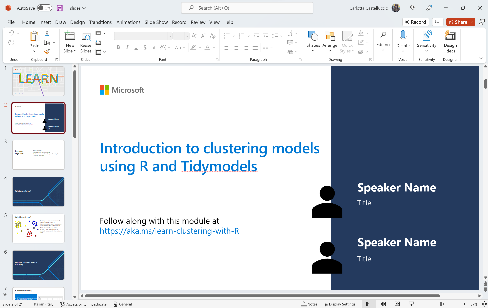

# Introduction to clustering models by using R and Tidymodels

## Module Source
[Introduction to clustering models by using R and tidymodels](https://docs.microsoft.com/en-us/learn/modules/introduction-clustering-models/?WT.mc_id=academic-59300-cacaste)

## Goals

Hello and welcome to this learning adventure! In this folder, you will find a Clustering Challenge Notebook. This is basically an autograding guided assessment notebook that will help you test your understanding in using R to create models that predict which category an item belongs to. So grab your wand and let the adventure begin!

| **Goal**                      | Description                                    |
| ----------------------------- | -----------------------------------------------|
| **What will you learn**       | How to create clustering models in R           |
| **What you'll need**          | [Visual Studio Code](https://code.visualstudio.com?WT.mc_id=academic-59300-cacaste), [Docker Desktop](https://www.docker.com/products/docker-desktop), [Remote Developer Extension](https://aka.ms/vscode-remote/download/extension) and [Git](https://git-scm.com/downloads)   |
| **Duration**                  | 1.5 to 2 Hours                                         |
| **Slides**                    | [Powerpoint](./slides.pptx)                                 |

## Video

> 🎥 Click this image to watch Carlotta walk you through the workshop material and to gain some tips about delivering this workshop

## Pre-Learning
This workshop allows learners to use the skills learnt in the module [Introduction to clustering models by using R and tidymodels](https://docs.microsoft.com/en-us/learn/modules/introduction-clustering-models/?WT.mc_id=academic-59300-cacaste) to create their clustering models. As such, learners are encouraged to go through the module beforehand to get used to the concepts covered in this workshop.
This is the fourth workshop of a series designed to get started with data science in R. You may want to have a look at the [first](../explore-analyze-data-with-R), [second](../intro-regression-R-tidymodels), and [third](../intro-classification-R-tidymodels) workshops of the series, dealing with exploratory data analysis and supervised learning.

## Prerequisites

To get you up and running and writing R code in no time, we have containerized this workshop so that you have a ready out of the box R coding environment.

### Setting up the development container

A **development container** is a running [Docker](https://www.docker.com) container with a well-defined tool and runtime stack with its prerequisites. You can try out development containers with **[GitHub Codespaces](https://github.com/features/codespaces)** or **[Visual Studio Code Remote - Containers](https://aka.ms/vscode-remote/containers)**.

#### GitHub Codespaces
Follow these steps to open this workshop in a Codespace:
1. Click the Code drop-down menu and select the **Open with Codespaces** option.
2. Select **+ New codespace** at the bottom on the pane.

For more info, check out the [GitHub documentation](https://docs.github.com/en/free-pro-team@latest/github/developing-online-with-codespaces/creating-a-codespace#creating-a-codespace?WT.mc_id=academic-59300-cacaste).

#### Binder
This workshop is also available on Binder. To open the notebook in a Binder environment, just click the button below.

#### Learn Sandbox
You can go through this challenge leveraging on the Learn Sandbox environment, provided by [Unit 7](https://docs.microsoft.com/en-us/learn/modules/introduction-clustering-models/7-challenge-clustering?WT.mc_id=academic-59300-cacaste) of the MS Learn module - Introduction to clustering models by using R and tidymodels. Just sign in with your Microsoft or GitHub account and click on **Activate sandbox** to start.

#### VS Code Remote - Containers
Follow these steps to open this workshop in a container using the VS Code Remote - Containers extension:

1. If this is your first time using a development container, please ensure your system meets the pre-reqs (i.e. have Docker installed) in the [getting started steps](https://aka.ms/vscode-remote/containers/getting-started?WT.mc_id=academic-59300-cacaste).

2. Press <kbd>F1</kbd> select and **Add Development Container Configuration Files...** command for **Remote-Containers** or **Codespaces**.

   > **Note:** If needed, you can drag-and-drop the `.devcontainer` folder from this sub-folder in a locally cloned copy of this repository into the VS Code file explorer instead of using the command.

3. Select the "R Data Science Environment" definition. You may also need to select **Show All Definitions...** for it to appear.

4. Finally, press <kbd>F1</kbd> and run **Remote-Containers: Reopen Folder in Container** to start using the definition.

This definition includes some test code that will help you verify it is working as expected on your system. Open the `all-systems-check` folder where you can choose to run the `.R`, `.Rmd` or `.ipynb` scripts. You should see "Hello, remote world!" in an R terminal window (for `.R` and `.Rmd`) or within a Jupyter Notebook (for `.ipynb`) after the respective script executes.

At some point, you may want to make changes to your container, such as installing a new package. You'll need to rebuild your container for your changes to take effect. 

## What you will learn
In this challenge, you will separate a dataset consisting of three numeric features (A, B, and C) into clusters using both K-means and agglomerative clustering. You will  then visualize the resulting cluster assignments and evaluate the level of separation achieved by the models.

## Milestone 1: Reduce features space with PCA

The challenge dataset contains 3 features that could interpreted as coordinates, describing each item’s location in a 3 dimensional space. Now, of course a three-dimensional space is difficult to visualize on a two-dimensional plot. And in real-life scenarios it is quite common to deal with a higher number of features, which makes it even harder. A possible solution is taking advantage of a mathematical technique called principal component analysis (PCA) to analyze the relationships between the features, and to summarize each observation as coordinates for two principal components. In other words, this means translating the 3-dimensional feature values into two-dimensional, uncorrelated coordinates.

In this section you will:

- Build a recipe to scale and center the numeric predictors (all the 3 features) and to convert all predictors into two principal components.

- Prep the recipe you created above. Prepping a recipe estimates the required quantities and statistics required by PCA.

- Bake the prepped recipe. This takes the trained (prepped) recipe and applies its operations to a data set to create a design matrix. 

## Milestone 2: Calculate WCSS to determine the right number of clusters

One of the fundamental problems with clustering is: without knowing class labels, how do you know how many clusters to separate your data into? One way is to use a data sample to create a series of clustering models with an incrementing number of clusters. Then, you can measure how tightly the data points are grouped within each cluster, by using the cluster sum of squares (WCSS) with lower values which means that the data points are closer. You can also plot the WCSS for each model and spot the optimal number of cluster from the chart.

In this section you will:

- Use the built-in `kmeans()` function to perform clustering by creating a series of 10 clustering models.

- Extract and visualize the WCSS for each cluster.

## Milestone 3: Use K-Means

K-Means is one of the most common clustering methods and consists of selecting K observations from the dataset to serve as the initial centroids and then iteratively assign every other observation to a centroid - according to their distance - until convergence is achieved.

In this section you will:

- Extract the k-means model with the right number of K, identified at the previous step.

- Add the cluster assignments generated by the model to the 2D version (2 Principal Components) of the data set and visualize them on a scatter plot.

## Milestone 4: Try agglomerative clustering

Agglomerative clustering is a bottom up, hierarchical clustering method in which each observation is initially considered as a single element cluster and at each step of the algorithm, two clusters that are most similar are combined into a bigger cluster until all points are members of one single big cluster.

In this section you will:

- Compute the distance matrix (distances between the rows of the data) using the "euclidean" method.

- Perform Hierarchical clustering with the Ward linkage agglomeration method.

- Cut the hierarchical clustering model into K clusters (where K has been identified at step 2) and extract the cluster labels for each observation.

- Visualize the agglomerative cluster assignments.

## Practice

Congratulations on finishing this classification challenge 🏅!

In this workshop, you separated a dataset consisting of three numeric features (A, B, and C) into clusters using both K-means and agglomerative clustering. You can experiment with clustering models using a dataset with a larger number of features and then compare K-means and hierarchical clustering by counting the number of observations in the corresponding clusters.

## Quiz

Test your knowledge with [a short quiz](https://docs.microsoft.com/en-us/learn/modules/introduction-clustering-models/6-knowledge-check?WT.mc_id=academic-59300-cacaste)!

## Feedback

Be sure to give [feedback about this workshop](https://forms.office.com/r/MdhJWMZthR)! Happy Learning!

[Code of Conduct](../../CODE_OF_CONDUCT.md)

