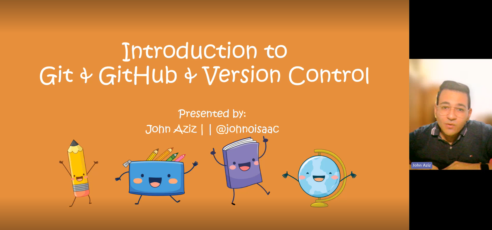

# Introduction to Git, GitHub, and Version Control

## Goals

In this workshop, we will discuss the concept of version control which is the foundation of understanding how Git works then we will install Git, work on a local Git repository, work on a remote GitHub repository, and work on another developer's repository.   

| **Goal**                      | Learn the basics you need to get started with Git and GitHub and apply them practically                            |
| ----------------------------- | ------------------------------------------------------------------------------------------------------------------ |
| **What will you learn**       | *Fundamentals of Version Control, Setting Up Git, Working with Local Repositories, Working with GitHub*            |
| **What you'll need**          | *[Git](https://git-scm.com/?wt.mc_id=studentamb_71460)*, *[GitHub](https://github.com/?wt.mc_id=studentamb_71460)* |
| **Duration**                  | *1h*                                                                                                               |
| **Microsoft Cloud Topics taught**                  | *Git*, *GitHub*                                                                       |
| **Slides**                                         | *[Powerpoint](slides.pptx)*                                                           |
| **Author**                                         | *[John Aziz](https://github.com/john0isaac)*                                          |

## Video

> 🎥 Click this image to watch John walk you through the workshop

## Pre-Learning

- Read this [introduction to Git](https://learn.microsoft.com/training/modules/intro-to-git/0-introduction/?wt.mc_id=studentamb_71460).
- Read this [introduction to GitHub](https://learn.microsoft.com/training/modules/introduction-to-github/1-introduction/?wt.mc_id=studentamb_71460).
- Read this [introduction to creating a Git project](https://learn.microsoft.com/training/modules/create-git-project/1-introduction/?wt.mc_id=studentamb_71460).
- Read this [introduction to collaborating with Git and GitHub](https://learn.microsoft.com/training/modules/collaborate-with-git/0-introduction/?wt.mc_id=studentamb_71460).

## Prerequisites

### Git

Git is the version control tool that we will be using throughout this workshop.
To install Git, follow these steps:
- Go to [git-scm.com/downloads](https://git-scm.com/download/?wt.mc_id=studentamb_71460).
- Download the suitable version of Git.
- Install it on your local machine.

### GitHub

GitHub is the cloud platform that we will use to share our code with others and collaborate on projects.
To set up a GitHub account, follow these steps:
- Go to [github.com/signup](https://github.com/signup/?wt.mc_id=studentamb_71460).
- Enter your email.
- Create a password.
- Enter a username. (Note that this is your unique identifier on GitHub.)

## The workshop

- [Part 0: Install and Configure Git](./setup.md)
- [Part 1: Working with a Local Repository](./local-git.md)
- [Part 2: Working with Remotes](./remote-github.md)

## Feedback

Be sure to give [feedback about this workshop](https://forms.office.com/r/MdhJWMZthR)!

[Code of Conduct](../../CODE_OF_CONDUCT.md)
