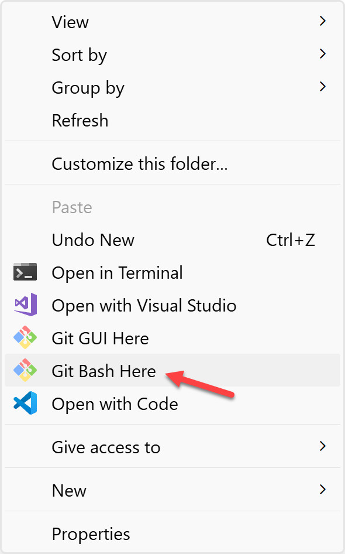

# Part 1: Working with a Local Repository

Git tracks changes in your source code, enables versioning, and supports non-linear development through thousands of parallel branches without the need for the internet.

## Initializing a Local Git Repository

1. On your local machine, create a new empty folder.
2. Right-click inside the folder and select **Git Bash Here** from the options.

    

3. Inside git bash, execute the following command to initialize a Git repository
   
    ```bash
    git init
    ```

## Making Changes

1. Inside git bash, execute the following command to create a new file

    ```bash
    touch new-text-file.txt
    ```

2. Inside git bash, execute the following command to open the newly created file

   ```bash
    start new-text-file.txt
    ```

3. Add some text to the file then save and close it.

Common shell commands:
  ```bash
  $ ls    # used to list files and directories
  $ mkdir # used to create a new directory
  $ cd    # used to change directories
  $ rm    # used to remove files and directories
  $ pwd   # used to print the current working directory
  $ touch # used to create and modify files
  $ start # used to open files or directories using the default program
  ```

## Staging Changes

In Git, just because a file was modified doesn't mean it will be automatically included in the next commit. Instead, you have to tell Git explicitly which of your modifications shall be part of the next commit. This is done by adding a change to the Staging Area or, put simply, by "staging" it.

Inside git bash, execute the following command to stage all the changes

```bash
git add .
```

> [!NOTE]
> The dot (.) here means all the changes.
> 
> Instead of using it we can add the names of each changed file individually.

## Committing Changes

The "commit" command is used to save your changes to the local repository as it captures a snapshot of the project's currently staged changes. Committed snapshots can be thought of as "safe" versions of a project. Git will never change them unless you explicitly ask it to.

Inside git bash, execute the following command to commit all the changes

```bash
git commit -m "Imperative description of the changes"
```

> [!NOTE]
> Write your commit message in the imperative: "Fix bug" and not "Fixed
bug" or "Fixes bug.". Try to avoid using dots at the end of your commit message.

## Reviewing the Repository's History

Git status displays the state of the working directory and the staging area. It lets you see which changes have been staged, which haven't, and which files aren't being tracked by Git.

1. Inside git bash, execute the following command to see the status of your repository

    ```bash
    git status
    ```

The output before making any changes:

```bash
On branch main
No commits yet
nothing to commit (create/copy files and use "git add" to track)
```

2. Make some changes, add, and commit them.

3. Inside git bash, execute the `git status` command again.

The output after what we have done:
```bash
On branch main
No commits yet
Untracked files:
  (use "git add <file>..." to include in what will be committed)
        new-text-file.txt
nothing added to commit but untracked files present (use "git add" to track)
```

The status output does not show you any information regarding the committed project history and that's why we need Git log as it will show us the history of our Git repository.

4. Inside git bash, execute the following command to get the history of your repository

    ```bash
    git log
    ```

> [!NOTE]
> `git log` displays the following:
> - the SHA (unique ID for each commit)
> - the author (the email and username you configured Git with)
> - the date (the date of the commit)
> - the commit message (the message that you added with the commit)
>
> You can use `git log --oneline` to get a one-line version of the logs. 

## Summary

Congratulations! You are now able to use Git on your local machine to manage your projects. Next you'll practice [working with remotes](./remote-github.md).
