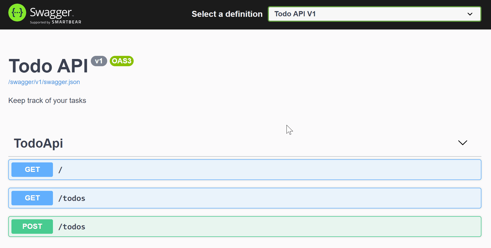

# Build a minimal API with .NET 6

## Module Source Link

* [Tutorial](https://minimal-apis.github.io/tutorial/)
* [Related Module](https://docs.microsoft.com/learn/paths/aspnet-core-minimal-api/)

## Goals

In this workshop, we will discuss *Minimal APIs*.

| **Goal**              | **Create a fast, powerful API with .NET 6**                                   |
| ----------------------------- | --------------------------------------------------------------------- |
| **What will you learn**       | Learn the basics of creating a web API that links to a persistent database.                                        |
| **What you'll need**          | [.NET 6 and VS Code (For Windows)](https://aka.ms/dotnet-coding-pack-win), [.NET 6 and VS Code (For macOS)](https://aka.ms/dotnet-coding-pack-mac) |
| **Duration**                  | 1 hour                                                                |
| **Slides** | [Powerpoint](slides.pptx) 
| **Author** | Katie Savage |                         
## Video

Coming soon...

## Pre-Learning

[Create web apps and services with ASP.NET Core, minimal API, and .NET 6](https://docs.microsoft.com/en-us/learn/paths/aspnet-core-minimal-api/)

## Prerequisites

* [.NET 6 and VS Code (For Windows)](https://aka.ms/dotnet-coding-pack-win)
* [.NET 6 and VS Code (For macOS)](https://aka.ms/dotnet-coding-pack-mac)
* If you already have Visual Studio Code, or another preferred editor, just download the [.NET 6 SDK](https://dotnet.microsoft.com/download/dotnet/6.0).

## What students will learn

In this workshop, use a Minimal API, or Application Programming Interface, to create a dynamic Todo list that you can update, create new items for, mark items as complete, and delete items.



## What are minimal APIs

In this segment, you'll learn the basics of what APIs, web APIs, and minimal APIs are and when you will use them.

[For more information, click here.](https://docs.microsoft.com/learn/modules/build-web-api-minimal-api/2-what-is-minimal-api)

## Create a new web app

Using the .NET CLI, create a new web application with the following command:
```
dotnet new web -o TodoApi 
```

Now that you have created your minimal API you can run it. To run your application, navigate to the *TodoApi* folder and type the command below:
```
TodoApi> dotnet watch
```

.NET will build and run your minimal API project with hot reload enabled, showing output in the console that looks similar to this:
```
Building...
info: Microsoft.Hosting.Lifetime[14]
      Now listening on: https://localhost:7243
info: Microsoft.Hosting.Lifetime[14]
      Now listening on: http://localhost:5085
info: Microsoft.Hosting.Lifetime[0]
      Application started. Press Ctrl+C to shut down.
info: Microsoft.Hosting.Lifetime[0]
      Hosting environment: Development
info: Microsoft.Hosting.Lifetime[0]
      Content root path: C:\Users\Jon\temp\TodoApi
```

The console output shows the ports your API is running on. It will attempt to open a browser window to the HTTPS port - if it doesn't you can click on those links in the console, or type them into a browser to navigate to them. You should see a "Hello world!" message.

Add a new route to your API by opening the app in your editor and navigating to the Program.cs file. In Program.cs, create new todo route to our api that returns a list items. Add the following MapGet after *app.MapGet("/", () => "Hello World!");*.
```csharp
app.MapGet("/todo", () => new { Item = "Water plants", Complete = "false" });
```
This route will return one Todo item. Stop the application using `ctrl+c` / `cmd+c`.

Learning checklist
* Created a new route /todo
* Used the GET HTTP Request method MapGet
* Configured and implemented OpenAPI and Swagger UI
* Introduced to middleware and dependency injection

[Create a new web app](https://minimal-apis.github.io/tutorial/first-steps.html#getting-started)

## Add interactive API docs

In a terminal window, type the following command:
```
TodoApi> dotnet add package Swashbuckle.AspNetCore
```

To set up Swagger UI, add the following code snippets:

**Snippet 1** : Under *var builder = WebApplication.CreateBuilder(args);*, add the following lines of code:

```csharp
builder.Services.AddEndpointsApiExplorer();
builder.Services.AddSwaggerGen(c =>
{
    c.SwaggerDoc("v1", new OpenApiInfo { Title = "Todo API", Description = "Keep track of your tasks", Version = "v1" });
});
```
The `AddSwaggerGen` method adds information such as title, description, and version to your API.

Add a using statement to the top of the file with the following code:
```csharp
using Microsoft.OpenApi.Models;
```

**Snippet 2** : Above app.MapGet("/", () => "Hello World!");, add the following lines of code:
```csharp
app.UseSwagger();
app.UseSwaggerUI(c =>
{
   c.SwaggerEndpoint("/swagger/v1/swagger.json", "Todo API V1");
});
```

The preceding code enables middleware to serve the generated OpenAPI description as JSON content, enables middleware to serve the Swagger UI elements, and specifies the OpenAPI description's endpoint.

Restart the application using `dotnet watch`. When the application runs, add `swagger` to the end of the URL, e.g. https://localhost:7243/swagger in this example (filling in your port number instead of 7243).

Learning checklist
* Configured and implemented OpenAPI and Swagger UI
* Introduced to middleware and dependency injection

[Link: Interactive API docs](https://minimal-apis.github.io/tutorial/first-steps.html#interactive-api-docs)

## Create Read Update Delete

You just built simple API where you hard coded the results to HTTP method. Now, we are going to step it up a notch and create something dynamic. Instead of returning a static item that is hardcoded to our route, we are going to be creating to-do list we can update, create new items, mark an item as complete and delete an item.

Our to-do APIs is going to:

* Create a new item.
* Return a specific item on a list. 
* Update an existing item.
* Delete an item. 

### Create a TodoItem class after *app.Run();* using the following code:
```csharp
class TodoItem
{
    public int Id { get; set; }
    public string? Item { get; set; }
    public bool IsComplete { get; set; }
}
```

### Install the Entity Frameworkcore InMemory package.
> Entity Framework is a code library that enables the transfer of data stored in relational database tables(E.g. SQLite and MySQL, SQL server etc) into objects that are more commonly used in application code.
In your terminal execute the following:
```
TodoApi>dotnet add package Microsoft.EntityFrameworkCore.InMemory --version 6.0
```
Add *using Microsoft.EntityFrameworkCore;* to the top of your Program.cs file.

### Set up your in memory database
Add the following code snippets

**Snippet 1** : Below the *TodoItem* create a *TodoDb* class
```csharp
class TodoDb : DbContext
{
    public TodoDb(DbContextOptions options) : base(options) { }
    public DbSet<TodoItem> Todos { get; set; }
}
```

**Snippet 2** : Before AddSwaggerGen services we configured earlier, add the code snippet below.
```csharp
builder.Services.AddDbContext<TodoDb>(options => options.UseInMemoryDatabase("items"));
```
**Return a list of items**
To read from a list of items in the todo list replace the "/todo" route with the "/todos" route below.
```csharp
app.MapGet("/todos", async (TodoDb db) => await db.Todos.ToListAsync());
```

Restart the application using `dotnet watch`. Go back your browser and navigate to [https://localhost:[port]/swagger] and click on the GET/todos button. You will see the list is empty under Response body.

### Create new items
Let's *POST* new tasks to the todos list. Below `app.MapGet` you created earlier, add the following:
```csharp
app.MapPost("/todos", async (TodoDb db, TodoItem todo) =>
{
    await db.Todos.AddAsync(todo);
    await db.SaveChangesAsync();
    return Results.Created($"/todo/{todo.Id}", todo);
});
```

Go back to Swagger and now you should see POST/todos. To add new items to the todo list:

* Click on POST /todos
* Click on Try it out
* Update id, item, and isComplete
* Click Execute

### Read the items in the list
To read the items in the list

* Click on GET/todos
* Click on Try it out
* Click `Execute
* The Response body will include the items just added.

To GET an item by id add the code below app.MapPost route created earlier
```csharp
app.MapGet("/todos/{id}", async (TodoDb db, int id) => await db.Todos.FindAsync(id));
```

### Update an item
To update an existing item add the code below GET /todos/{id} route we created above.
```csharp
app.MapPut("/todos/{id}", async ( TodoDb db, TodoItem updateTodo ,int id) =>
{
    var todo = await db.Todos.FindAsync(id);
    
    if (todo is null) return Results.NotFound();
    
    todo.Item = updateTodo.Item;
    todo.IsComplete = updateTodo.IsComplete;

    await db.SaveChangesAsync();

    return Results.NoContent();
});
```

* Click on PUT/todos/{id}
* Click on Try it out
* In the id text box enter 2
* Update Request body paste the JSON below and update isComplete to true.
```json
{
    "id": 2,
    "item": "Water plants",
    "isComplete": false
  }
```
* Click Execute

### Delete an item
To delete an existing item add the code below PUT/todos/{id} we created above.
```csharp
app.MapDelete("/todos/{id}", async (TodoDb db, int id) =>
{
    var todo = await db.Todos.FindAsync(id);
    if (todo is null)
    {
        return NotFound();
    }
    db.Todos.Remove(todo);
    await db.SaveChangesAsync();

    return Results.Ok();

});
```
Now, try deleting an item.

Learning checklist:
* Add model class and database context
* CRUD methods (GET, POST, PUT, DELETE)
* Configured routing and returned values

[Link: Create Read Update Delete](https://minimal-apis.github.io/tutorial/crud.html#create-read-update-delete)

## Set up SQLite database

We just learned how to build a basic CRUD application with an in-memory database. Now, we are going to step it up notch and work with a persistent database. Meaning your data will be saved even after you shut down your application.

Install the following tools and packages
```
TodoApi>dotnet add package Microsoft.EntityFrameworkCore.Sqlite --version 6.0
TodoApi>dotnet tool install --global dotnet-ef
TodoApi>dotnet add package Microsoft.EntityFrameworkCore.Design --version 6.0
```

[Working with Databases](https://minimal-apis.github.io/tutorial/databases.html#working-with-databases)

### Enable database creation
In order to enable database creation they are couple of steps we need to complete:

1. Set the database connection string.
2. Migrate your data model to a SQLite database.
3. Create your database and schema

### Set connection string
In Program.cs below your app builder `var builder = WebApplication.CreateBuilder(args);` add a connection string.
```csharp
var connectionString = builder.Configuration.GetConnectionString("todos") ?? "Data Source=todos.db";
```

### Add context to your services
Now we are going to replace the in-memory database with a persistent database. Replace your current in-memory database implementation `builder.Services.AddDbContext<TodoDb>(options => options.UseInMemoryDatabase("items"));` in your build services with the SQLite one below:
```csharp
builder.Services.AddSqlite<TodoDb>(connectionString);
```

### Migrate the data model
With the EF Core migration tool, you can now start your first migration, InitialCreate. In a terminal window, run the migrations command:
```
dotnet ef migrations add InitialCreate    
```
    
### Create your database and schema
Now that you have completed the migration, you can use it to create your database and schema. In a terminal window, run the database update command below to apply migrations to a database:
```
dotnet ef database update
```

### Test the application using the new database

Test the application again in Swagger – you will see that your Todo items are stored in the database, so they will remain if you stop and start the app.

Learn checklist
* Setup SQLite database
* Create a SQLite database
* Perform SQLite CRUD operation from our todo API

## Next steps

[Create web apps and services with ASP.NET Core, minimal API, and .NET 6](https://docs.microsoft.com/learn/paths/aspnet-core-minimal-api/)


## Feedback

Be sure to give [feedback about this workshop](https://forms.office.com/r/MdhJWMZthR)!

[Code of Conduct](../../CODE_OF_CONDUCT.md)

