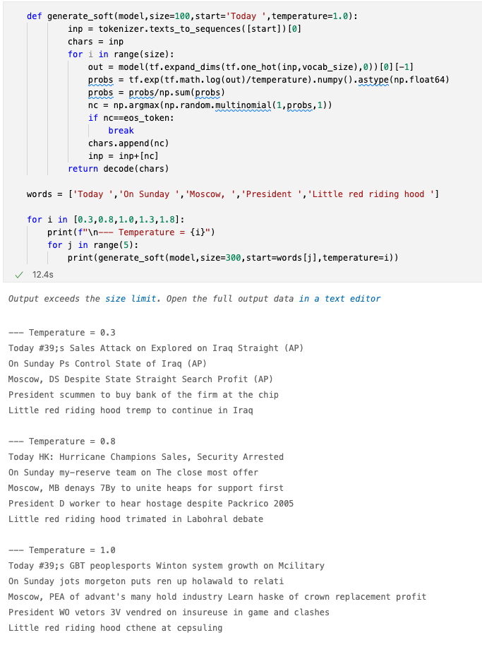

# Introduction to NLP with TensorFlow

## Module Source

[Introduction to NLP with TensorFlow](https://docs.microsoft.com/learn/modules/intro-natural-language-processing-tensorflow/?WT.mc_id=academic-56322-alfredodeza)

## Goals

In this workshop, we will cover how text is processed using TensorFlow, a popular platform for machine learning.

| **Goal**              | Description                                    |
| ----------------------------- | --------------------------------------------------------------------- |
| **What will you learn**       | Analyze text using TensorFlow                                        |
| **What you'll need**                              | <ul><li>[Python](https://docs.microsoft.com/learn/modules/python-install-vscode/?WT.mc_id=academic-56322-alfredodeza)</li> <li>[Visual Studio Code](https://code.visualstudio.com?WT.mc_id=academic-56322-alfredodeza)</li><li>[Setup VSCode for Data Science](https://youtu.be/yyQM70vi7V8)</li></ul>                                          |
| **Duration**                                      | 1 hour |
| **Slides**                                        | [Powerpoint](./slides.pptx)                                                                                      |

## Video

[](https://youtu.be/f2RoFeLDneI "Tensorflow and Keras for NLP video - Click to Watch!")
> 🎥 Click the image above to learn how to deliver this workshop

## Pre-Learning

- [Introduction to TensorFlow using Keras](https://docs.microsoft.com/learn/modules/intro-machine-learning-keras/?WT.mc_id=academic-56322-alfredodeza)

## Prerequisites

You can activate the sandbox environments in each module, or alternately setup your local environment:

- [Install Python](https://docs.microsoft.com/learn/modules/python-install-vscode/?WT.mc_id=academic-56322-alfredodeza)
- [Setup Visual Studio Code for Data Science](https://youtu.be/yyQM70vi7V8)

If you are trying the examples in a local environment, install required libraries and download the dataset in the same directory where the notebooks are:

```bash
$ pip install --quiet tensorflow_datasets==4.4.0
$ wget -q -O - https://mslearntensorflowlp.blob.core.windows.net/data/tfds-ag-news.tgz | tar xz
```

## What you will learn

TensorFlow is a popular Machine Learning platform that allows many workflows and operations for Machine Learning in Python. In this workshop, you'll be learn how to process and analyze text, so that you can create generated text or answer questions based on context.




## Milestone 1: Represent text as Tensors

Complete the [sandboxed Jupyter Notebook](https://docs.microsoft.com/learn/modules/intro-natural-language-processing-tensorflow/2-represent-text-as-tensors?WT.mc_id=academic-56322-alfredodeza) which will go through the following:

- Perform a text classification task using the AG NEWS dataset
- Convert text into numbers that can be represented as tensors
- Create a Bag-of-Words text representation
- Automatically calculate Bag-of-Words vectors with TensorFlow


## Milestone 2: Represent words with embeddings

Go through the [sandboxed Jupyter Notebook](https://docs.microsoft.com/learn/modules/intro-natural-language-processing-tensorflow/3-embeddings?WT.mc_id=academic-56322-alfredodeza) to work with the AG News dataset and try to represent a _semantic_ meaning of a word.

In this section you will:

- Create and train a Classifier Neural Network
- Work with semantic embeddings
- Use pre-trained embeddings available in the Keras framework
- Find about potential pitfalls and limitations of traditional pre-trained embedding representations like Word2Vec

## Milestone 3: Capture patterns with recurrent neural networks

Work through the [sandboxed Jupyter Notebook](https://docs.microsoft.com/learn/modules/intro-natural-language-processing-tensorflow/4-recurrent-networks?WT.mc_id=academic-56322-alfredodeza) to understand not only the aggregated meaning of words but take into account the order. To capture the meaning of a text sequence you'll use a recurrent neural network.

The notebook will go through the following items:

- Load the AG News dataset and train it with TensorFlow
- Use masking to minimize the amount of padding
- Use LSTM to learn relationships between distant tokens


## Milestone 4: Generate text with recurrent networks

Complete the [sandboxed Jupyter Notebook](https://docs.microsoft.com/learn/modules/intro-natural-language-processing-tensorflow/5-generative-networks?WT.mc_id=academic-56322-alfredodeza) to discover how to generate text using RNNs (Recurrent Neural Networks). In this final section of the workshop, you'll cover the following:

- Build character vocabulary with tokenization
- Train an RNN to generate titles
- Produce output with a custom decoding function
- Sample generated strings during training to check for correctness


## Quiz

Verify your knowledge with [a short quiz](https://docs.microsoft.com/learn/modules/intro-natural-language-processing-tensorflow/6-knowledge-check?WT.mc_id=academic-56322-alfredodeza)

## Next steps

There are other Learn Modules for TensorFlow that are grouped in [the TensorFlow fundamentals Learning Path](https://docs.microsoft.com/learn/paths/tensorflow-fundamentals/?WT.mc_id=academic-56322-alfredodeza)

## Practice

In this workshop you used pre-trained models which may yield limited results. Try using other data sources to train your own model. What can you discover?

## Feedback

Be sure to give [feedback about this workshop](https://forms.office.com/r/MdhJWMZthR)!

[Code of Conduct](../../CODE_OF_CONDUCT.md)

