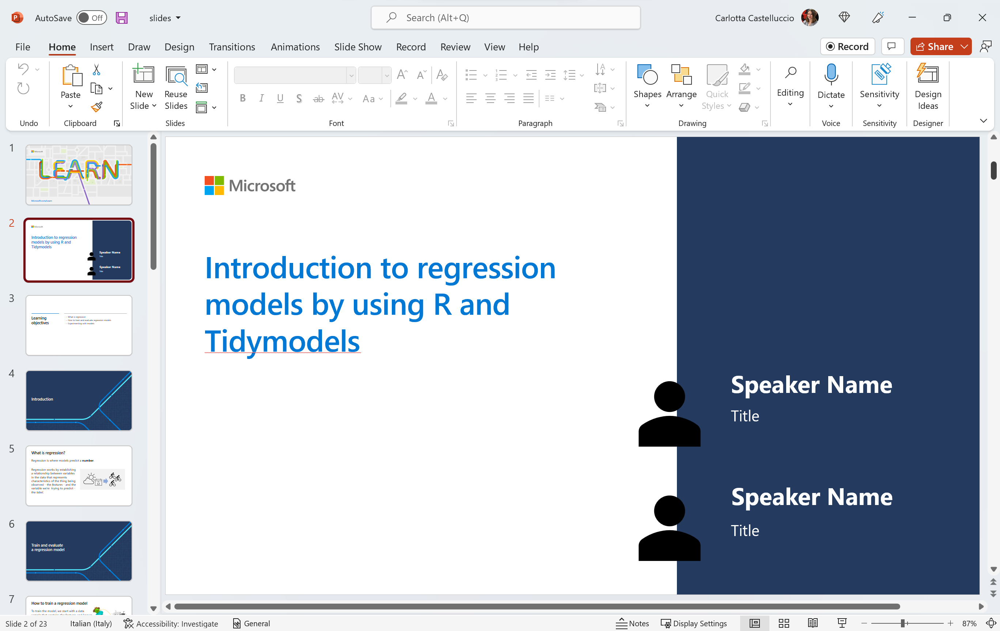

# Introduction to regression models by using R and Tidymodels

## Module Source
[Introduction to regression models by using R and tidymodels](https://docs.microsoft.com/en-us/learn/modules/introduction-regression-models/?WT.mc_id=academic-59300-cacaste)

## Goals

Hello and welcome to this learning adventure! In this folder, you will find a Regression Challenge Notebook. This is basically an autograding guided assessment notebook that will help you test your understanding in using R to create models that can predict a numeric, quantifiable value, such as a price, amount, size, or other scalar numbers.

| **Goal**                      | Description                                    |
| ----------------------------- | -----------------------------------------------|
| **What will you learn**       | How to create regression models in R           |
| **What you'll need**          | [Visual Studio Code](https://code.visualstudio.com?WT.mc_id=academic-59300-cacaste), [Docker Desktop](https://www.docker.com/products/docker-desktop), [Remote Developer Extension](https://aka.ms/vscode-remote/download/extension) and [Git](https://git-scm.com/downloads) |
| **Duration**                  | 1.5 to 2 Hours                                         |
| **Slides**                    | [Powerpoint](./slides.pptx)                               |

## Video

> 🎥 Click this image to watch Carlotta walk you through the workshop material and to gain some tips about delivering this workshop.

## Pre-Learning

This workshop allows learners to use the skills learnt in the module [Introduction to regression models by using R and tidymodels](https://docs.microsoft.com/en-us/learn/modules/introduction-regression-models/?WT.mc_id=academic-59300-cacaste) to create their own regression models. As such, learners are encouraged to go through the module beforehand so as to be conversant with some of the concepts covered in this workshop.
This workshop is the second of a series designed to get started with data science in R. So you may also want to have a look to the [first](../explore-analyze-data-with-R) workshop of the series, dealing with exploratory data analysis.

## Prerequisites

To get you up and running and writing R code in no time, we have containerized this workshop such that you have a ready out of the box R coding environment.

### Setting up the development container

A **development container** is a running [Docker](https://www.docker.com) container with a well-defined tool/runtime stack and its prerequisites. You can try out development containers with **[GitHub Codespaces](https://github.com/features/codespaces)**, **[Binder](https://mybinder.org/)** or **[Visual Studio Code Remote - Containers](https://aka.ms/vscode-remote/containers)**.

#### GitHub Codespaces
Follow these steps to open this workshop in a Codespace:
1. Click the Code drop-down menu and select the **Open with Codespaces** option.
2. Select **+ New codespace** at the bottom on the pane.

For more info, check out the [GitHub documentation](https://docs.github.com/en/free-pro-team@latest/github/developing-online-with-codespaces/creating-a-codespace#creating-a-codespace?WT.mc_id=academic-59300-cacaste).

#### Binder
This workshop is also available on Binder. To open the notebook in a Binder environment, just click the button below.

#### Learn Sandbox
You can go through this challenge also leveraging on the Learn Sandbox environment, provided by [Unit 9](https://docs.microsoft.com/en-us/learn/modules/introduction-regression-models/9-challenge-regression?WT.mc_id=academic-59300-cacaste) of the MS Learn module - Introduction to regression models by using R and tidymodels. Just sign in with your Microsoft or GitHub account and click on **Activate sandbox** to start.

#### VS Code Remote - Containers
Follow these steps to open this workshop in a container using the VS Code Remote - Containers extension:

1. If this is your first time using a development container, please ensure your system meets the pre-reqs (i.e. have Docker installed) in the [getting started steps](https://aka.ms/vscode-remote/containers/getting-started).

2. Press <kbd>F1</kbd> select and **Add Development Container Configuration Files...** command for **Remote-Containers** or **Codespaces**.

   > **Note:** If needed, you can drag-and-drop the `.devcontainer` folder from this sub-folder in a locally cloned copy of this repository into the VS Code file explorer instead of using the command.

3. Select this definition. You may also need to select **Show All Definitions...** for it to appear.

4. Finally, press <kbd>F1</kbd> and run **Remote-Containers: Reopen Folder in Container** to start using the definition.

This definition includes some test code that will help you verify it is working as expected on your system. Open the `all-systems-check` folder where you can choose to run the `.R`, `.Rmd` or `.ipynb` scripts. You should see "Hello, remote world!" in an R terminal window (for `.R` and `.Rmd`) or within a Jupyter Notebook (for `.ipynb`) after the respective script executes.

At some point, you may want to make changes to your container, such as installing a new package. You'll need to rebuild your container for your changes to take effect.

## What you will learn

Let's say we are a real estate agent and we've just been handed a couple of new houses at different locations of a city. We don't know the selling price, and we want to get an estimate of it by comparing it with that of other houses in the location.

In this challenge, you will use a dataset of real estate sales transactions to predict the price-per-unit of a property based on features such as the property age, availability of local amenities, and location.

## Milestone 1: Explore the Data 🕵️‍️

The first step in any machine learning project is typically to explore the data that you will use to train a model. The goal of this exploration is to try to understand the relationships between its attributes; in particular, any apparent correlation between the features and the label your model will try to predict.

In this section you will:

- Import the data and identify the `features` (predictors) and `label` (outcome) variables that you'll be working with.

- Examine the summary statistics and plot the distribution of the outcome variable, in our case: price of a house.

- Deal with outliers.

- Examine the apparent relationship between numeric features and the price of a house using the correlation statistic and scatter plots.

- Examine the distribution of the house price for each categorical feature using boxplots.

Now that you've explored the data, it's time to use it to train a regression model that uses the features we've identified as potentially predictive to predict the rentals label.

## Milestone 2: Data budgeting

 It’s common practice in supervised learning to split the data into two subsets; a (typically larger) set with which to train the model, and a smaller “hold-back” set with which to validate the trained model. This enables us to evaluate how well the model performs in order to get a better estimate of how your models will perform on new data.

In this section you will:

- Create a data splitting specification i.e what proportion goes to training and what goes to testing.

- Extract the training and testing sets.

## Milestone 3: Create a Random Forest model specification

In this section, you will create a model specification with the following information:

- the `type` of model is `random forest`

- the `mode` of the model is `regression` (as opposed to classification, etc)

- the computational `engine` is the name of the R package, which in our case will be the `randomForest` package.

## Milestone 4: Preprocess data using recipes

A recipe is an object that defines a series of steps for data processing. In practice, it's common to perform some preprocessing of the data to make it easier for an algorithm to fit a model to it.

In this section, you will specify a recipe that will:

- Remove the transaction_date feature.

- Transform local_convenience_stores feature into categorical (factor).

- Center and scale all numeric predictors.

## Milestone 5: Create a modeling workflow and train a model

A model workflow allows the user to bind modeling and preprocessing objects together. You can then fit the entire workflow to the data, so that the model encapsulates all of the preprocessing steps as well as the algorithm.

In this section you will:

- Create a model workflow.

- Train the random forest model.

## Milestone 6: Evaluate model performance

Once you have a trained model using the training set, you will want to evaluate how well (or not) it will perform on new data.

In this section, you will:

- Use the trained model to make predictions on the `test set`.

- Evaluate the model predictions using metrics such as `rmse` and `R^2`.

## Milestone 7: Use the trained model

If you are satisfied with the model performance, you can save it to be used later. You can then load it whenever you need it, and use it to predict labels for new data. This is often called scoring or inferencing.

In this section you will:

- Save your trained model, and then use it to predict the price-per-unit for the following real estate transactions:

 | **transaction_date** | **house_age** | **transit_distance** | **local_convenience_stores** | **latitude** | **longitude** |
|---------------------|----------------|--------------|--------|-------|------|
| 2013.167             | 16.2          | 289.3248             | 5                            | 24.98203     | 121.54348     |
| 2013.000             | 13.6          | 4082.015             | 0                            | 24.94155     | 121.50381     |

## Quiz

Test your knowledge with [a short quiz](https://docs.microsoft.com/en-us/learn/modules/introduction-regression-models/8-knowledge-check?WT.mc_id=academic-59300-cacaste)!

## Next steps

Congratulations on finishing this regression challenge 🏅!

There are other workshops around using R for Data Science. In this workshop, we learnt how regression can be used to create a machine learning model that predicts numeric values. The next set of workshops show you how to [create classification models](../intro-classification-R-tidymodels) and create clustering models (coming soon!). Be sure to check them out!

## Practice

In this workshop, you trained a single model (random forest) to predict house prices based on their features. Sometimes, a data practitioner may need to try out a couple of models. Try using other models discussed in this workshop. Try tuning some model hyperparameters while at it too. Do you obtain better evaluation metrics?

## Feedback

Be sure to give [feedback about this workshop](https://forms.office.com/r/MdhJWMZthR)! Happy Learning!

[Code of Conduct](../../CODE_OF_CONDUCT.md)
