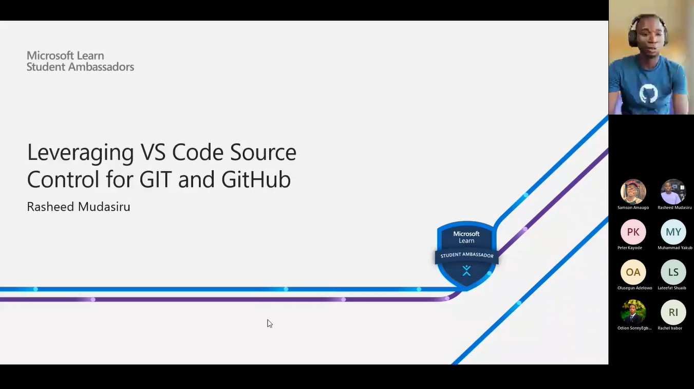

# Leveraging VS Code Source Control for GIT and GitHub

## Module Source

This workshop is based on the [Work with source control using Git in Visual Studio Code](https://docs.microsoft.com/en-us/learn/modules/work-source-control-git/)

## Goals

In this workshop, you will learn how to leverage VS Code source control tab to perform all tasks that can be done using git commands.

| **Goal**                                          | **Description**                                                                                                       |
| ------------------------------------------------- | --------------------------------------------------------------------------------------------------------------------- |
| **What will you learn**                           | Students will be skilled at creating using VS Code Source Control to create, rename, switch and merge branches, add, commit, and even publish to GitHub                                                          |
| **What you'll need**                              | [Visual Studio Code](https://code.visualstudio.com?WT.mc_id=academic-56602-chrhar) and [Git](https://git-scm.com/) |                                           |
| **Slides**                                        | [Powerpoint](./slides.pptx)                                                                                             |

## Video walk-through

## Prerequisites

- Software
  - [Visual Studio Code](https://code.visualstudio.com?WT.mc_id=academic-56602-chrhar)
  - [Git](https://git-scm.com/)

## What students will learn

- Understands VS Code Interface
- Perform basic Git tasks
   -  Initialize
   - Branch actions
   - Stages
   - Remote

### Introducing VS Code

You will start by exploring the VS code [Getting Started in Visual Studio ](https://docs.microsoft.com/en-us/learn/modules/develop-web-apps-with-vs-code/).

### Create a working directory/folder

Open the folder in VS Code

### Create New file and add content

Add files to be tracked in the working directory and click the source control tab to initialize git

### Initialize Git

This will create a .git folder in your working direcory which gives git to track everything in the directory. This is done once for a single project

### Add Commit and Publish to the GitHub

After initializizing git, and still on the source control tab will gives access to plus button to stage the files added before and after adding it by pressing the buttons. Can be committed by adding commit message and press a mark like button to commit it and another button to publish will come up to publish to either private or public repository on GitHub

## Quiz or Code Challenge

[Knowledge check](https://docs.microsoft.com/en-us/learn/modules/work-source-control-git/12-check)

## Next steps

[VS Code official documentation on source control feature](https://code.visualstudio.com/Docs/editor/versioncontrol)
[A quick start created for everyone](https://taiwrash.github.io/g4-workshop/beginner-intermediate/4-git-in-vscode.html)
[VS Code Source Control Basics Video](https://youtu.be/i_23KUAEtUM)

## Feedback

Be sure to give [feedback about this workshop](https://forms.office.com/r/MdhJWMZthR)!

[Code of Conduct](../../CODE_OF_CONDUCT.md)
