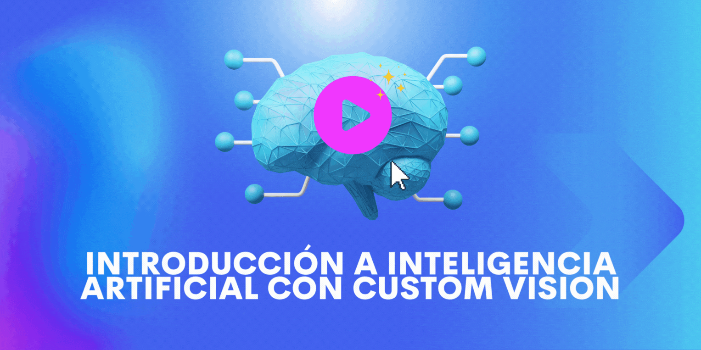

# Construye un Modelo De Aprendizaje Automático usando Azure Custom Vision.  

## Descripción

Azure [Custom Vision](https://docs.microsoft.com/azure/cognitive-services/custom-vision-service/?WT.mc_id=academic-49102-chrhar) le permite crear modelos que pueden clasificar y detectar objetos en imágenes. Puede usar esto para detectar una raza de perro, si alguien está usando un casco, o alguna otra característica de interés. Si bien, esto se puede hacer mediante el uso de código y procesamiento manual de las imágenes, Custom Vision proporciona una interfaz y herramientas basadas en web que agilizan el proceso. ¡No se requieren conocimientos previos de aprendizaje automático o matemáticas! 

En el transcurso de este taller construirá un modelo para detectar razas de perros. Comenzará instalando y configurando las herramientas necesarias, luego creará un modelo personalizado subiendo y etiquetando imágenes, y finalmente usará el modelo con un kit de desarrollo de software (SDK). 

| **Meta del proyecto**              | Obtenga información sobre Custom Vision AI y sobre cómo usarlo para entrenar y probar imágenes.                                    |
| ----------------------------- | --------------------------------------------------------------------- |
| **¿Qué aprenderás?**       |El uso de imágenes para entrenar un modelo capaz de realizar inferencias para clasificar imágenes. |
| **¿Qué necesitarás?**          | Python 3.8+, Visual Studio Code, Git |
| **Duración**                  | 1 hora                                                                |
| **¿Quieres ver el resultado?** | [Solución](./solucion/)                         |
| **Slides** | [Powerpoint](./slides_ES.pptx)
| **Autor** | [Christopher Harrison](https://geektrainer.dev)

## Video Tutorial
🎥 Haz click en la imagen para ver a Christopher explicar paso a paso el taller. 
[](https://youtu.be/YWTDxcHAfkA "workshop walk-through")

## Lo que vas a construir con CustomVision.ai


## Prerrequisitos

### Git

Este taller asume que cuentas con un conocimiento básico de Git, específicamente la capacidad de clonar un repositorio. Durante el taller descargaras el código de GitHub y también necesitarás [Git](https://git-scm.com/) para clonar el repositorio. 


### Python 3.8 o superior, incluyendo pip

Construirás un proyecto usando Python. Por lo cual, se asume que cuentas con conocimiento básico de Python, específicamente la habilidad de importar paquetes y utilizar `open` y `with`. También necesitaras tener Python instalado localmente. Para probar sí ya cuentas con Python y pip instalados, abre la ventana de comandos o terminal y ejecuta los siguientes comandos.  

```bash
python3 --version
pip3 --version
```
Si Python y pip están instalados se mostrará un número de versión, cómo *3.8.10*. De lo contrario, se mostrará un mensaje de error. Puede instalar Python y pip según sea necesario: 

- [Windows](https://docs.microsoft.com/windows/python/beginners?WT.mc_id=academic-49102-chrhar#install-python)
- [MacOS](https://www.python.org/downloads/macos/)
- [Linux](https://packaging.python.org/guides/installing-using-linux-tools/)

### Visual Studio Code

Para realizar este taller necesitaras [Visual Studio Code](https://code.visualstudio.com?WT.mc_id=academic-49102-chrhar), un editor de código abierto. También necesitarás la [extensión Pylance](https://marketplace.visualstudio.com/items?itemName=ms-python.vscode-pylance&WT.mc_id=academic-49102-chrhar), la cual proporciona funcionalidad adicional al escribir en Python. 

## El taller

- [Parte 0: Instalar y configurar herramientas](./setup-es.md)
- [Parte 1: Entrenar tu modelo](./train-es.md)
- [Parte 2: Probar tu modelo](./predict-es.md)


## Agradecimientos ❤️ 

¡Muchísimas gracias a [Nicolas Chávez](https://www.linkedin.com/in/nicolaschavezc/) @NikoMagafi por haber traducido todo este contenido a español! ❤️ 🚀 ✨  

## Feedback

Asegúrate de dejar tu [feedback acerca de este taller](https://forms.office.com/r/MdhJWMZthR)!

## [Código de Conducta](../../../../CODE_OF_CONDUCT.md)
