# Integrating Custom Vision with Power Apps for Diabetic Retinopathy Detection

## Module Source Link
https://docs.microsoft.com/learn/modules/classify-images-custom-vision/

https://docs.microsoft.com/learn/modules/customize-apps-in-powerapps/

## Goals

In this workshop, we will discuss how to build a no-code app with Custom Vision to classify images 

| **Goal**              |                     Description           |
| ----------------------------- | --------------------------------------------------------------------- |
| **What will you learn**       | How to build an app with Power Apps and integrate Custom Vision to classify images                                        |
| **What you'll need**          | [Custom Vision](https://www.customvision.ai/), [Power App]( https://make.powerapps.com)|
| **Duration**                  | 1 hour                                                                |
| **Just want to try the app or see the solution?** | [DR Detection App](https://apps.powerapps.com/play/7df60516-60d8-4627-bccb-f96169f86d76?tenantId=84c31ca0-ac3b-4eae-ad11-519d80233e6f&source=portal&screenColor=RGBA(0%2C176%2C240%2C1))                      |
| **Slides** | [Powerpoint](slides.pptx) 
| **Author**                  | [Jingyi Zhu](https://github.com/viviana2419), [Sanya Sinha](https://github.com/ssanya942)                                                                |
                         
## Video

[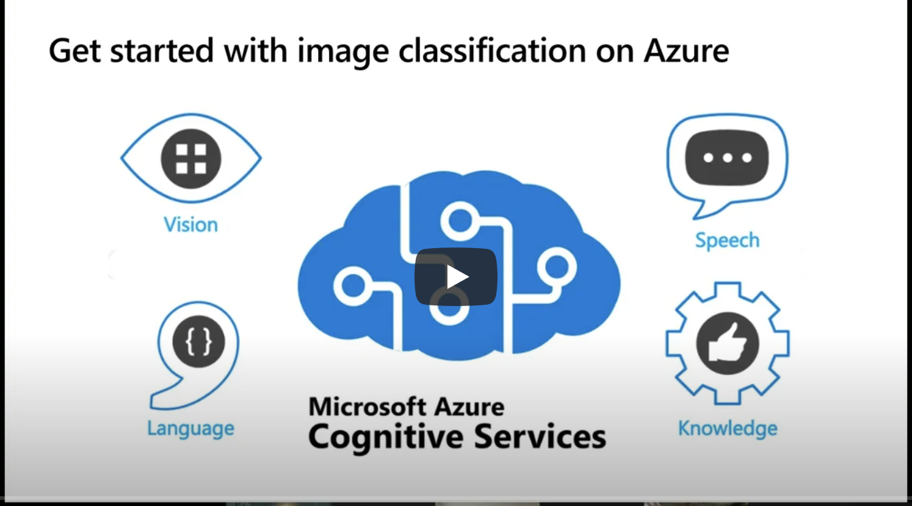](https://youtu.be/YctfdD8ycQY "workshop walk-through")
> 🎥 Click this image to watch Jingyi and Sanya walk you through the workshop

## Pre-Learning

[Get started with Computer Vision](https://docs.microsoft.com/learn/modules/analyze-images-computer-vision/)

[Get started with Power App](https://docs.microsoft.com/learn/modules/get-started-with-powerapps/)

## Prerequisites

1. You'll need to have an [Azure Account](https://azure-for-academics.github.io/getting-azure/) for Custom Vision Service. You may get free credits from [Azure for Students](https://azure.microsoft.com/free/students/), or [Azure Free Trial](https://azure.microsoft.com/free/).

    Learn more about creating an Azure Account at [Microsoft Learn](https://docs.microsoft.com/learn/modules/create-an-azure-account/)

2. Moreover, If you haven’t already, [sign up for free](https://powerapps.microsoft.com/) at PowerApps.com with a work or school account. Once you’ve signed up, you’ll be able to [sign in](https://web.powerapps.com/) to PowerApps on the web. 

    Learn more about [joining Microsoft Developer program](https://developer.microsoft.com/en-us/microsoft-365/dev-program) and [creating a PowerApp Account](https://techcommunity.microsoft.com/t5/educator-developer-blog/getting-started-with-a-power-apps-community-developer-account/ba-p/2693859) 

## What students will learn

In this project, you will build an app that detect Diabetic Retinopathy  

You will be able to...
  1. Draw automatic & accurate detection insights from datasets
  2. Use the Custom Vision service to create an image classification solution
  3. Customize a Power app by adding controls, images, and logic.
  
What is Diabetic Retinopathy?
  A diabetes complication that affects eyes, which might cause no symptoms or only mild vision problems at first. But it can lead to blindness. Careful management of diabetes is the best way to prevent vision loss. Patient should see an eye doctor for a yearly eye exam with dilation — even if the vision seems fine.

## Milestone 1 - Custom Vision project build up

In Azure, you can use the Custom Vision cognitive service to train an image classification model based on existing images. There are two elements to creating an image classification solution. First, you must train a model to recognize different classes using existing images. Then, when the model is trained you must publish it as a service that can be consumed by applications.

1. Let's begin by getting the dataset of diabetic retinopathy images

    https://www.kaggle.com/linchundan/fundusimage1000

    https://www5.cs.fau.de/fileadmin/research/datasets/fundus-images/healthy.zip
    
    You are free to amalgamate both these datasets to strengthen the robustness of your model. 

2. Open the Azure portal at https://portal.azure.com/. If prompted, sign in using the Microsoft account associated with your Azure subscription and agree to the terms of service
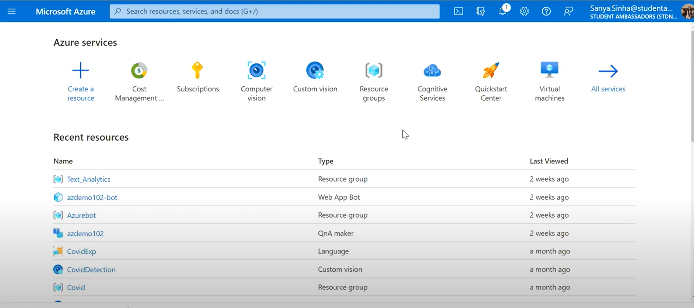

3. Click the Custom Vision section, then you'll enter this page:
  

    * Let's create a new project with the following settings:

      Create options: Both

      Project Details: 
      
          Subscription: Visual Studio Enterprise Subscription 
          
          Resource group: DRDEMO 

      Instance Details:
      
          Region: the one closest to you

          Name: DRDEMO101
      
      Training and Prediction Resource:
      
          Pricing tier: Standard
          
    Click 'Review+create'. Once your resource is validated, hit 'Create'.   You will now have the resource group available
    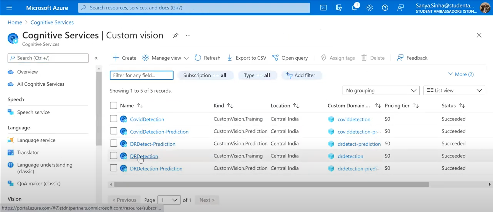

      
4. Next, login to the [Custom Vision portal](https://www.customvision.ai/), create a new project with the following settings:

   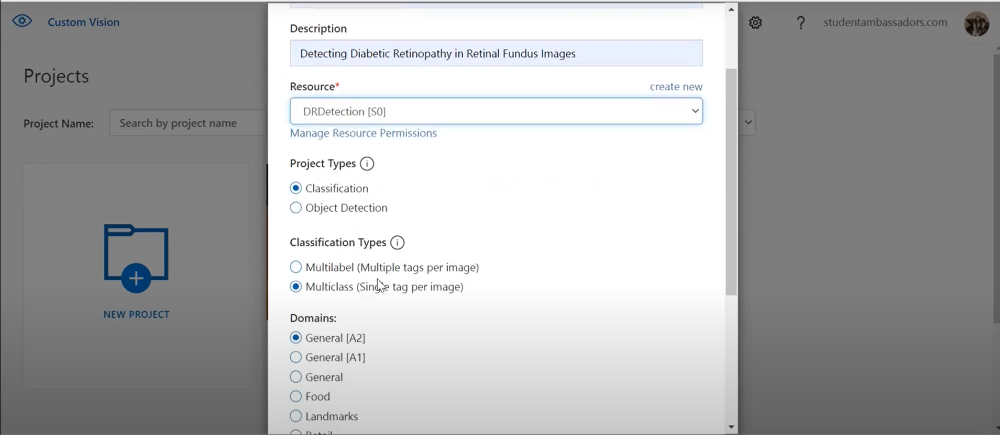

          Name: Diabetic Retinopathy detection 

          Description: Image classification for Diabetic Retinopathy

          Resource: The resource you created previously

          Project Types: Classification

          Classification Types: Multiclass (single tag per image)

          Domains: General[A2]
   Then, click 'Create Project'

5. You will enter the User Interface of Custom Vision like the one below. Click [+] Add images, and select all of the files in the positive image folder you extracted previously. Then upload the image files, specifying the tag positive
   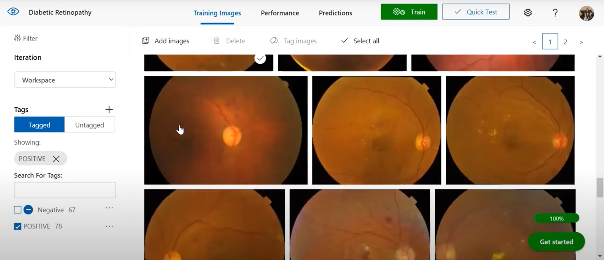

6. Repeat the previous step to upload the images in the negative folder with the tag negative

7. In the Custom Vision project, above the images, click Train to train a classification model using the tagged images. Select the Quick Training option, and then wait for the training iteration to complete (this may take a minute or so).

8. When the model iteration has been trained, review the Precision, Recall, and AP performance metrics - these measure the prediction accuracy of the classification model, and should all be high.

   * Precision indicates the fraction of identified classifications that were correct. For example, if the model identified 100 images as dogs, and 99 of them were actually of dogs, then the precision would be 99%.
   * Recall indicates the fraction of actual classifications that were correctly identified. For example, if there were actually 100 images of apples, and the model identified 80 as apples, the recall would be 80%.
   * Mean average precision is the average value of the average precision (AP). AP is the area under the precision/recall curve (precision plotted against recall for each prediction made).

## Milestone 2 - Test the model & Generate Custom Vision link

Before publishing this iteration of the model for applications to use, you should test it.

1. Above the performance metrics, click 'Quick Test'. View the predictions returned by your model - the probability score should be around 90%
2. In the Quick Test window, select in the Submit Image field and enter the URL of the image you want to use for your test. If you want to use a locally stored image instead, select the Browse local files button and select a local image file.
3. The image you select appears in the middle of the page. Then the prediction results appear below the image in the form of a table with two columns, labeled Tags and Confidence. After you view the results, you may close the Quick Test window.
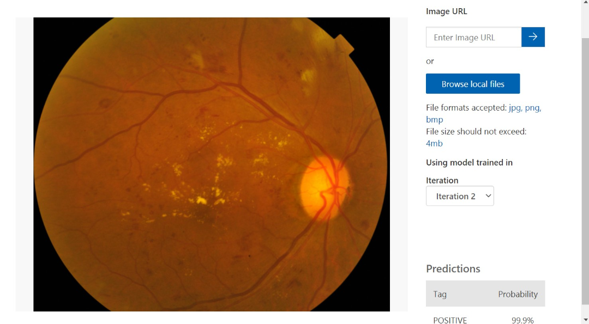

Now you're ready to publish your trained model and use it from a client application!

Click Publish to publish the trained model with the following settings:

        Model name: Diabetic Retinopathy detection 

        Prediction Resource: The prediction resource you created previously.

After publishing, click the Prediction URL icon to see information required to use the published model. Later, you will need the appropriate URL and Prediction-Key values to get a prediction from an Image URL, so keep this dialog box open and carry on to the next task.

## Milestone 3 - Link Custom Vision model and Power App

Go to https://make.powerapps.com and sign in with your organizational account.

The following figure shows the main development window when you enter Power Apps Studio:

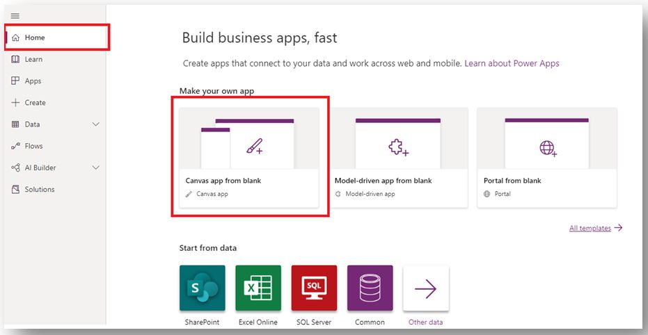

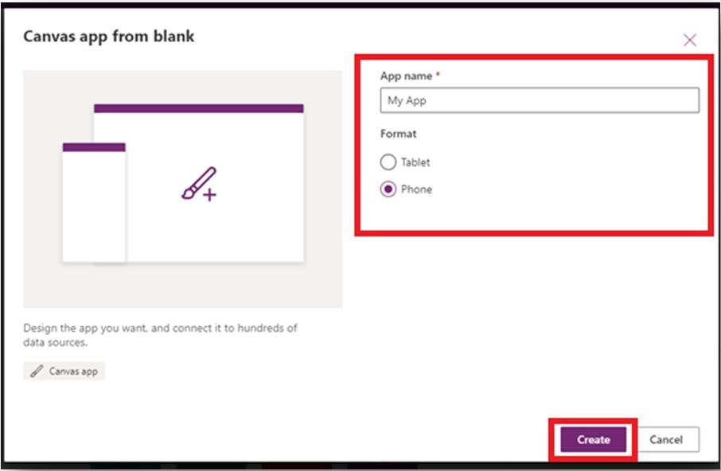

Now we will have a look at the steps to connecting our application to Custom Vision

1. We need to connect to Custom Vision by going Data source→(search Custom Vision) → Select Custom Vision → Choose a table/entity.
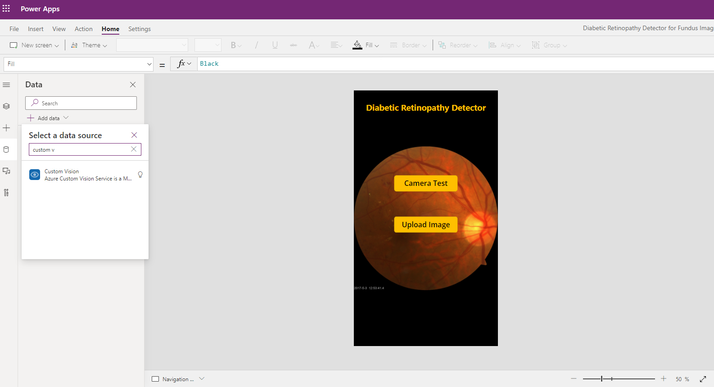
2. Then you will be asked to enter the Prediction Key and Site URL. We'll go back to Custom Vision Performance tab and find the Prediction Key like the image below (We covered the specific keys to avoid cost of reusing resources)
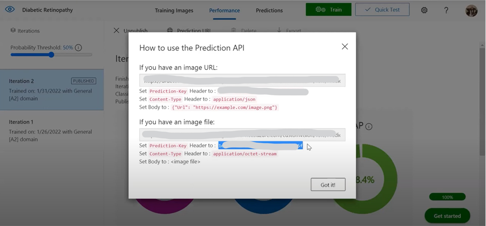

We'll use only a portion of the image file URL like the image below
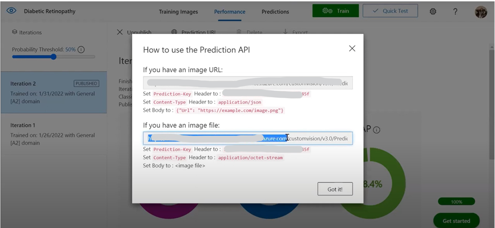

Click 'Connect' then your Custom Vision data resource will appear in your left pane!

## Milestone 4 - Layout of Power App
Now, we'll create the 'CameraTestScreen'
 * First, add the 'Camera' feature for detection functionality on phone or tablet
 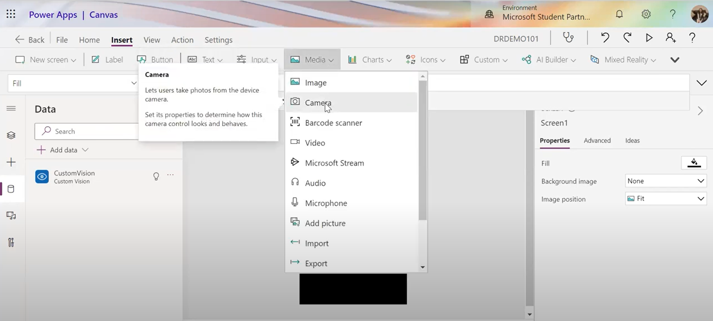
 * Then, add one button 'Scan'. Its OnSelect function should be similar as below as we are using the [ClearCollect](https://docs.microsoft.com/en-us/powerapps/maker/canvas-apps/functions/function-clear-collect-clearcollect), and we are naming it as camercol 
 
 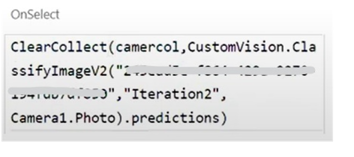
 * Next, let's insert a gallery to show the scanning process, 
 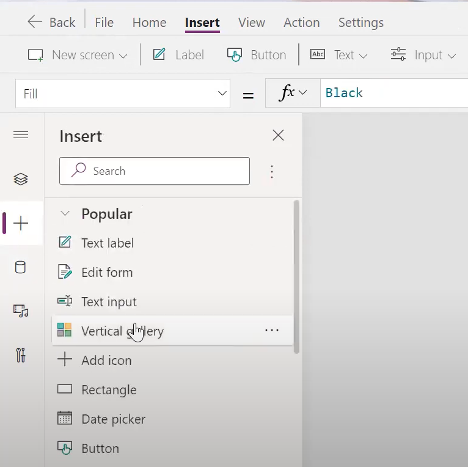
   * When prompted, choose camercol as the resource group
   * In properties, choose Layout as 'title and subtitle', and font color as yellow or as you like
   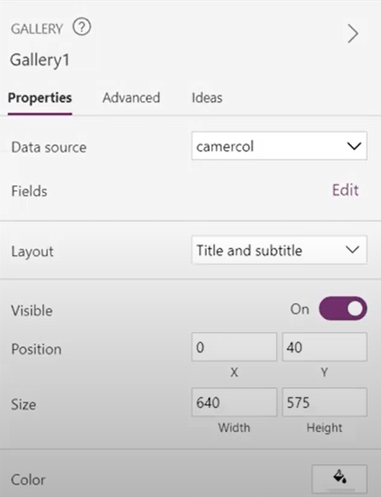
   * Then, Click 'Title2' in the left pane. Modify its function as ThisItem.tagName and change font color as yellow or as you like
   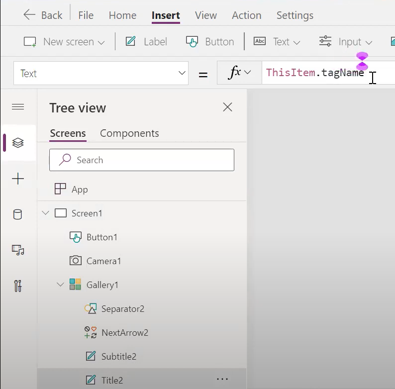
   * Moving on to 'Subtitle2' in the left pane, we are going to use it showing the percentage of positive or negative detection result. Modify its function as Round(ThisItem.probability*100,2)&"%" and change font color as yellow or as you like
   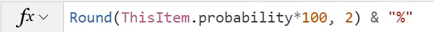
 * Lastly, rename the screen name as 'CameraTestScreen'. 

The second screen is 'GalleryTestScreen', which looks like this 
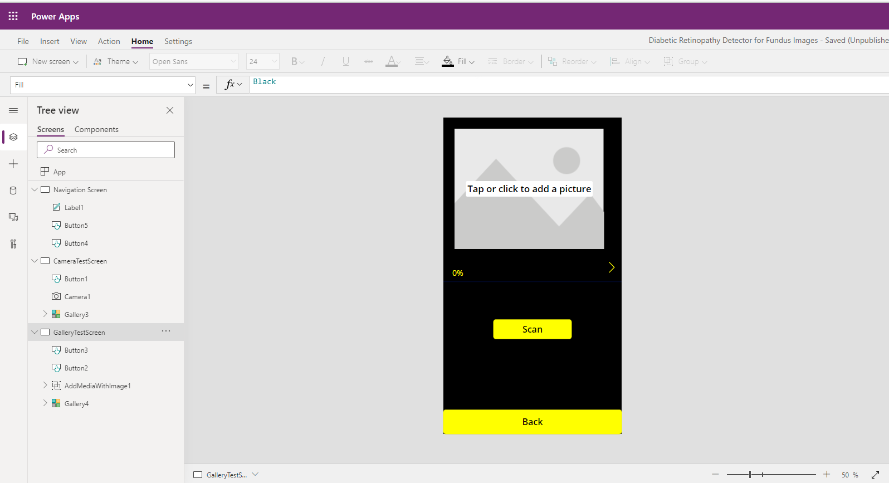
 * First, let's add the 'add picture' function
 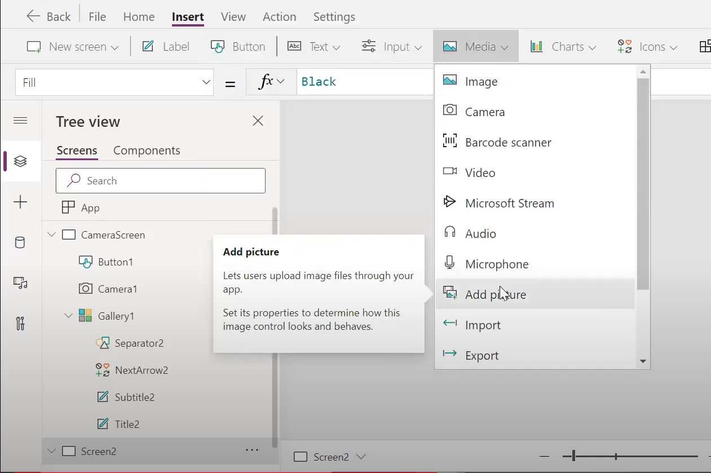
  It should generate the box like below
   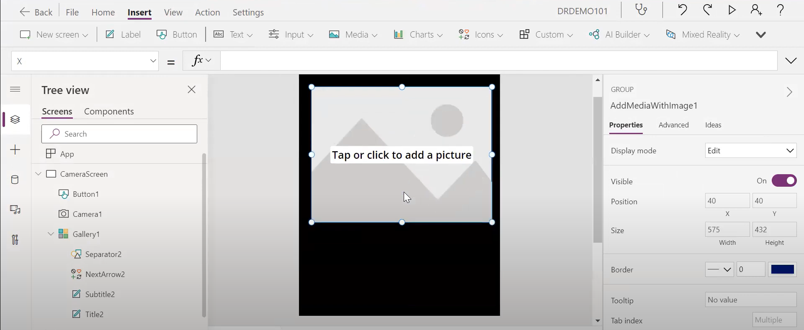
   
 * Then, add one button 'Scan'. Its OnSelect function should be similar as below, and we are naming it as gallerycol   
 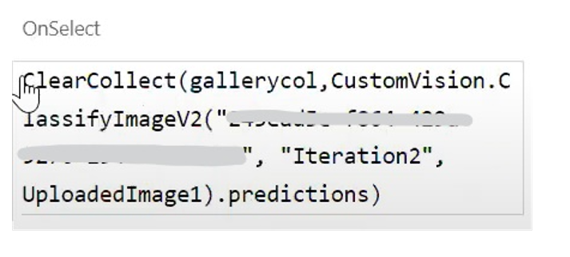
 * Next, let's insert a gallery, similar process as we add it in the first camera screen
 * You can test out the the detection process using the preview!
 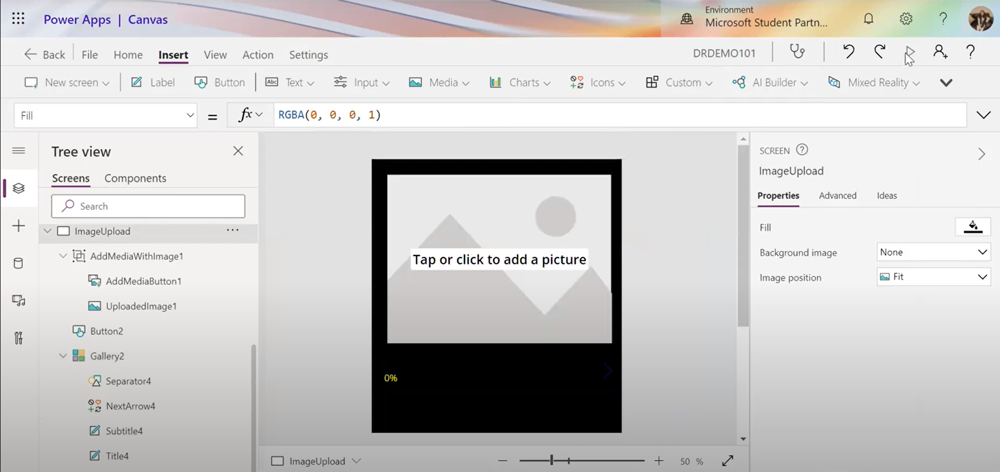

Moving forward, we'll build up the navigation screen when you enter the app. 

 * Let's change the background to 'Black' and add the background image
 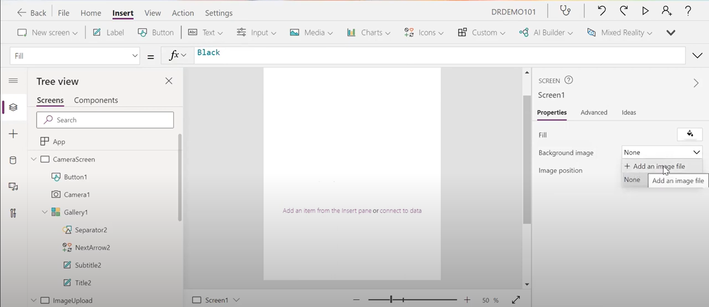
 * There'll be a label of our app at the top, refer as "Diabetic Retinopathy Detector", or any name you prefer
 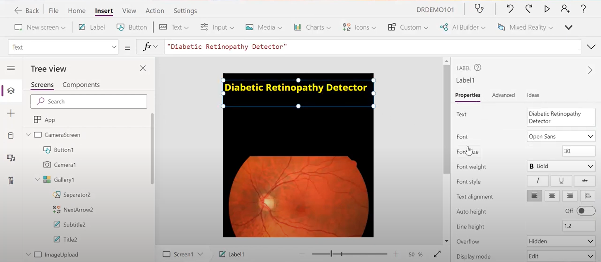
 * Add two buttons, one 'Camera Test', another 'Upload Image', modify the OnSelect function to navigate the clicking action
 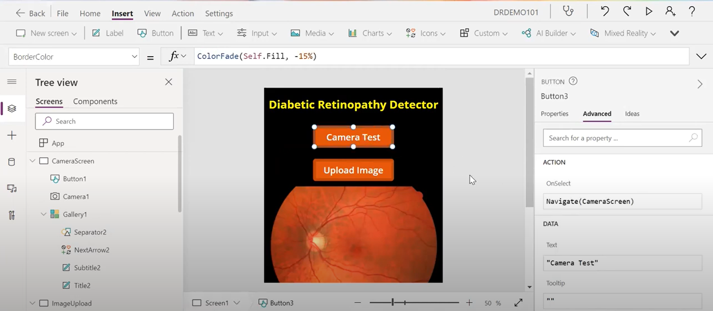

 * Finally, add one button 'Back' in the camera and gallery screen to navigate back to the main screen
   * input function: Navigate('Navigation Screen')
   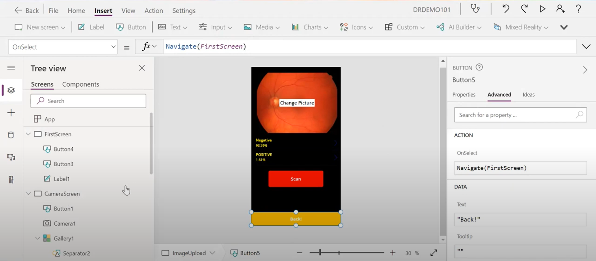

After performing all the above steps, you get a Power Apps with screens and functions which will look like the image below. 
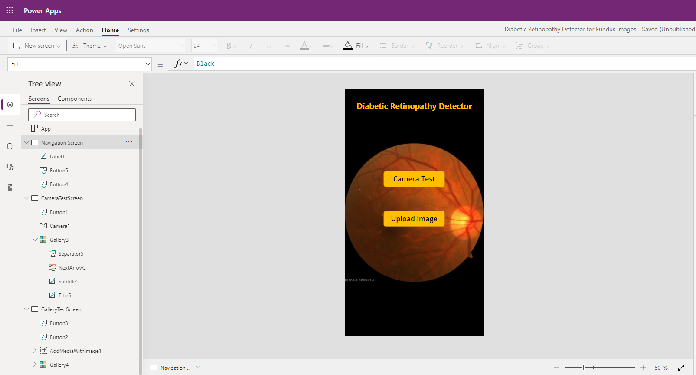

The app can run on mobile, install the Power Apps Mobile app on your phone. When building an app, you should test it in the same form factor as your users!

## Milestone 5 - App accuracy test with new inputs

Now that your app is built, the next step is to start testing it.

Unit test
* A unit test is used to check whether a specific function or feature of your app is working correctly.
* let's start from refering back to the Planning phase and Designing phase sections to make sure you test all the important scenarios. Make sure you break the tests down to each feature or function. 
* For testing inside canvas apps, you can use a built-in tool named Power Apps Test Studio to write, organize, and automate tests for canvas apps. More info: https://docs.microsoft.com/powerapps/maker/canvas-apps/test-studio

End-to-end test
* End-to-end tests are used to check whether the overall solution runs correctly. 
* You can conduct this test by following a test scenario that's close to the use case of the actual business process.

User acceptance test (Optional)
* A user acceptance test (UAT) is done by the user of the app instead of the maker. This test is to ensure that what has been built by the makers matches the requirements initially requested by the user.
* Test your app with families, friends and others with diversity in terms of IT skill levels. This way, you can get a variety of feedback.
* You can quickly review issues and see recommended fixes with [solution checker](https://docs.microsoft.com/powerapps/maker/data-platform/use-powerapps-checker)

Congratulations! You made your first app, and it's tested and ready to go! Now you can [publish](https://docs.microsoft.com/powerapps/maker/canvas-apps/save-publish-app) and [share](https://docs.microsoft.com/powerapps/maker/canvas-apps/share-app) your canvas app!

## Knowledge check

https://docs.microsoft.com/learn/modules/classify-images-custom-vision/3a-knowledge-check

https://docs.microsoft.com/learn/modules/get-started-with-powerapps/6-powerapps-quiz-get-started

## Next steps

[Learning more about Custom Vision](https://docs.microsoft.com/learn/paths/explore-computer-vision-microsoft-azure/)

[Learning more about Canvas App creation](https://docs.microsoft.com/learn/paths/create-powerapps/)

[Azure Health bot by using built-in or custom scenarios](https://docs.microsoft.com/learn/paths/create-bots-azure-health-bot/)

[AI business school for healthcare](https://docs.microsoft.com/learn/paths/ai-business-school-healthcare)

The Value of Computer Vision in Healthcare Panel in [this video](https://www.youtube.com/watch?v=dbISoN71rrY)

## Practice your skills

You can modify your app to analyze images, including generating a descriptive caption, extracting relevant tags, identifying objects, determining image type and metadata, detecting human faces, known brands, and celebrities, and others. You can find out more about using the Computer Vision service in the [service documentation](https://docs.microsoft.com/azure/cognitive-services/computer-vision/).

With Power Apps, you can:

Build an app quickly by using the skills that you already have.

Connect to the cloud services and data sources that you're already using.

Share your apps instantly so that coworkers can use them on their phones and tablets.

## Feedback

Be sure to give [feedback about this workshop](https://forms.office.com/r/MdhJWMZthR)!

[Code of Conduct](../../CODE_OF_CONDUCT.md)

