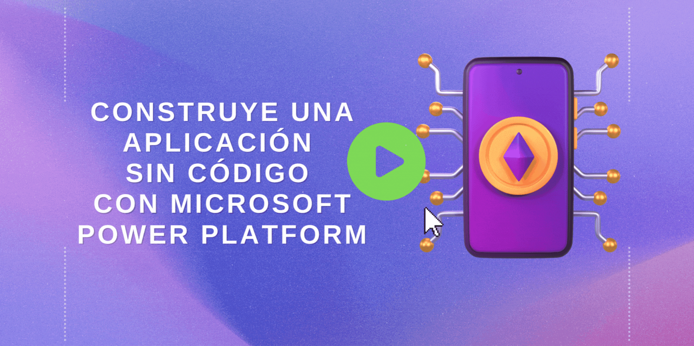

# Construye una aplicación sin código con Microsoft Power Platform

¿Te gustaría construir una aplicación, pero la cantidad de conocimientos en desarrollo requeridos para hacerlo te detiene? Si es así, ¡convierte tus ideas en realidad con la ayuda de Microsoft Power Apps!

## Objetivos

En este taller, abordaremos como construir una aplicación sin código con _low code_ gracias a la plataforma de Power Apps.

| **Objetivo**                                          | Descripción                                                                                                    |
|-----------------------------------------------|---------------------------------------------------------------------------------------------------------|
| **¿Qué aprenderás?**                           | Aprenderás a cómo construir y personalizar una aplicación con Power Apps y aprenderás sobre todos sus elementos|
| **¿Qué vas a necesitar?**                              | [Suscripción M365](https://developer.microsoft.com/es-ES/microsoft-365/dev-program)                                          |
| **Duración**                                      | 1 hora |
| **Presentación**                                        | [Powerpoint](../../slides_es.pptx)                                                                                      |

## Pre-Aprendizaje

- [Introducción a Power Platform](https://developer.microsoft.com/es-ES/microsoft-365/dev-program?WT.mc_id=academic-00000-abrilu)

## Pre-Requisitos

- [Suscripción M365](https://developer.microsoft.com/es-ES/microsoft-365/dev-program?WT.mc_id=academic-00000-abrilu) 

## Recorrido en video
> 🎥 _Clic a la imagen para mirar una guía del taller_

## Resultado del proyecto final

## Pasos a seguir:

 
1. Configura tu ambiente

Asegúrate de tener una suscripción M365, visita el portal [Power Apps studio](https://make.powerapps.com?WT.mc_id=academic-56577-hmitra) e inicia sesión con tu cuenta. 

De no ser así, [crea y configura tu entorno](https://docs.microsoft.com/power-platform/admin/create-environment?WT.mc_id=academic-56577-hmitra).

 
2. Crea la aplicación

Después de configurar el ambiente y acceder a [Power Apps studio](https://make.powerapps.com?WT.mc_id=academic-56577-hmitra), da clic en 'Crear' desde el panel izquierdo.

 
3. Elige tu fuente de datos

Puedes usar algún conjunto de datos de muestra del siguiente [archivo zip](../../data/Contoso-Site-Tracking.zip). Extrae y sube el archivo zip a través de One Drive, seleccionando `One Drive para empresas` como fuente de datos.

 
4. Explorando los diferentes elementos

Para agregar más detalles a la aplicación, explora los diferentes [elementos](https://docs.microsoft.com/learn/modules/build-app-solution/2-learn-basic-elements?WT.mc_id=academic-56577-hmitra) y servicios.

 
5. Agrega la lógica

Agrega lógica a tu aplicación usando [funciones](https://docs.microsoft.com/learn/modules/build-app-solution/4-get-started-functions-power-apps?WT.mc_id=academic-56577-hmitra).

 
6. Comparte tu aplicación

¡Es tiempo de compartirla! Puedes publicar tu aplicación para la organización desde [Power Apps](https://docs.microsoft.com/learn/modules/build-app-solution/5-share-app?WT.mc_id=academic-56577-hmitra).

 

## Siguientes pasos:

Aprende más sobre Power Apps visitando los siguientes enlaces:

- [Navegación en una aplicación de lienzo en Power Apps](https://docs.microsoft.com/learn/modules/navigation-canvas-app/?WT.mc_id=academic-56577-hmitra)

- [Personalización de una aplicación de lienzo en Power Apps](https://docs.microsoft.com/learn/modules/customize-apps-in-powerapps/?WT.mc_id=academic-56577-hmitra)

- [Administración de aplicaciones en Power Apps](https://docs.microsoft.com/learn/modules/manage-apps-in-powerapps/index?WT.mc_id=academic-56577-hmitra)

## Practica

¿Qué más puedes construir con Power Apps? Utiliza tu creatividad y explora esta poderosa plataforma.

## Retroalimentación

Asegúrate de darnos [retroalimentación de este taller](https://forms.office.com/r/MdhJWMZthR) ¡Tu opinión es muy importante!

## Agradecimientos 💖

¡Muchas gracias a [Alejandra Perez](https://www.linkedin.com/in/apcastillo/) @aleepsy por habernos ayudado a traducir todo este contenido a español! 

## Módulo de referencia

[¿Cómo crear una aplicación de lienzo?](https://docs.microsoft.com/learn/modules/build-app-solution/?WT.mc_id=academic-56577-hmitra)

[Código de Conducta](../../CODE_OF_CONDUCT.md)