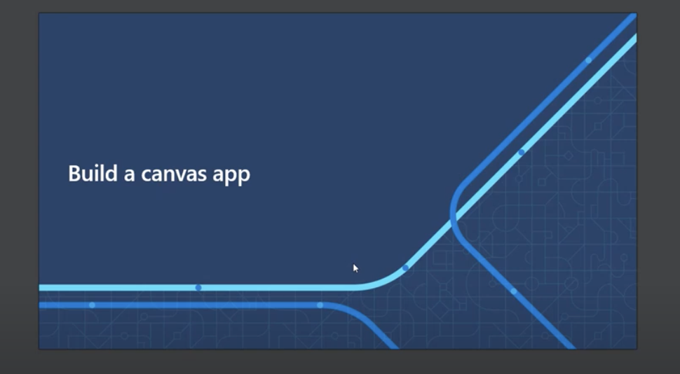
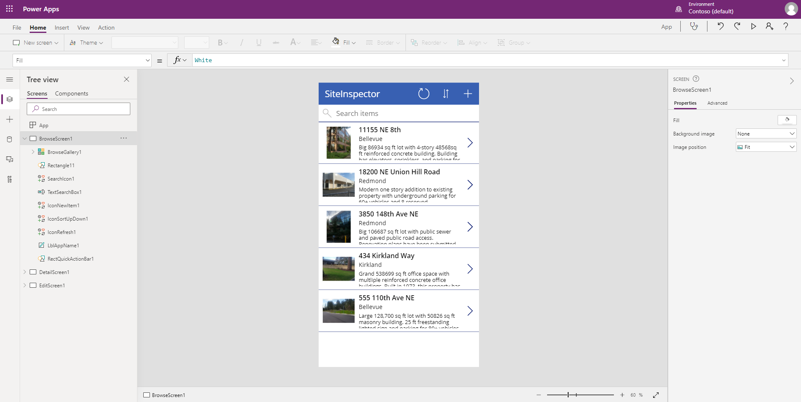

# Crie um aplicativo sem usar nenhum código com o Microsoft Power Platform

## Módulo de Referência

[Como criar um aplicativo de tela](https://docs.microsoft.com/pt-br/learn/modules/build-app-solution/?WT.mc_id=academic-56577-hmitra)

## Objetivos

Neste workshop, discutiremos como criar um aplicativo *no-code* da maneira com *low-code* com o Power Apps.

| **Objetivo**                 | Descrição                                                                                                     |
|------------------------------|---------------------------------------------------------------------------------------------------------------|
| **O que você vai aprender**  | Como criar e personalizar um aplicativo com o Power Apps e conhecer todos os seus elementos                   |
| **Do que você irá precisar** | [Inscrição no M365](https://developer.microsoft.com/microsoft-365/dev-program?WT.mc_id=academic-56577-hmitra) |
| **Duração**                  | 1 hora                                                                                                        |
| **Slides**                   | [Powerpoint](../../slides.pptx)                                                                               |

## Passo a passo em vídeo

> 🎥 Clique nesta imagem para ver Someleze te guiar pelo workshop

## Pré-aprendizagem

- [Introdução à Microsoft Power Platform](https://docs.microsoft.com/pt-br/learn/modules/introduction-power-platform/?WT.mc_id=academic-56577-hmitra)

## Pré-requisitos

- [Inscrição no M365](https://developer.microsoft.com/pt-br/microsoft-365/dev-program?WT.mc_id=academic-56577-hmitra) 

## O que você vai aprender

Você deseja criar um aplicativo, mas a quantidade de conhecimento de desenvolvimento necessária para começar a criar um aplicativo está impedindo você? Em caso afirmativo, transforme suas ideias em realidade com o Microsoft Power Apps.

## Fluxo do workshop

### Configure seu ambiente

Se certificando de que você tenha uma assinatura do M365, visite [Power Apps studio](https://make.powerapps.com?WT.mc_id=academic-56577-hmitra) e entre com sua conta. 

Caso contrário, [configure e prepare um ambiente](https://docs.microsoft.com/pt-br/power-platform/admin/create-environment?WT.mc_id=academic-56577-hmitra).

### Crie a aplicação

Depois de configurar o ambiente e abrir o [Power Apps studio](https://make.powerapps.com?WT.mc_id=academic-56577-hmitra), clique em 'Criar' no painel esquerdo.

### Escolhendo dados

Você pode usar alguns dados de amostra no [arquivo zip](../../data/Contoso-Site-Tracking.zip) anexado. Extraia e carregue o arquivo zip usando o One Drive, escolhendo "One Drive for Business" como fonte de dados.

### Explorando os vários elementos

Para adicionar mais detalhes ao aplicativo, explore os vários [elementos](https://docs.microsoft.com/pt-br/learn/modules/build-app-solution/2-learn-basic-elements?WT.mc_id=academic-56577-hmitra) e serviços.

### Adicione lógica

Adicione lógica ao aplicativo usando [funções](https://docs.microsoft.com/pt-br/learn/modules/build-app-solution/4-get-started-functions-power-apps?WT.mc_id=academic-56577-hmitra) do Power Apps.

### Compartilhe sua aplicação

Agora é hora de compartilhar! Você pode publicar seu aplicativo na organização usando [Power Apps](https://docs.microsoft.com/pt-br/learn/modules/build-app-solution/5-share-app?WT.mc_id=academic-56577-hmitra).

## Próximos passos

Saiba mais sobre o Power Apps visitando os seguintes links:

[Navegação em um aplicativo de tela no Power Apps](https://docs.microsoft.com/pt-br/learn/modules/navigation-canvas-app/?WT.mc_id=academic-56577-hmitra)

[Personalizar um aplicativo de tela no Power Apps](https://docs.microsoft.com/pt-br/learn/modules/customize-apps-in-powerapps/?WT.mc_id=academic-56577-hmitra)

[Gerenciar aplicativos no Power Apps](https://docs.microsoft.com/pt-br/learn/modules/manage-apps-in-powerapps/?WT.mc_id=academic-56577-hmitra)

## Pratique

O que mais você pode criar com o Power Apps? Seja criativo e explore esta plataforma poderosa.

## Feedback

Certifique-se de dar [*feedback* sobre este workshop](https://forms.office.com/r/MdhJWMZthR)!

[Código de Conduta](../../../../CODE_OF_CONDUCT.md)
