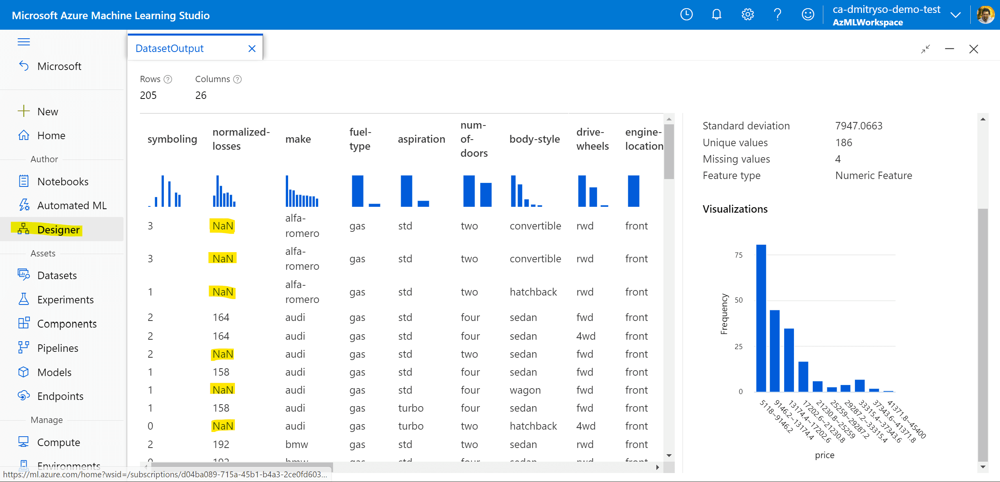
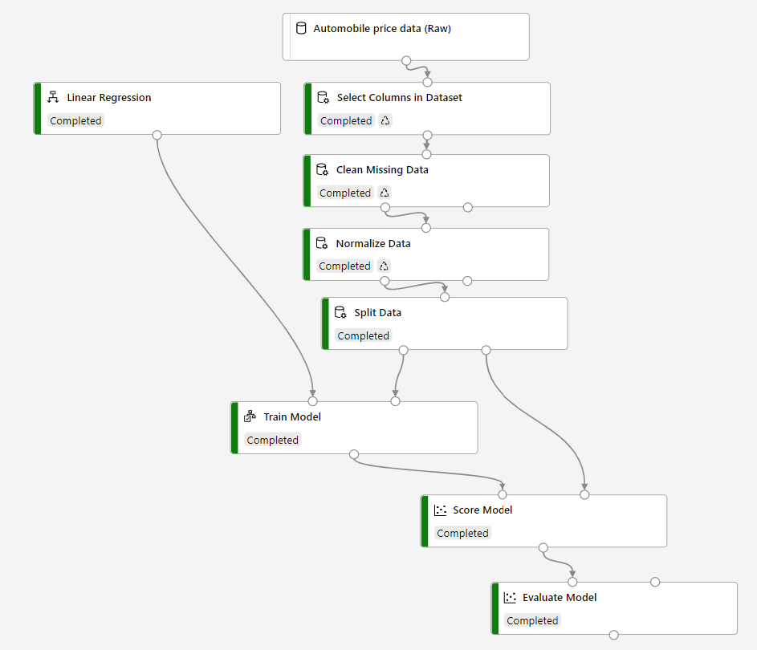
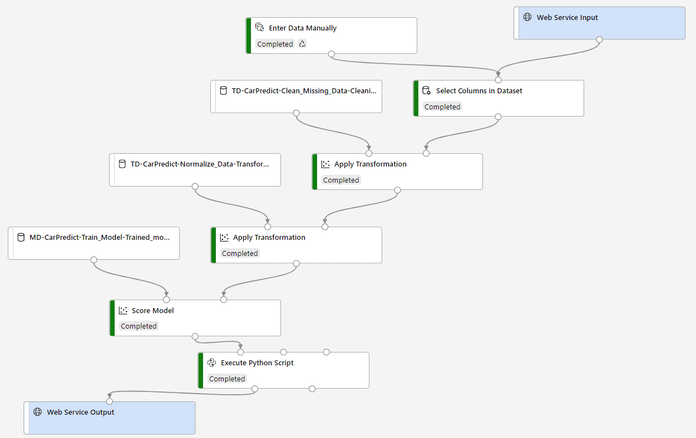
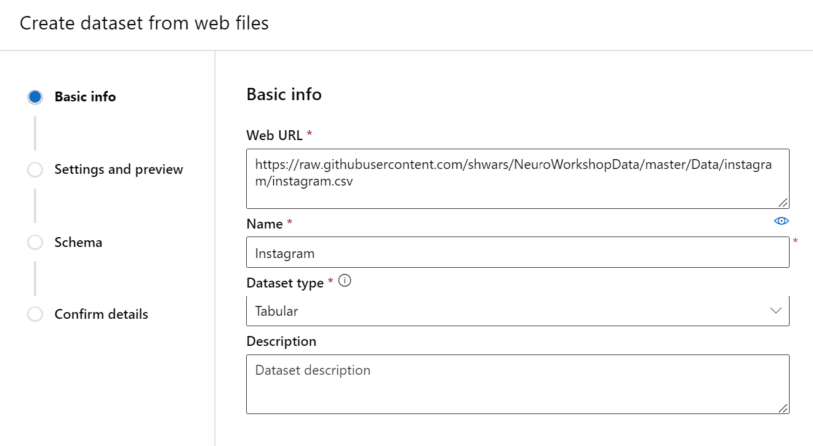

# Crie um Modelo de Regressão com Azure Machine Learning designer

## Módulo de Referência

[Crie um Modelo de Regressão com Azure Machine Learning designer](https://docs.microsoft.com/learn/modules/create-regression-model-azure-machine-learning-designer/?WT.mc_id=academic-56424-dmitryso)

## Metas

Nesse workshop, nós iremos aprender como treinar um **modelo de regressão** - modelo de Aprendizado de Máquina que prevê valores numéricos. Neste módulo iremos focar na predição de **preços de carros**, mas você pode tentar usar a mesma abordagem para prever, por exemplo, **números de likes no Instagram**.

| **Metas do Projeto**              | Aprenda como prever preço de carro / likes do instagram baseado em dados |
| ----------------------------- | --------------------------------------------------------------------- |
| **O que você irá aprender**       | O que é Aprendizado de Máquina e modelos de regressão. Como usar No Code no [Azure ML](https://azure.microsoft.com/services/machine-learning/?WT.mc_id=academic-56424-dmitryso) para treinar e implementar um modelo de regressão.|
| **O que você precisa**          | [Azure Subscription](https://azure-for-academics.github.io/getting-azure/) |
| **Duração**                  | *1 hour*                                                                |
| **Slides** | [Powerpoint](RegressionAMLDesigner.pptx) |
| **Autor** | [Dmitry Soshnikov](http://soshnikov.com) |

## Video passo-a-passo

*Em breve*

## O que estudantes irão aprender

Neste projeto, você aprenderá sobre **regressão** - uma família de algoritmos de Machine Learning usados para fazer previsões numéricas com base em dados. Aprenderemos a usar as ferramentas **Low-Code/No-Code** em  [Azure Machine Learning](https://azure.microsoft.com/services/machine-learning/?WT.mc_id=academic-56424-dmitryso) para treinar e implantar um modelo de regressão.

## Pré-requisitos

Para este workshop, você precisa ter uma [Conta Azure](https://azure-for-academics.github.io/getting-azure/). Você pode ter um da sua universidade, caso contrário, obter [Azure for Students](https://azure.microsoft.com/free/students/?WT.mc_id=academic-49822-dmitryso), [GitHub Student Developer Pack](https://education.github.com/pack) ou um [Azure Free Trial](https://azure.microsoft.com/free/?WT.mc_id=academic-49822-dmitryso).

> Saiba mais sobre a criação de uma Conta Azure em [Microsoft Learn](https://docs.microsoft.com/learn/modules/create-an-azure-account/?WT.mc_id=academic-49822-dmitryso)

## Realize o Workshop

O Workshop segue o modulo [Crie um Modelo de Regressão com Azure Machine Learning designer](https://docs.microsoft.com/learn/modules/create-regression-model-azure-machine-learning-designer/?WT.mc_id=academic-56424-dmitryso) do Microsoft Learn. Você pode abrir o módulo em uma guia/janela separada e seguir junto com as instruções abaixo.

## Objetivo 1: Criar um Machine Learning Workspace e Recurso de Computação

Para trabalhar com o Azure Machine Learning, você precisa de um **Workspace**. Siga [as instruções no Learn](https://docs.microsoft.com/learn/modules/create-regression-model-azure-machine-learning-designer/2-create-workspace/?WT.mc_id=academic-56424-dmitryso) para criar o Workspace interativamente usando o Portal Azure.

> Se você é um desenvolvedor e prefere fazer as coisas via código, você também pode criar um Workspace [através da linha de comando](https://docs.microsoft.com/azure/machine-learning/how-to-manage-workspace-cli/?WT.mc_id=academic-56424-dmitryso) ou [através Python SDK](https://docs.microsoft.com/azure/machine-learning/how-to-manage-workspace?tabs=python&WT.mc_id=academic-56424-dmitryso)

Depois de criar o Workspace, abra-o em [Azure Machine Learning Studio](https://ml.azure.com/?WT.mc_id=academic-56424-dmitryso)

Em sequida, você precisa criar **recursos de computação**. Siga [as instruções no Learn](https://docs.microsoft.com/learn/modules/create-regression-model-azure-machine-learning-designer/3-create-compute/?WT.mc_id=academic-56424-dmitryso) para criar dois tipos de recursos de computação:

* **Instância de computação** é uma máquina virtual que você pode usar para executar notebooks Jupyter, uma ferramenta que muitos cientistas de dados usam. Vamos usá-lo para testar nosso modelo no final do módulo.
* **Cluster de computação** é uma computação  que escala automaticamente para treinar seus modelos de Aprendizado de Máquina Azure. Será a principal computação que usaremos para treinamento.

> **Nota**: Com a versão mais nova do estúdio Azure Machine Learning, você pode evitar criar cluster de computação completamente e usar a instância de computação para executar seu experimento. Usar clusters para executar experimentos faz sentido quando você precisa de uma computação rápida que deseja agendar automaticamente. No nosso caso, você pode economizar tempo não usando cluster de computação.

## Objetivo 2: Criar o Experimento, Explore e Limpe os Dados

Para treinar nosso modelo, vamos usar o [Azure ML Designer](https://azure.microsoft.com/services/machine-learning/designer/?WT.mc_id=academic-56424-dmitryso) para criar um pipeline de experimentos. Siga [as instruções no Learn](https://docs.microsoft.com/learn/modules/create-regression-model-azure-machine-learning-designer/4-explore-data/?WT.mc_id=academic-56424-dmitryso) para iniciar o novo experimento e explorar o conjunto de dados.

Você deve ser capaz de visualizar o conjunto de dados:

Observe os valores 'NaN' faltantes. Precisamos retirar eles antes de treinar o modelo. Há também alguns valores faltando em outras colunas. A limpeza dos dados envolve duas etapas:

* Remova completamente a coluna `normalized-losses` usando **Selecione colunas no Dataset**, pois contém muitos valores ausentes
* As colunas `bore`, `stroke` e `horsepower` também contêm alguns valores faltantes, por isso usaremos **Limpar dados faltantes** para remover apenas linhas com valores faltantes.

> Se você não ver a opção **Por nome** ao adicionar nomes de campo nas opções, certifique-se de ter configurado o experiemento para usar uma das opções de computação criadas na etapa anterior. 

Finalmente, como todos os dados numéricos estão em escala diferente, precisamos **Normalizar os Dados** para dimensionar todos os valores numéricos em intervalo 0-1. Isso deve ser feito para as seguintes colunas: `symboling`, `wheel-base`, `length`, `width`, `height`, `curb-weight`, `engine-size`, `bore`, `stroke`, `compression-ratio`, `horsepower`, `peak-rpm`, `city-mpg`, `highway-mpg`.

Você pode executar o experimento e ver os dados no final do pipeline para garantir que tudo funcionou corretamente.

## Objetivo 3: Treinar o Modelo e avaliar os resultados

Uma vez que você tenha os dados tradados, você pode treinar o modelo de aprendizado de máquina para prever preços. Siga [as instruções no Learn](https://docs.microsoft.com/learn/modules/create-regression-model-azure-machine-learning-designer/5-create-training-pipeline/?WT.mc_id=academic-56424-dmitryso) para dividir os dados em conjunto treino e teste, e treinar o modelo com os dados de treinamento.

Em seguida, você pode usar o bloco **Score model** para aplicar o modelo ao conjunto de dados de teste. Finalmente, siga para a [próxima unidade de aprendizado](https://docs.microsoft.com/learn/modules/create-regression-model-azure-machine-learning-designer/5-create-training-pipeline/?WT.mc_id=academic-56424-dmitryso)
para adicionar bloco **Evaluate model** para calcular algumas estatísticas.

Seu experimento final deve ficar assim:

Como resultado, devemos obter o **coeficiente de determinação** em torno de 93%. Este coeficiente mostra o quanto os preços previstos estão relacionados com os reais no conjunto de dados de teste, ou seja, quão precisamente somos capazes de prever. Em valores absolutos, **erro absoluto médio** mostra a diferença média entre o preço esperado e o previsto, que é em torno de US $ 2 mil no nosso caso. Não é tão ruim, dado que o preço médio é de US $ 13 mil, por isso estamos fazendo cerca de 15% de erro de previsão.

## Objetivo 4: Construir e Implantar o Pipeline de Inferência

Uma vez que tenhamos treinado o modelo, precisamos ser capazes de aplicá-lo aos nossos próprios dados para fazer previsões. Isso pode ser feito usando o **Pipeline de Inferencia**, que vamos construir em seguida. Siga a [próxima unidade de aprendizado](https://docs.microsoft.com/learn/modules/create-regression-model-azure-machine-learning-designer/7-inference-pipeline/?WT.mc_id=academic-56424-dmitryso) para construir o pipeline.

O Pipeline é construído como um experimento separado, que inclui dois blocos especiais: **web service input** e **web service output**. Eles representam dados de entrada e saída do modelo, e pode haver quaisquer transformações entre eles. No nosso caso, precisamos executar as mesmas etapas de transformação (incluindo a normalização) nos dados de entrada e, em seguida, chamar o modelo.

Também usamos um **bloco de código Python** para simplificar os dados de saída do modelo. Isso não é estritamente necessário, mas mostra como podemos incorporar código personalizado no pipeline para realizar qualquer processamento de dados que precisamos.

Agora você pode **Enviar** o pipeline para ter certeza de que ele faz previsões corretamente. Ele lhe dará o preço previsto para os dados amostrais que fornecemos no início do pipeline.

Uma vez que tenhamos executado o pipeline, podemos **implantá-lo**, para que o modelo possa ser chamado através da internet como um serviço web. Veja na [unidade de aprendizado](https://docs.microsoft.com/learn/modules/create-regression-model-azure-machine-learning-designer/6-exercise) como implantar o serviço em um **Azure Container Instance**.

O Azure ML oferece duas maneiras de implantar o modelo:

* **Azure Container Instance** (ACI) significa que haverá um contêiner em uma máquina virtual que serve ao seu modelo. Não é escalável, por isso podemos recomendá-lo para testes, mas não para ambientes de produção.
* **Azure Kubernetes Service** (AKS) implanta o modelo no cluster Kubernetes (que você pode criar na seção **Compute** do portal), o que faz com que o modelo escale em função da carga. 

Em nosso Workshop vamos implantar no ACI.

## Objetivo 5: Testar o Modelo

Uma vez implantado o modelo, podemos chamá-lo como serviço REST através da internet de qualquer lugar, por exemplo: de um aplicativo móvel, aplicativo web, etc. No nosso caso, usaremos o teste da pagina do ponto de extremidade. Siga [esta unidade de aprendizado](https://docs.microsoft.com/learn/modules/create-regression-model-azure-machine-learning-designer/6-exercise).

## Objetivo 6 [Opcional]: Tente treinar um modelo diferente

Para entender melhor o processo, é sempre uma boa ideia repetir o mesmo exercício com diferentes dados, em diferentes domínios problemáticos. Por exemplo, você pode tentar prever o número de curtidas de uma foto no Instagram. Você pode usar esse [Dataset de Likes do Instagram](https://github.com/shwars/NeuroWorkshopData/tree/master/Data/instagram).

* [instagram.csv](https://github.com/shwars/NeuroWorkshopData/blob/master/Data/instagram/instagram.csv) contém o resultado do processamento de posts no Instagram de um blogueiro famoso. Cada fotografia foi processada usando [Computer Vision Cognitive Service](https://azure.microsoft.com/services/cognitive-services/computer-vision/?WT.mc_id=academic-56424-dmitryso) para extrair a categoria principal, tags, cor de fundo/primeiro plano e algumas outras propriedades.

likes|main_category|no_faces|avg_age|date|adult_score|color_fg|color_bg|tags|objects
-----|-------------|--------|-------|----|-----------|--------|--------|----|-------
321112|people|0|0|2017-06-24|0.005|Pink|Pink|woman person dress clothing|person
245154|building|0|0|2017-06-25|0.003|White|Grey|sky outdoor|plant
279328|others|1|53.0|2017-07-03|0.004|White|Black|text|person
299499|people|0|0|2017-07-05|0.069|Black|Pink|person food outdoor

* [instagram-onehot.csv](https://github.com/shwars/NeuroWorkshopData/blob/master/Data/instagram/instagram_onehot.csv) é o mesmo conjunto de dados, mas as tags mais usadas são representadas por **one-hot encoding**, ou eja, eles têm 0/1 na coluna correspondente, dependendo se a tag correspondente está associada à imagem ou não.

Antes de começar a construir um experimento, você precisa carregar o conjunto de dados para o portal Azure ML. Ir para **Datasets** -> **Create Dataset** -> **From Web Files**. Na sequência, forneça um dos URLs a seguir para o arquivo de conjunto de dados:
* instagram.csv - `https://raw.githubusercontent.com/shwars/NeuroWorkshopData/master/Data/instagram/instagram.csv`
* instagram_onehot.csv - `https://raw.githubusercontent.com/shwars/NeuroWorkshopData/master/Data/instagram/instagram_onehot.csv`  

Depois de criar o conjunto de dados, vá para **Designer** e contrua o experimento semelhante ao da previsão de preços de carros:
* Comece com o conjunto de dados carregado
* Use **Select columns from Dataset** para ignorar algumas das colunas. Você pode querer ignorar colunas textuais, como **tags** or **objects**.
* Uma vez que os dados incluem várias features *categóricos* que provavelmente terão efeito não linear sobre o resultado, use a família de modelos de árvores de decisão, por exemplo, **Decision Forest Regression**.

Treine o modelo e veja se consegue previsões razoavelmente precisas.

Você também pode explorar alguns outros conjuntos de dados do [Kaggle](http://kaggle.com/datasets), por exemplo:
* Um [dataset de Gambás](https://www.kaggle.com/datasets/abrambeyer/openintro-possum) com características físicas. Você pode tentar prever a idade de um gambá com base no comprimento da cabeça, largura do crânio, comprimento total, etc.
* Um conjunto de dados de [custos de seguro médico](https://www.kaggle.com/datasets/mirichoi0218/insurance), onde você pode tentar prever os custos de seguro com base em diferentes parâmetros.
* Um conjunto de dados para a predição de [preços imobiliários](https://www.kaggle.com/datasets/quantbruce/real-estate-price-prediction).

## Objetivo 7: Limpeza

Depois de fazer os experimentos, é importante excluir os recursos que você não está usando para não gastar créditos da sua assinatura do Azure. Certifique-se de fazer o seguinte:

* Exclua a instância ACI do seu serviço preditivo.
* Pare a instância do cálculo. Se você está planejando usar o Azure ML com frequência, faz sentido configurar o cronograma para desligar automaticamente a instância de computação todos os dias no final do dia, para que você não o deixe funcionando e sem uso por longos períodos de tempo.
* Se você não estiver planejando nenhum experimento com o Azure ML no futuro próximo - exclua completamente o espaço de trabalho do Azure ML. Mesmo quando nenhuma computação está sendo executado, os recursos de nuvem existentes ainda incorrem em alguns custos de armazenamento.

## Próximos passos

Agora que você sabe como usar o Azure ML Designer, você pode explorar outros componentes do Azure ML:

* [Automated Machine Learning](https://docs.microsoft.com/learn/modules/use-automated-machine-learning/?WT.mc_id=academic-56424-dmitryso) é outra abordagem de Código Baixo / Sem Código que tenta automaticamente encontrar o melhor modelo experimentando diferentes opções e hiperparmetros.
* Aprenda a [Criar modelos de classificação](https://docs.microsoft.com/learn/modules/create-classification-model-azure-machine-learning-designer/?WT.mc_id=academic-56424-dmitryso) no Azure ML designer.
* Saiba como você pode [Explicar modelos de aprendizado de máquina](https://docs.microsoft.com/learn/modules/explain-machine-learning-models-with-azure-machine-learning/?WT.mc_id=academic-56424-dmitryso) para entender quais características desempenham um papel mais importante no resultado.

## Pratique

Você aprendeu a treinar um modelo e torná-lo utilizável através da API REST. Você pode construir um projeto que exponha seu modelo de regressão treinado aos usuários construindo um aplicativo móvel ou web. Junte-se a alguns pares com experiência de programação para criar um aplicativo preditivo de ponta a ponta:

* Selecione um domínio de problemas que lhe interessa. Obtenha uma inspiração dos conjuntos de dados disponíveis no Kaggle ou em outros lugares
* Treine e implante o modelo do jeito que você fez neste Workshop
* Construa um aplicativo móvel ou web que consuma a API. Você pode aprender ainda como consumir uma [API REST com Xamarin](https://docs.microsoft.com/learn/modules/consume-rest-services/?WT.mc_id=academic-56424-dmitryso).

## Continuação

* [Como aprender ciência de dados sem codificação](https://soshnikov.com/azure/how-to-learn-data-science-without-coding/) - postagem do blog descrevendo outra abordagem No Code/Low Code para treinar modelos de aprendizado de máquina - [Automated ML](https://azure.microsoft.com/services/machine-learning/automatedml/?WT.mc_id=academic-56424-dmitryso)

## Feedback

Não deixe de dar [feedback sobre este workshop](https://forms.office.com/r/MdhJWMZthR)!

[Código de Conduta](../../CODE_OF_CONDUCT.md)
