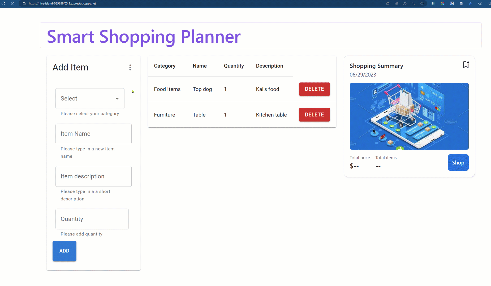
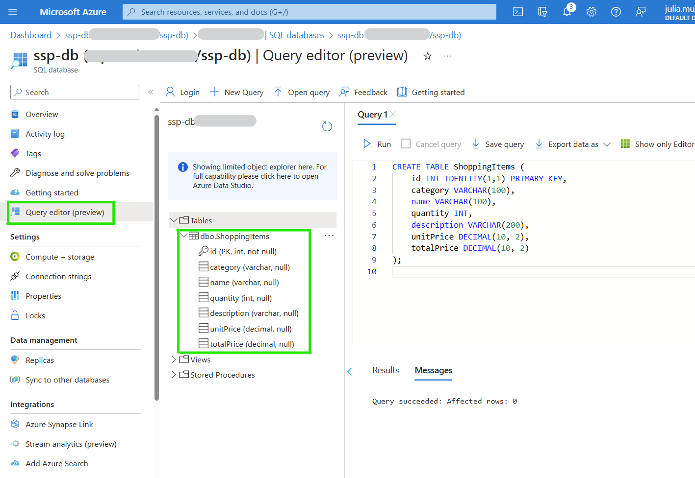

# Seamless API Development with Data API Builder for your Static Web Apps

### Goals

Have you ever walked into a store, did some shopping, and headed back home only to find that you forgot to buy 60% of the items you needed to get?
I struggle with this very same issue and so I decided to create the ‘Smart Shopping Planner’, an application that will help me keep track of the items I need to buy and that I can easily update before and after shopping.



| **Goal**              | Learn how to seamlessly build APIs with Data API Builder                                   |
| ----------------------------- | --------------------------------------------------------------------- |
| **What will you learn**       | *JavaScript, React, Azure Static Web Apps, Azure Static Web Apps CLI, Data API Builder, Azure SQLAI*                                        |
| **What you'll need**          | *[Azure subscription](https://azure.microsoft.com), [GitHub](https://github.com/)* |
| **Duration**                  | *1 hr*                                                                |
| **Microsoft Cloud Topics taught**                  | *Azure Static Web Apps Database Connections,* *Azure SQL Database*, *Data API Builder*                                                                |
| **Just want to try the app or see the solution?** | [Solution](./Solution/)                         |
| **Slides** | Coming soon!

## Video
[Solution Video](https://youtu.be/9N1Z9KPbeEY)

## Pre-Learning
[Connect your Static Web Apps to Azure Databases using REST or GraphQL on Azure Friday](https://youtu.be/gCrBSSOezSQ)


## Prerequisites
1. VS Code
1. .NET 6 SDK installed!
1. An Azure Subscription

## What students will learn
Smart Shopping Planner is a React application built using JavaScript, that stores data in an Azure SQL database. In this blog, I want to show you how incredibly easy it was to provide REST endpoints (you can work with GraphQL too) to connect the app to the database.

## Workshop Milestones
Full workshop on this [step-by-step guide](https://lnkd.in/deH5h84M)

1. **Create a SQL Database** ([Reference Step 1 in tutorial](https://lnkd.in/deH5h84M))

    _SQL code to create a table that will store our shopping items._
    ```
    CREATE TABLE ShoppingItems (
        id INT IDENTITY(1,1) PRIMARY KEY,
            category VARCHAR(100),
                name VARCHAR(100),
                quantity INT,
                description VARCHAR(200),
                unitPrice DECIMAL(10, 2),
                totalPrice DECIMAL(10, 2)
    );
    ```
    
1. **Prepare your Frontend** ([Reference Step 2 in tutorial](https://lnkd.in/deH5h84M))

    - Download the [Sample code](./Solution/) and open in VS Code
    - Run **npm install**
    - Run **npm start**
1. **Use database connections to connect to your data through REST endpoints** ([Reference Step 3 in tutorial](https://lnkd.in/deH5h84M))

    _Add an Item entity in the swa-database-config file and specify the permission_
    ```
    "Item": {
        "source": "dbo.ShoppingItems",
        "permissions": [
            {
              "actions": ["*"],
              "role": "anonymous"
            }
        ]
    }
    ```

## Feedback

Be sure to give [feedback about this workshop](https://forms.office.com/r/MdhJWMZthR)!

[Code of Conduct](../../CODE_OF_CONDUCT.md)