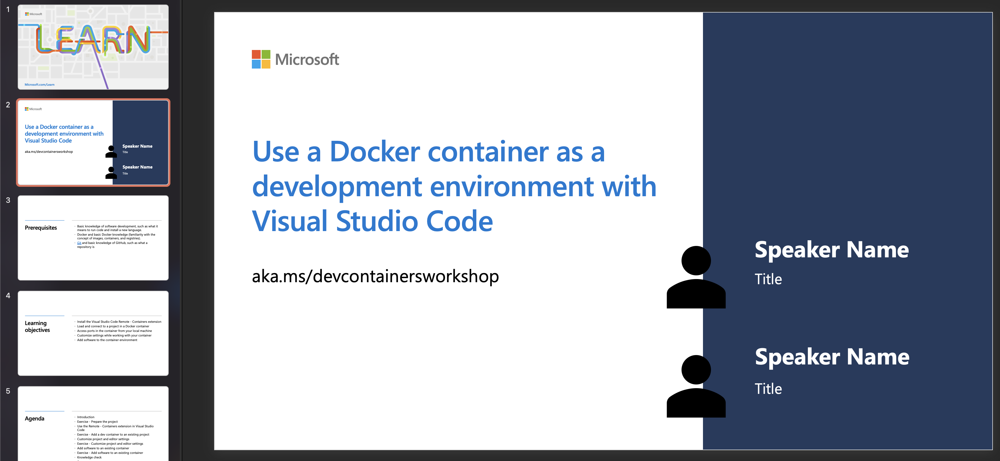

# Getting Started with Development Containers in VS Code

## Module Source

[Use a Docker container as a development environment with Visual Studio Code](https://docs.microsoft.com/learn/modules/use-docker-container-dev-env-vs-code/?WT.mc_id=academic-55190-ornella)

# Goals 

In this workshop, you will learn how to access, customize, and add software to development containers in Visual Studio Code so that you can collaborate with ease across machines and development environments. 

| **Goal**                                          | Description                                                                                                    |
| ------------------------------------------------- | -------------------------------------------------------------------------------------------------------------- |
| **What will you learn**                           | How to load and connect to a remote project, customize settings when working with a development container, and add software to the container environment. |
| **What you'll need**                              | [Visual Studio Code](https://code.visualstudio.com?WT.mc_id=academic-55190-ornella), [Docker Desktop](https://www.docker.com/products/docker-desktop), and [Git](https://git-scm.com/downloads)                                          |
| **Duration**                                      | 1 hour |
| **Slides**                                        | [Powerpoint](./slides.pptx) |   

# Video

> 🎥 Click this image to watch Ornella walk you through the workshop

## Pre-Learning

- [Overview of Containers and Docker](https://docs.microsoft.com/dotnet/architecture/containerized-lifecycle/introduction-to-containers-and-docker?WT.mc_id=academic-55190-ornella)
- [Introduction to Git](https://docs.microsoft.com/learn/modules/intro-to-git/?WT.mc_id=academic-55190-ornella)
- [Use a Docker container as a development environment with Visual Studio Code](https://docs.microsoft.com/learn/modules/use-docker-container-dev-env-vs-code/?WT.mc_id=academic-55190-ornella)

## Prerequisites

- [Visual Studio Code](https://code.visualstudio.com?WT.mc_id=academic-55190-ornella)
- [Docker Desktop](https://www.docker.com/products/docker-desktop)
- [Git](https://git-scm.com/downloads)

## What students will learn

Say you're working on a hackathon project with your classmates using Python, and you want to make sure that your project is compatible across multiple machines. In this workshop, you will learn how you can use development containers to work on any project without having to set up or configure your machine first.

## Prepare the project

In this section, you'll do some setup to [open a sample project](https://docs.microsoft.com/learn/modules/use-docker-container-dev-env-vs-code/2-exercise-prepare-project?WT.mc_id=academic-55190-ornella) written in Python, and install the Remote Containers extension for Visual Studio Code. 

## Use the Remote - Containers extension

Next, you'll learn how to [use the Remote - Containers extension in Visual Studio Code](https://docs.microsoft.com/learn/modules/use-docker-container-dev-env-vs-code/3-use-as-development-environment?WT.mc_id=academic-55190-ornella). You'll be able to understand how Docker and Visual Studio Code make it possible to have projects contained in their own preconfigured, containerized environments using the extension. 

## Add a dev container to an existing project

Now that you have the extension ready to go, you'll [add a dev container and open the sample project](https://docs.microsoft.com/learn/modules/use-docker-container-dev-env-vs-code/4-exercise-add-development-container?WT.mc_id=academic-55190-ornella) in the container. 

## Customize project and editor settings

After setting up the dev container for the project, you'll learn how to [customize and automate all the project setup](https://docs.microsoft.com/learn/modules/use-docker-container-dev-env-vs-code/5-customize-settings?WT.mc_id=academic-55190-ornella) using the [devcontainer.json file](https://docs.microsoft.com/learn/modules/use-docker-container-dev-env-vs-code/6-exercise-customize-settings?WT.mc_id=academic-55190-ornella). 

## Add software to an existing container

So far, you've learned how to add a preconfigured dev container and customize it using the devcontainer.json file. Next, you'll learn how to [add software](https://docs.microsoft.com/learn/modules/use-docker-container-dev-env-vs-code/7-add-software?WT.mc_id=academic-55190-ornella) beyond what's available in those preconfigured dev containers to further customize your experience. Apply what you learned by [using a Dockerfile to add Node.js to your container](https://docs.microsoft.com/learn/modules/use-docker-container-dev-env-vs-code/8-exercise-add-software?WT.mc_id=academic-55190-ornella). 

## Quiz

[Knowledge Check](https://docs.microsoft.com/learn/modules/use-docker-container-dev-env-vs-code/9-knowledge-check?WT.mc_id=academic-55190-ornella)

## Next steps

- [Remote - Containers tutorial](https://code.visualstudio.com/docs/remote/containers-tutorial?WT.mc_id=academic-55190-ornella)
- [Learn to create a development container](https://code.visualstudio.com/docs/remote/create-dev-container?WT.mc_id=academic-55190-ornella)
- [Main Remote - Containers documentation](https://code.visualstudio.com/docs/remote/containers?WT.mc_id=academic-55190-ornella)
- [How students can use dev containers](https://www.youtube.com/watch?v=Uvf2FVS1F8k)

## Practice

To test your knowledge, try creating your own development container filled with your favorite coding tools. Share it with a friend!

## Feedback

Be sure to give [feedback about this workshop](https://forms.office.com/r/MdhJWMZthR)!

[Code of Conduct](../../CODE_OF_CONDUCT.md)

