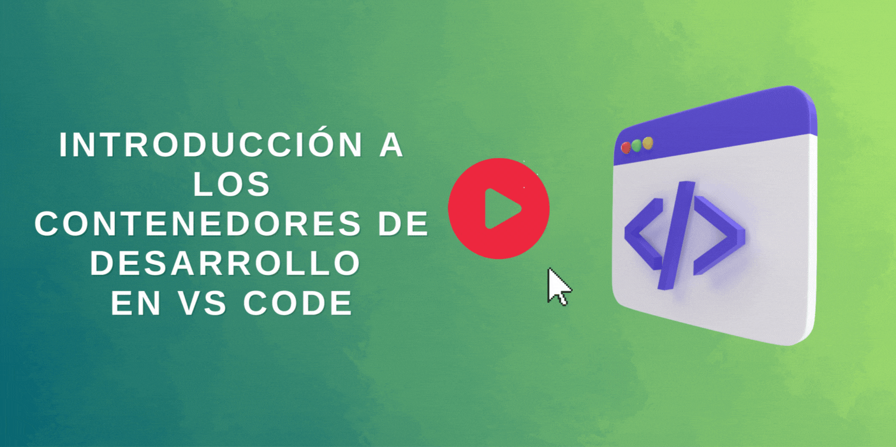

# Introducción a los contenedores de desarrollo en VS Code

Digamos que estás trabajando en un proyecto de hackathon junto a tus compañeros de clases, utilizando Python y quieres asegurarte de que tu proyecto es compatible en múltiples máquinas. 
**En este taller, aprenderás como puedes utilizar contenedores de desarrollo para trabajar en cualquier proyecto sin tener que instalar o configurar tu equipo**.

# Objetivos 

En este taller, aprenderás a como acceder, personalizar y añadir software a los contenedores de desarrollo en Visual Studio Code con la finalidad de que puedas trabajar con facilidad entre máquinas y entornos de desarrollo.

| **Objetivo**                                          | Descripción                                                                                                    |
| ------------------------------------------------- | -------------------------------------------------------------------------------------------------------------- |
| **¿Qué aprenderás?**                           | Aprenderás a como cargar y conectarte a un proyecto remoto, personalizar la configuración cuando se trabaja con un contenedor de desarrollo y añadir software al entorno del contenedor. |
| **Lo que necesitarás**                              | [Visual Studio Code](https://azure.microsoft.com/es-mx/products/visual-studio-code/), [Docker Desktop](https://www.docker.com/products/docker-desktop) y [Git](https://git-scm.com/downloads)                                          |
| **Duración**                                      | 1 hora |
| **Diapositivas**                                        | [Powerpoint](./slides.pptx) |   

## Pre-aprendizaje

- [Visión general de Contenedores y Docker](https://docs.microsoft.com/gl-es/dotnet/architecture/containerized-lifecycle/introduction-to-containers-and-docker?WT.mc_id=academic-55190-ornella)
- [Introducción a Git](https://docs.microsoft.com/gl-es/learn/modules/intro-to-git/?WT.mc_id=academic-55190-ornella)
- [Uso de un contenedor de Docker como entorno de desarrollo con Visual Studio Code](https://docs.microsoft.com/gl-es/learn/modules/use-docker-container-dev-env-vs-code/?WT.mc_id=academic-55190-ornella)

# Video
> 🎥 Dale click a la imagen para ver como Ornella te da el paso a paso del taller

## Prepara el proyecto

En esta sección, configurarás un poco este [proyecto de ejemplo](https://docs.microsoft.com/gl-es/learn/modules/use-docker-container-dev-env-vs-code/2-exercise-prepare-project?WT.mc_id=academic-55190-ornella) que está escrito en Python, e instalarás la extensión de Contenedores Remotos para Visual Studio Code. 

## Utiliza la extensión de Contenedores Remotos

Después, aprenderás a como [utilizar la extensión de Contenedores Remotos en Visual Studio Code](https://docs.microsoft.com/gl-es/learn/modules/use-docker-container-dev-env-vs-code/3-use-as-development-environment?WT.mc_id=academic-55190-ornella). Serás capaz de entender como Docker y Visual Studio Code hacen posible tener proyectos contenidos en sus propios entornos preconfigurados y en contenedores mediante esta extensión.

## Añade un contenedor de desarrollo a un proyecto existente

Ahora que ya tienes lista la extensión, [añadirás un contenedor de desarrollo y abriras el proyecto de ejemplo](https://docs.microsoft.com/gl-es/learn/modules/use-docker-container-dev-env-vs-code/4-exercise-add-development-container?WT.mc_id=academic-55190-ornella) en el contenedor.

## Personaliza las configuraciones del proyecto y del editor de código

Después de configurar el contenedor de desarrollo para el proyecto, aprenderás a como [personalizar y automatizar toda la configuración del proyecto](https://docs.microsoft.com/gl-es/learn/modules/use-docker-container-dev-env-vs-code/5-customize-settings?WT.mc_id=academic-55190-ornella) utilizando el [archivo devcontainer.json](https://docs.microsoft.com/gl-es/learn/modules/use-docker-container-dev-env-vs-code/6-exercise-customize-settings?WT.mc_id=academic-55190-ornella).

## Añade software a un contenedor existente

Hasta ahora has aprendido a como añadir un contenedor de desarrollo preconfigurado y personalizarlo utilizando el archivo devcontainer.json. Ahora, aprenderás a como [añadir software](https://docs.microsoft.com/gl-es/learn/modules/use-docker-container-dev-env-vs-code/7-add-software?WT.mc_id=academic-55190-ornella) más allá del que está disponible en esos contenedores de desarrollo preconfigurados para mejorar aún más tu experiencia. Aplica lo aprendido [utilizando un archivo de Docker (Dockerfile) para añadir Node.js a tu contenedor](https://docs.microsoft.com/gl-es/learn/modules/use-docker-container-dev-env-vs-code/8-exercise-add-software?WT.mc_id=academic-55190-ornella).

## Prueba

[Prueba de conocimientos](https://docs.microsoft.com/gl-es/learn/modules/use-docker-container-dev-env-vs-code/9-knowledge-check?WT.mc_id=academic-55190-ornella)

## Próximos pasos

- [Tutorial de contenedores remotos](https://code.visualstudio.com/docs/remote/containers-tutorial?WT.mc_id=academic-55190-ornella)
- [Aprende a crear un contenedor de desarrollo](https://code.visualstudio.com/docs/remote/create-dev-container?WT.mc_id=academic-55190-ornella)
- [Remoto principal - documentación de contenedores](https://code.visualstudio.com/docs/remote/containers?WT.mc_id=academic-55190-ornella)
- [Cómo pueden utilizar los estudiantes los contenedores de desarrollo](https://www.youtube.com/watch?v=Uvf2FVS1F8k)

## Práctica

Prueba tu conocimiento, intenta crear tu propio contenedor de desarrollo lleno de tus herramientas de desarrollo favoritas. ¡Compártelo con un amigo!

## Agradecimientos 💖 
¡Muchísimas gracias a [Alfonso Amaya](https://www.linkedin.com/in/alfonso-camargo/) @Alfonso-AmayaC por habernos ayudado a traducir todo este contenido a español! 

## Feedback

¡Asegúrate de dejarnos [comentarios sobre este taller](https://forms.office.com/r/MdhJWMZthR)!

## [Código de conducta](../../../../CODE_OF_CONDUCT.md)

## Módulo de referencia

[Uso de un contenedor de Docker como entorno de desarrollo con Visual Studio Code](https://docs.microsoft.com/gl-es/learn/modules/use-docker-container-dev-env-vs-code/?WT.mc_id=academic-55190-ornella)