# Creating your website

Now that you have your basic resume crafted in [HTML](./create-html.md) and [CSS](./add-style.md), let's work on putting your resume on a website. To do this, we'll use Azure Static Web App, which allows you to create a website directly from a repository on GitHub.

> You need Visual Studio Code installed on your physical computer.

## Commit your changes

The first thing we need to do is commit the changes we've made to our **resume** folder to GitHub. This will upload all of the resume content that we added to our repository/folder, so we can use it for our website.

> NOTE:
> Make sure your HTML and CSS files are in a folder called resume on your local computer.

1. Select the **Source Control** icon on the left-hand side Activity Bar. Selecting it will open a new blade, it will show you two options, select `Publish to GitHub` as follows:
   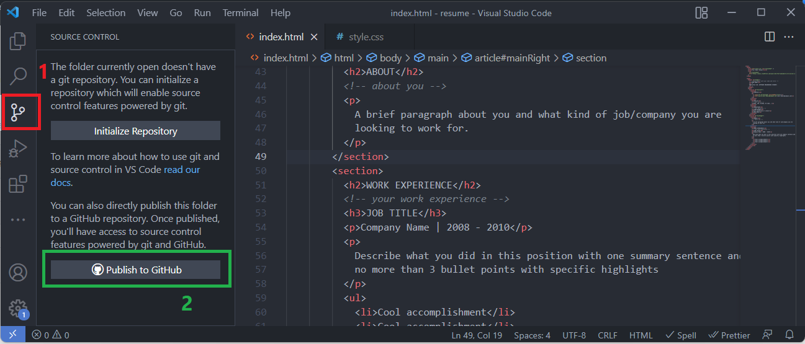
2. A pop-up will appear saying "The extension 'GitHub' wants to sign in using GitHub.". Select _Allow_. Selecting allow will open the browser where you have to click on _Continue_. And then on the new pop-up click on _Open_. Now the authentication is done and you are back in your VS Code.
3. You will see the following in the top-middle section of your VS Code. Select "Publish to GitHub public repository". And after selecting that, click on Ok.
   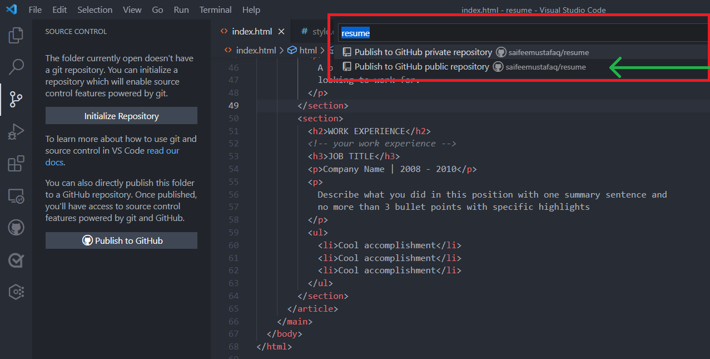
   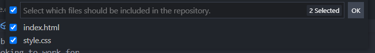
4. Once you create the repo, your files will be pushed to the new repo. You can check it by going to https://github.com/<github_username>/resume

> Now that you've created your GitHub repository, you can create a Static Web Apps instance from the Azure portal.

> This module requires an Azure Subscription, you can obtain a free Azure subscription from [aka.ms/Azure4Students](aka.ms/Azure4Students) to complete the exercise. Before proceeding, please make sure you have a subscription.

## Install the Azure Static Web Apps extension for Visual Studio Code

1. Click on the Extensions(or press Ctrl+Shift+X) and Visual Studio Marketplace will open, install the Azure Static Web Apps extension for Visual Studio Code.

2. When the extension tab loads in Visual Studio Code, select Install on the gear icon in the bottom left-hand side.

3. After installation is complete, select Restart to update.

## Sign in to Azure in Visual Studio Code

1. In Visual Studio Code, sign in to Azure by selecting **View** > **Command Palette**, and entering **Azure: Sign In**.

   > IMPORTANT NOTE:
   > Log in to Azure using the same account used to activate your free account.

2. Follow the prompts to log-in to your Azure Account.
3. Once you have successfully logged in, you will see in the bottom area Azure: {username}@outlook.com
   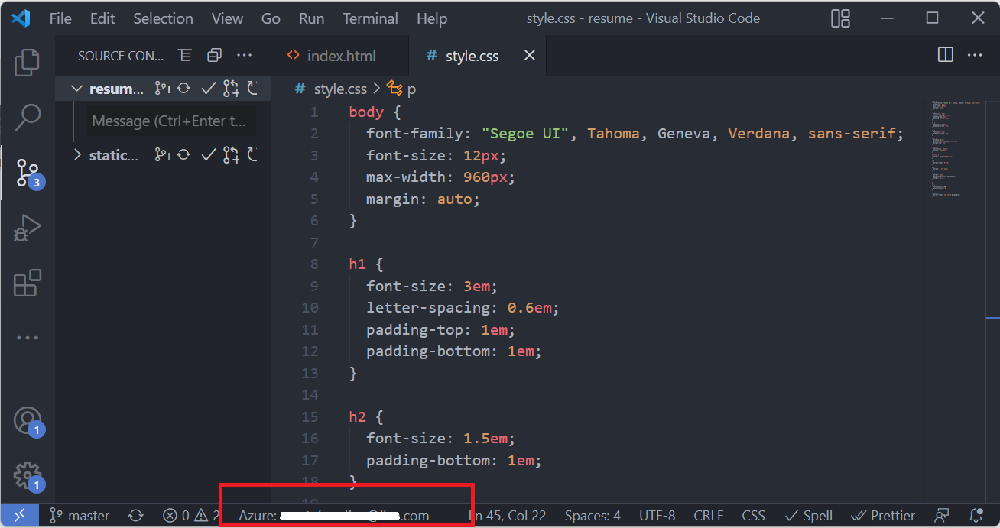
4. Click on your email ID as shown in the above image, you will be prompted to select the subscription. Select your subscription. And click on Ok.
   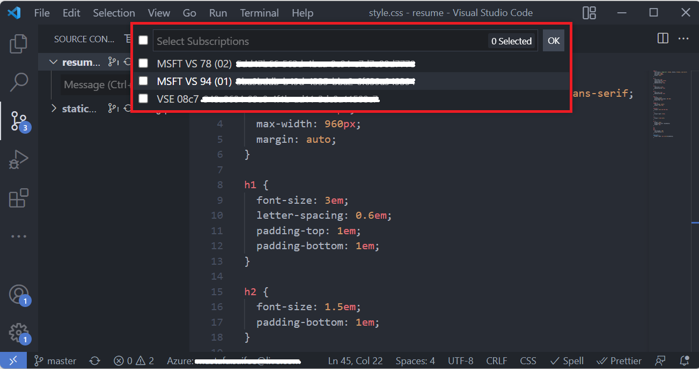

## Create a static web app

1. Inside Visual Studio Code, select the Azure logo in the Activity Bar to open the Azure extensions window.

   

   > Note: Azure and GitHub sign-in are required. If you are not already signed in to Azure and GitHub from Visual Studio Code, the extension will prompt you to sign in to both during the creation process.

2. Place your mouse over the _Static Web Apps_ label, and select the **+** (plus sign). (you might be asked to login to your GitHub again for authentication)
   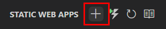
3. Command pallette will open up with the following text `Create Static Web App (1/5)`.
4. For the first step write the **name** of the static app as `resumeStaticApp`. _Press Enter_
   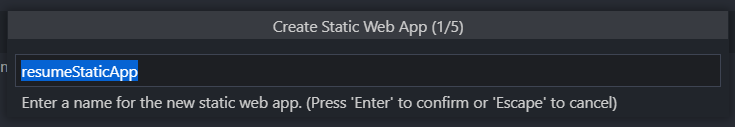
5. For the second step, it will ask for a **region**, select any region and _Press Enter_
   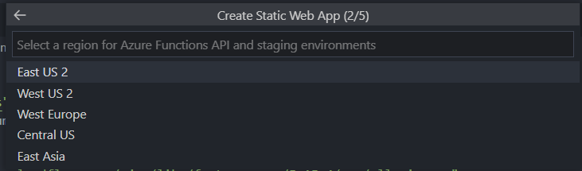
6. For the third step, when it asks "Choose build preset to configure default project structure" just type **Custom** and press Enter.
   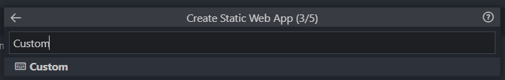
7. For the fourth step, as we don't have to input anything, leave it at `/`
   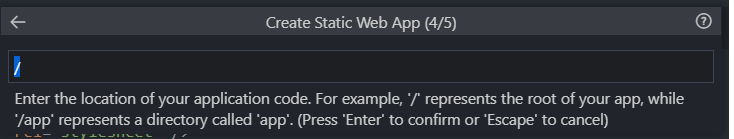
8. For the fifth step leave it blank as we don't have build so we don't need an output location. Press Enter
9. After this the creation will start and once it's completed successfully, you will get the following notification:
   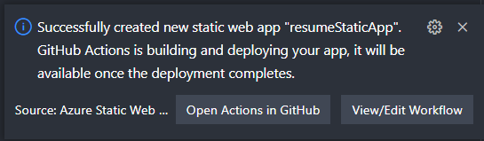
10. Once the deployment is complete, you can navigate directly to your website.
11. To view the website in the browser, right-click on the project in the Static Web Apps extension, and select Browse Site.
    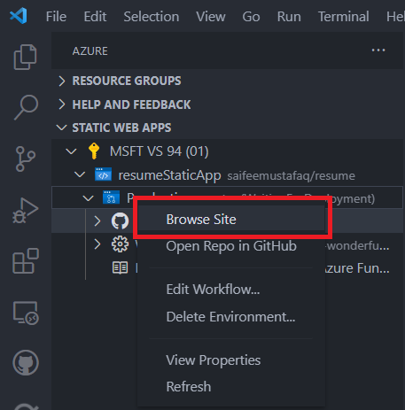

   
   
## Summary

Congratulations! You have successfully created a resume website using HTML, CSS, VS Code, and Azure Static Web Apps! You can continue to grow your web development skills by modifying this page, or exploring [content on Microsoft Learn](https://docs.microsoft.com/learn/paths/web-development-101/).
