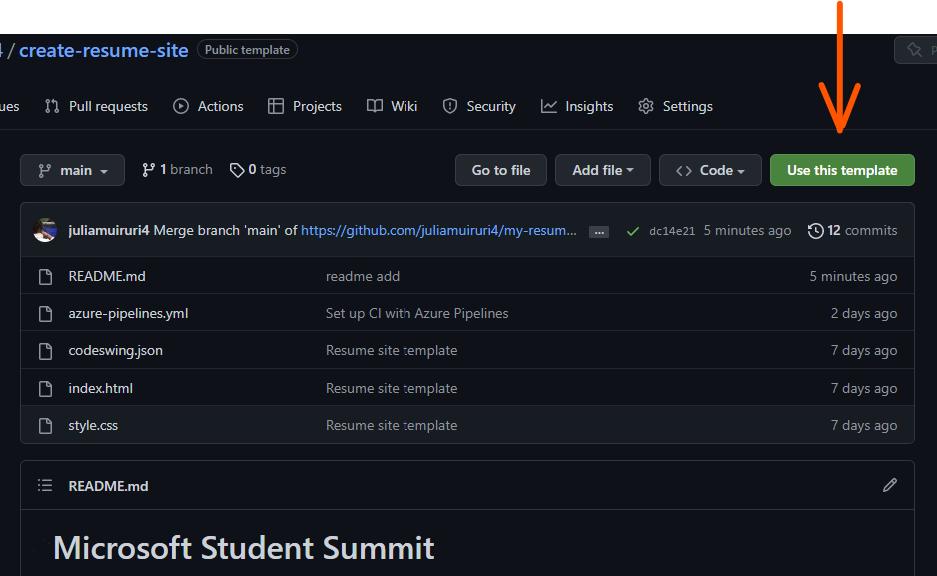
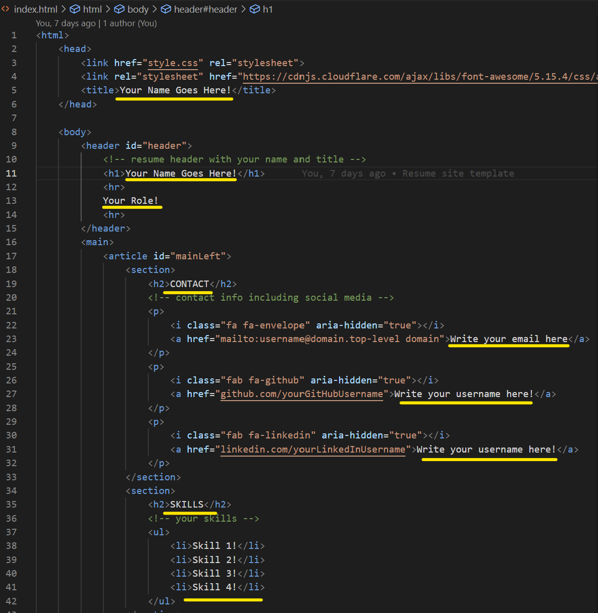

# Microsoft Student Summit
## Launch into the Cloud with GitHub and Azure

_"There is nothing that speaks more dev than having a recruiter ask for your resume and you point them to a url"_

### Do you want to deploy your resume website for free on Azure? Here is  template to help you do that in a few steps.

## Pre-requisites
1. A GitHub Account
1. An Azure Subscription. 🔊Students, you can sign up for the [free Azure for Students benefit here](https://azure.microsoft.com/en-us/free/students/?WT.mc_id=academic-0000-juliamuiruri)

## Steps
1. Click the green `Use Template Button` at the top of this repository. 
    That will create this repository in your GitHub Account with the same structure and files.

2. With your respository open, click the . button on your keyboard.
    This will open github.dev to allow you to edit the code on your browser.

3. Open the index.html file and fill in the required details for you resume.
    Add your details then close and go back to the repository on GitHub.com

4. Log in to [Azure Portal](portal.azure.com) and create a Static Web App

    a) _Provide static web app details_

    b) _Connect to your GitHub project from Azure_
    
    c) _Provide deployment details to configure your Continous Deployment (CD) GitHub Action workflow file_ and **Create**

5. Once your static web app is created successfully, Click 'Go to Resource' and then browse
6. Head back to your project on github and observe under the 'GitHub Actions' tab. After the action runs succesfully and you get a green check mark, navigate back to the site and refresh
7. Congratulations!! You have created your resume website and deployed it to Microsoft Azure

See [full workshop](https://github.com/microsoft/workshop-library/blob/main/full/build-resume-website/README.md/?WT.mc_id=academic-70942-juliamuiruri) to learn more