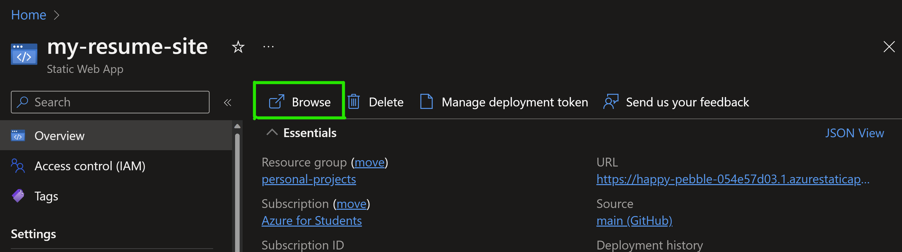

# Launch into the Cloud with GitHub and Azure


_"There is nothing that speaks more dev than having a recruiter ask for your resume and you point them to a url"_

### Do you want to deploy your resume website for free on Azure? Here is  template to help you do that in a few steps.

## Pre-requisites
1. A GitHub Account
1. An Azure Subscription. 🔊Students, you can sign up for the [free Azure for Students benefit here](https://azure.microsoft.com/en-us/free/students/?WT.mc_id=academic-0000-juliamuiruri)

## Steps
1. Create a new GitHub Repository and give it a name **my-resume** 
1. Create 3 empty files - **index.html**, **style.css** and **codeswing.json**
1.  With your respository open, click the `.` button on your keyboard.
    This will open github.dev to allow you to edit the project on your browser.

1. Open the `index.html` file in your repository, paste in the code below, edit it with your details and save. 

    <details>
    <summary><b>HTML code responsible for the content on your resume website.</b></summary>
    
        <html>

            <head>
                <link href="style.css" rel="stylesheet">
                <link rel="stylesheet" href="https://cdnjs.cloudflare.com/ajax/libs/font-awesome/5.15.4/css/all.min.css">
                <title>Your Name Goes Here!</title>
            </head>
            <body>
                <header id="header">
                    <!-- resume header with your name and title -->
                    <h1>Your Name Goes Here!</h1>
                    <hr>
                    Your Role!
                    <hr>
                </header>
                <main>
                    <article id="mainLeft">
                        <section>
                            <h2>CONTACT</h2>
                            <!-- contact info including social media -->
                            <p>
                                <i class="fa fa-envelope" aria-hidden="true"></i>
                                <a href="mailto:username@domain.top-level domain">Write your email here</a>
                            </p>
                            <p>
                                <i class="fab fa-github" aria-hidden="true"></i>
                                <a href="github.com/yourGitHubUsername">Write your username here!</a>
                            </p>
                            <p>
                                <i class="fab fa-linkedin" aria-hidden="true"></i>
                                <a href="linkedin.com/yourLinkedInUsername">Write your username here!</a>
                            </p>
                        </section>
                        <section>
                            <h2>SKILLS</h2>
                            <!-- your skills -->
                            <ul>
                                <li>Skill 1!</li>
                                <li>Skill 2!</li>
                                <li>Skill 3!</li>
                                <li>Skill 4!</li>
                            </ul>
                        </section>
                        <section>
                            <h2>EDUCATION</h2>
                            <!-- your education -->
                            <h3>Write your course here!</h3>
                            <p>
                                Write your institution here!
                            </p>
                            <p>
                                Start - End Date
                            </p>
                        </section>            
                    </article>
                    <article id="mainRight">
                        <section>
                            <h2>ABOUT</h2>
                            <!-- about you -->
                            <p>Write a blurb about yourself!</p>
                        </section>
                        <section>
                            <h2>WORK EXPERIENCE</h2>
                            <!-- your work experience -->
                            <h3>Job Title</h3>
                            <p>
                                Organization Name Goes Here | Start Month – End Month
                            </p>
                            <ul>
                                    <li>Task 1 - Write what you did!</li>
                                    <li>Task 2 - Write what you did!</li>
                                    <li>Write the outcomes/impact of your contribution</li>
                                    
                            </ul>
                            <h3>Job Title 2</h3>
                            <p>
                                Organization Name Goes Here | Start Month – End Month
                            </p>
                            <ul>
                                    <li>Task 1 - Write what you did!</li>
                                    <li>Task 2 - Write what you did!</li>
                                    <li>Write the outcomes/impact of your contribution</li>
                                    
                            </ul>
                        </section>
                    </article>
                </main>
            </body>
        </html>
    
    </details>


1. Open the `style.css` file and copy in the code below and save.
 
    <details>
        <summary><b>CSS code to format the layout of the site.</b></summary>
            
            body {
                font-family: 'Segoe UI', Tahoma, Geneva, Verdana, sans-serif;
                font-size: 16px;
                max-width: 960px;
                margin: auto;
            }
            h1 {
                font-size: 3em;
                letter-spacing: .6em;
                padding-top: 1em;
                padding-bottom: 1em;
            }

            h2 {
                font-size: 1.5em;
                padding-bottom: 1em;
            }

            h3 {
                font-size: 1em;
                padding-bottom: 1em;
            }
            main { 
                display: grid;
                grid-template-columns: 40% 60%;
                margin-top: 3em;
            }
            header {
                text-align: center;
                margin: auto 2em;
            }

            section {
                margin: auto 1em 4em 2em;
            }

            i {
                margin-right: .5em;
            }

            p {
                margin: .2em auto
            }

            hr {
                border: none;
                background-color: lightgray;
                height: 1px;
            }

            h1, h2, h3 {
                font-weight: 100;
                margin-bottom: 0;
            }
            #mainLeft {
                border-right: 1px solid lightgray;
            }
            
    </details>
1. Open the `codeswing.json` file and paste in the code below.  
    ```
    {
    "scripts": [],
    "styles": []
    }
    ```
1. Click the `Extensions icon`, search for the `Codeswing` extension and  install it 
1. Log in to the [Azure Portal](http://portal.azure.com/?WT.mc_id=academic-0000-juliamuiruri) and create a `Static Web App`

    a) _Provide static web app details_

    b) _Connect to your GitHub project from Azure_
    
    c) _Provide deployment details to configure your Continous Deployment (CD) GitHub Action workflow file_ and **Create**


1. Once your static web app is created successfully, Click `Go to Resource` and then `Browse`


1. Head back to your project on Github and observe under the `GitHub Actions` tab. After the action runs succesfully and you get a green check mark, navigate back to the live static web app site and refresh

1. **Congratulations!! You have created your resume website and deployed it to a Static Web App**

## Next Steps
- See [full resume website workshop](https://github.com/microsoft/workshop-library/blob/main/full/build-resume-website/README.md/)

- Learn more about [Building & Deploying Applications to Azure using GitHub Actions](https://learn.microsoft.com/en-us/training/modules/github-actions-cd/?WT.mc_id=academic-0000-juliamuiruri)

- Check out this [Guided Tour of GitHub](https://learn.microsoft.com/en-us/training/modules/introduction-to-github/?WT.mc_id=academic-0000-juliamuiruri)