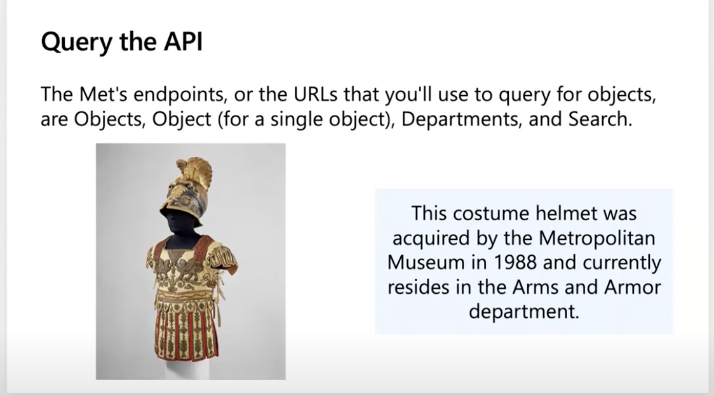

# Explore the art world by using RESTful APIs

## Module Source

[Explore the art world by using RESTful APIs](https://docs.microsoft.com/learn/modules/use-apis-discover-museum-art/?WT.mc_id=academic-56423-jelooper)

## Goals

In this workshop, you will learn the basics of REST APIs, a way to securely query a datasource from an external source. Using Museum APIs, you will discover interesting art via API queries.

| **Goal**              | Description                                    |
| ----------------------------- | --------------------------------------------------------------------- |
| **What will you learn**       | Explore the art world by using RESTful APIs                                        |
| **What you'll need**          | A modern web browser and an internet connection |
| **Duration**                  | 20 minutes                                                                |
| **Slides**                  | [slides](./slides.pptx)                                                           |

## Video

> 🎥 Click this image to watch Jen walk you through the workshop starting at 0:56:00

## What you will learn

You're a web developer with a passion for the art world. You'd love to create a web page to showcase examples of art through the ages. But you're not sure about the best way to get images of art for your web page. That's where APIs come in! In this module, you'll learn the basics of APIs that help you get images of artwork made public by museums around the world.

In this workshop, you'll learn about:

- RESTful APIs
- Strategies to connect to an external API
- Two different museum APIs and how to connect to them using authentication

## Introduction to RESTful APIs

Read about RESTful APIs [in this introduction](https://docs.microsoft.com/learn/modules/use-apis-discover-museum-art/2-what-is-api/?WT.mc_id=academic-56423-jelooper).

## Query the Metropolitan Museum API

A great API to query to discover the shape of its data structures as well as its collections is the Metropolitan Museum API from New York. [Let's query it](https://docs.microsoft.com/learn/modules/use-apis-discover-museum-art/4-query-met-api?/?WT.mc_id=academic-56423-jelooper)!

## Learn about Authentication Strategies

While some APIs are open and don't require authentication, many do. Learn more about authentication strategies [in this introduction](https://docs.microsoft.com/learn/modules/use-apis-discover-museum-art/5-authentication-strategies?WT.mc_id=academic-56423-jelooper).

## Query the Cooper Hewitt API

Now that you know how to get an authentication key, practice by [querying another museum api](https://docs.microsoft.com/learn/modules/use-apis-discover-museum-art/6-query-cooper-hewitt-api/?WT.mc_id=academic-56423-jelooper), the Cooper Hewitt Museum of Art. 

## Handle responses

[Handle API responses](https://docs.microsoft.com/learn/modules/use-apis-discover-museum-art/7-handle-responses?WT.mc_id=academic-56423-jelooper) by understanding status codes and what they indicate.

## Test your knowledge!

[Take a quiz](https://docs.microsoft.com/learn/modules/use-apis-discover-museum-art/9-knowledge-check/?WT.mc_id=academic-56423-jelooper)!

## Next steps

Explore more about ways to build and use APIs by completing [the other elements](https://docs.microsoft.com/learn/modules/use-apis-discover-museum-art/?WT.mc_id=academic-56423-jelooper) of this module.

## Practice

Now that you know about APIs and how interesting they can be to discover art, look for other interesting APIs throughout the internet. A good place to start is Todd Motto's [API list](https://github.com/public-apis/public-apis).

## Feedback

Be sure to give [feedback about this workshop](https://forms.office.com/r/MdhJWMZthR)!

[Code of Conduct](../../CODE_OF_CONDUCT.md)

