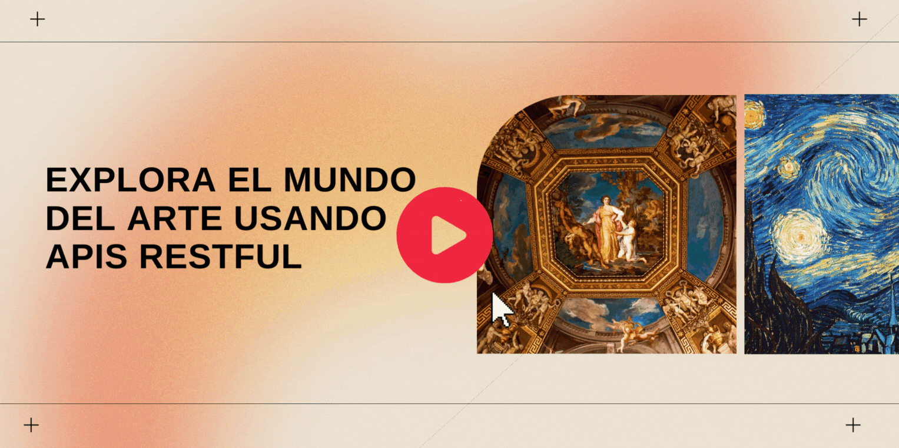

# Explora el mundo del arte usando APIs RESTful 

Te dedicas al desarrollo web y tienes pasión por el mundo del arte. Te encantaría crear una página web para mostrar el arte a través de los siglos. Pero no tienes la seguridad de cuál es la mejor manera de obtener imágenes de piezas de arte para tu página. ¡Es aquí donde entran las APIs! **En este taller, aprenderás los conceptos básicos de APIs que te ayudarán a obtener imágenes de piezas de arte publicadas por museos alrededor del mundo**.

En este taller, aprenderás sobre:
- APIs RESTful
- Estrategias para conectarte a una API externa
- Dos diferentes APIs de museos y cómo conectarte a ellas usando autenticación

## Objetivos 

En este taller, aprenderás los conceptos básicos de APIs REST, una manera segura de consultar una fuente de datos desde una fuente externa. Con las APIs de museos, descubrirás arte interesante a través de consultas de APIs.

| **Objetivo**          | Descripción                                       |
| ----------------------| ------------------------------------------------- |
| **¿Qué aprenderás?**  | Explorarás el mundo del arte usando APIs RESTful  |
| **¿Qué necesitarás?** | Un navegador moderno y conexión a internet    |
| **Duración**          | 20 minutos                                        |
| **Diapositivas**      | [PowerPoint](./slides.es.pptx)                       |

## Video 
> 🎥 Da click en la imagen para ver a Jen guiarte en este taller, empieza en 0:56:00

## Introducción a APIs RESTful

Lee sobre APIs RESTful [en esta introducción](https://docs.microsoft.com/learn/modules/use-apis-discover-museum-art/2-what-is-api/?WT.mc_id=academic-56423-jelooper).

## Consulta la API del Museo Metropolitano
Una grandiosa API para consultar, y descubrir la forma de sus datos, así como sus colecciones, es la del Museo Metropolitano de Nueva York. ¡[Vamos a consultarla](https://docs.microsoft.com/learn/modules/use-apis-discover-museum-art/4-query-met-api?/?WT.mc_id=academic-56423-jelooper)!

## Aprende sobre estrategias de autenticación

Mientras algunas APIs son de acceso público y no requieren de autenticación, algunas otras sí. Aprende más sobre estrategias de autenticación [con esta introducción](https://docs.microsoft.com/learn/modules/use-apis-discover-museum-art/5-authentication-strategies?WT.mc_id=academic-56423-jelooper).

## Consulta la API del museo de arte Cooper Hewitt

Ahora que tienes más conocimiento sobre cómo obtener una clave de autenticación, practica [consultando la API de otro museo](https://docs.microsoft.com/learn/modules/use-apis-discover-museum-art/6-query-cooper-hewitt-api/?WT.mc_id=academic-56423-jelooper), el museo de arte Cooper Hewitt. 

## Maneja las respuestas

[Maneja las respuestas de la API](https://docs.microsoft.com/learn/modules/use-apis-discover-museum-art/7-handle-responses?WT.mc_id=academic-56423-jelooper) comprendiendo los códigos de estado y lo que indican.

## Practica

Ahora que sabes sobre APIs y qué tan interesantes pueden ser para descubrir arte, busca otra API interesante en internet. Un buen lugar para empezar es la [lista de APIs](https://github.com/public-apis/public-apis) de Todd Motto.

## ¡Prueba tus conocimientos!

¡[Realiza la pueba](https://docs.microsoft.com/learn/modules/use-apis-discover-museum-art/9-knowledge-check/?WT.mc_id=academic-56423-jelooper)!

## Próximos pasos

Explora más sobre las maneras de crear y usar APIs con [los otros elementos](https://docs.microsoft.com/learn/modules/use-apis-discover-museum-art/?WT.mc_id=academic-56423-jelooper) de este módulo.

## Retroalimentación

¡Asegúrate de [dar una retroalimentación de este taller](https://forms.office.com/r/MdhJWMZthR)!

[Código de conducta](../../../../CODE_OF_CONDUCT.md)

## Agradecimientos ❤️ 

¡Muchísimas gracias a [Berenice Osorio](https://www.linkedin.com/in/ferenike/) @ferenike por habernos ayudado a traducir todo este contenido a español! ❤️ ✨ 🚀 

## Módulo de referencia

[Explora el mundo del arte usando APIs RESTful](https://docs.microsoft.com/learn/modules/use-apis-discover-museum-art/?WT.mc_id=academic-56423-jelooper)