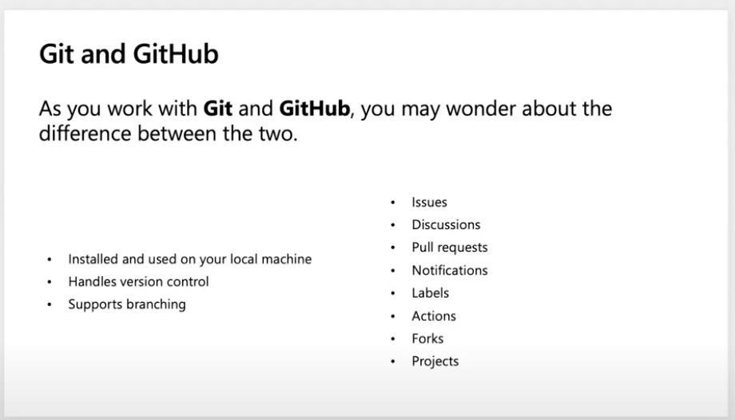

# Introdução ao GitHub com GitHub.dev

## Módulo de Referência

[Introdução ao GitHub](https://docs.microsoft.com/pt-br/learn/modules/introduction-to-github/?WT.mc_id=academic-55780-jelooper)

## Objetivos

In this workshop, you will learn how to use GitHub.dev to manage basic tasks on GitHub.

| **Objetivo**                 | Descrição                                              |
|------------------------------|--------------------------------------------------------|
| **O que você vai aprender**  | Como usar o GitHub.dev para fazer alterações no GitHub |
| **Do que você irá precisar** | Uma [conta no GitHub](https://github.com)              |
| **Duração**                  | 20 minutos                                             |
| **Slides**                   | [slides](../../slides.pptx)                            |

## Video

> 🎥 Clique nesta imagem para ver o Jen te guiar pelo workshop a partir de 0:04:15

## Pré-Aprendizado

Leia [esta introdução ao GitHub](https://docs.microsoft.com/pt-br/learn/modules/introduction-to-github/1-introduction/?WT.mc_id=academic-55780-jelooper).

Leia [esta explicação do workflow do GitHub](https://docs.microsoft.com/pt-br/learn/modules/introduction-to-github/2-what-is-github/?WT.mc_id=academic-55780-jelooper).

## Pré-requisitos

1. Certifique-se de ter uma conta [no GitHub](https://github.com) e faça sign in.

2. Navegue até o [repositório da Biblioteca do Workshop](https://github.com/microsoft/workshop-library).

3. Faça um *fork* do repositório clicando no botão **Fork** no canto superior direito da página. Isso criará um novo repositório em sua conta para praticar.

## O que você irá aprender

Imagine que você encontra um repositório incrível do GitHub e sente que pode adicionar algumas partes que estão faltando nele. Como você faria isso? Neste workshop, você aprenderá a:

- Abra um repositório usando o GitHub.dev
- Criar uma *branch*
- Confirmar alterações na *branch*
- Criar um *pull request*
- Fazer um *merge* do *pull request*
- Excluir o *branch*

## Abra o repositório bifurcado no GitHub.dev

Navegue até sua cópia do repositório Workshops em sua conta. 

Digite `.` na janela do navegador para abri-lo no GitHub.dev.

> GitHub.dev é uma versão baseada na web do GitHub.

## Crie uma *branch*

No GitHub.dev, clique no ícone 'Source Control' no painel esquerdo e depois no botão `...` no canto superior direito do painel de arquivos.

Crie uma nova *branch* selecionando Branch > Create new Branch.

Dê um nome à *branch* e mude para esta *branch*.

## Confirme suas alterações

Faça uma pequena alteração no arquivo `workshop-suggestions.md` - que workshop você gostaria de ver nesta biblioteca?

Faça um *push* de suas alterações para sua *branch* adicionando uma mensagem significativa na caixa de texto no painel de origem e clicando no botão 'verificar'. 

> Fazer um *push* significa que você adicionará suas alterações a uma cópia ramificada do repositório.

Sua alteração agora aparece em sua cópia do repositório.

## Criando uma *pull request*

> Leia sobre [práticas recomendadas](https://docs.microsoft.com/pt-br/learn/modules/contribute-open-source/4-exercise-create-pr/?WT.mc_id=academic-55780-jelooper) para criar uma pull request.

Agora você precisa mover suas alterações de sua *branch* para a *branch* principal.

No painel esquerdo, clique no ícone 'Source Control' e depois no botão '...'.

Escolha 'Pull Request>Create Pull Request' no menu suspenso ou use o ícone Pull Request no painel de arquivos.

Mescle sua alteração da *branch* na *branch* principal em seu repositório.

## Mescle a *pull request* e exclua a *branch*

Verifique se o branch não tem conflitos com o branch base e mescle o *Pull Request* criando um *Merge Commit*.

Na última tela, siga os prompts para excluir a *branch* remota onde você fez suas alterações.

> O que acabou de acontecer? A pequena alteração que você fez em seu *branch* foi copiada para o *branch* principal do seu repositório. Você pode usar essa técnica para contribuir com um projeto de código aberto que aceite *pull requests*. Verifique a guia de problemas do repositório para ver se algo está marcado como aberto para contribuição.

## Teste seu conhecimento!

[Responda a um questionário](https://docs.microsoft.com/pt-br/learn/modules/introduction-to-github/4-knowledge-check/?WT.mc_id=academic-55780-jelooper)!

## Próximos Passos

Se quiser sugerir a alteração que você fez no repositório original no qual você fez o *fork*, repita o processo de *Pull Request* para o repositório original.

[Leia mais para aprender mais sobre o GitHub e seus workflows](https://docs.microsoft.com/pt-br/learn/modules/contribute-open-source/5-next-steps/?WT.mc_id=academic-55780-jelooper).

## Pratique

Agora que você sabe como criar *branches* e *pull requests*, encontre um repositório de código aberto que esteja buscando contribuições. Existe alguma forma de contribuir com este projeto?

## Feedback

Certifique-se de dar [feedback sobre este workshop](https://forms.office.com/r/MdhJWMZthR)!

[Código de Conduta](../../../../CODE_OF_CONDUCT.md)

