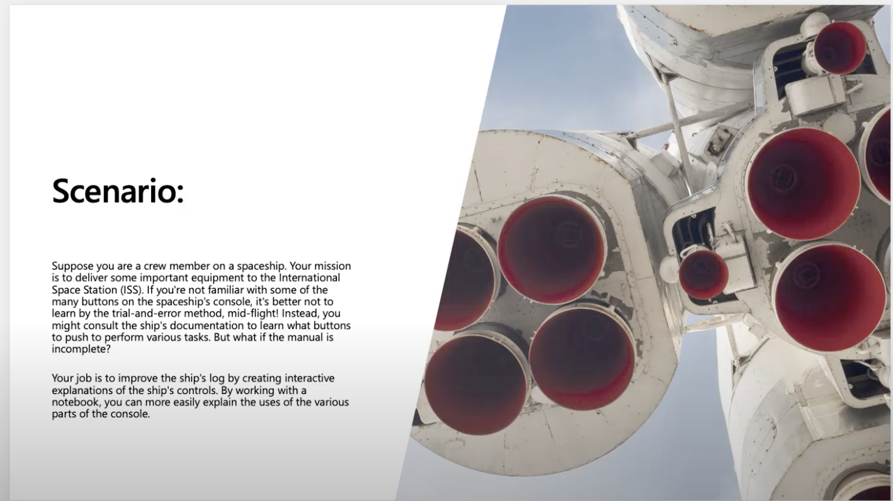

# Introduction to Jupyter Notebooks with Python

## Module Source

[Get started with Jupyter notebooks for Python](https://docs.microsoft.com/learn/modules/python-create-run-jupyter-notebook/?WT.mc_id=academic-56952-jelooper)

## Goals

In this workshop, you will learn how to use Jupyter notebooks to run Python by building a 🚀 spaceship manual 🚀 that has interactive, runnable Markdown and code elements.

| **Goal**              | Description                                    |
| ----------------------------- | --------------------------------------------------------------------- |
| **What will you learn**       | How to create and run Jupyter notebooks for Python development                                        |
| **What you'll need**          | Have Python 3 installed locally, Visual Studio Code, and a Python extension |
| **Duration**                  | 20 minutes                                                                |
| **Slides**                  | [slides](./slides.pptx)                                                           |

## Video
 
[](https://youtu.be/QJHd4jf4ekI "workshop walk-through")
> 🎥 Click this image to watch Chris walk you through the workshop starting at 1:16:00


## Pre-Learning

Read [this introduction to GitHub](https://docs.microsoft.com/learn/modules/introduction-to-github/1-introduction/?WT.mc_id=academic-55780-jelooper).

## Prerequisites

### Python 3 or greater

You will build a project using Python, so you will also need Python installed locally. To test if you have Python installed, open a command or terminal window and run the following commands:

```bash
python3 --version
```

If Python is installed a version number will be displayed, such as *3.8.10*. Otherwise, an error message is displayed. You can install Python as needed:

- [Windows](https://docs.microsoft.com/windows/python/beginners?WT.mc_id=academic-56952-jelooper#install-python)
- [MacOS](https://www.python.org/downloads/macos/)
- [Linux](https://packaging.python.org/guides/installing-using-linux-tools/)

### Visual Studio Code

Be sure to have [Visual Studio Code](https://code.visualstudio.com?WT.mc_id=academic-56952-jelooper), an open source code editor, installed locally. 

## What you will learn

Suppose you are a crew member on a spaceship. Your mission is to deliver some important equipment to the International Space Station (ISS). If you're not familiar with some of the many buttons on the spaceship's console, it's better not to learn by the trial-and-error method, mid-flight! In this workshop, you'll build a ship's manual as a Jupyter notebook, discovering the many ways to use this technology. You will:

- Set up your environment
- Create and run a notebook
- Use advanced commands
- Take a quiz

## Introduction

Learn about [Jupyter notebooks](https://docs.microsoft.com/learn/modules/python-create-run-jupyter-notebook/1-introduction) and get ready to build!

## Setup your environment

[Install](https://docs.microsoft.com/learn/modules/python-create-run-jupyter-notebook/2-setup) Python, VS Code, and the Python extension, if you haven't yet done so. 

## Create and run your notebook

[Create a notebook](https://docs.microsoft.com/learn/modules/python-create-run-jupyter-notebook/3-exercise-run-notebook) for your ship's manual. Write an element in Markdown and write some runnable code. 

## Use advanced commands

Using Numpy, [perform ship calculations](https://docs.microsoft.com/learn/modules/python-create-run-jupyter-notebook/4-exercise-advanced-commands) and show them as a visualization.

## Test your knowledge!

Take a [quiz](https://docs.microsoft.com/learn/modules/python-create-run-jupyter-notebook/5-knowledge-check) either on Learn or via the slides.

## Next steps

This module introduced some core elements of the many things you can do in Jupyter notebooks. For inspiration, you can check out an interesting gallery of [Jupyter notebooks on GitHub](https://github.com/jupyter/jupyter/wiki).

## Practice

Now you know how to create and use Jupyter notebooks, you can learn how to use them in the context of Data Science and Machine Learning. Explore [this learning path on Data Science with Notebooks](https://docs.microsoft.com/learn/modules/explore-analyze-data-with-python/) to learn more about the many tools you can use to build your own data science projects. To learn more about Python as a language, complete [this learning path on Python](https://docs.microsoft.com/learn/paths/beginner-python/).

## Feedback

Be sure to give [feedback about this workshop](https://forms.office.com/r/MdhJWMZthR)!

[Code of Conduct](../../CODE_OF_CONDUCT.md)

