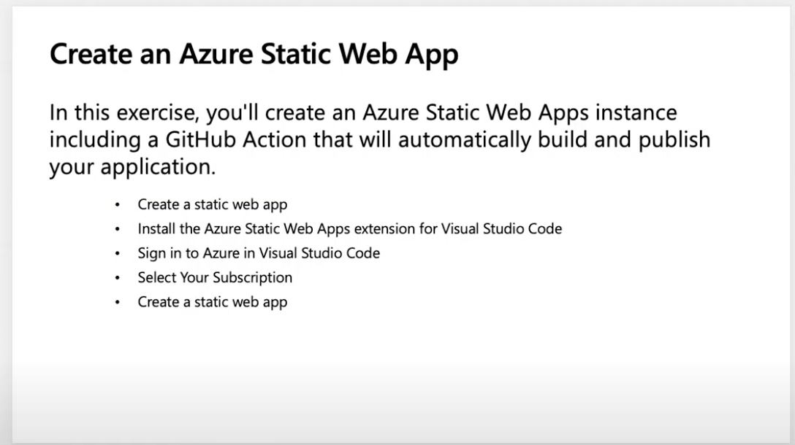

# Introdução aos Aplicativos Web Estáticos do Azure

## Módulo Origem

[Publicar um aplicativo Angular, React, Svelte ou Vue JavaScript com os Aplicativos Web Estáticos do Azure](https://docs.microsoft.com/pt-br/learn/modules/publish-app-service-static-web-app-api/?WT.mc_id=academic-56895-chnoring)

## Objetivos

Neste workshop, você aprenderá a implantar seus arquivos estáticos no Azure, sejam eles um Aplicativo de Página Única JavaScript (SPA) avançado ou um HTML simples.

| **Objetivo**                | Descrição                                                                                                                                                                                                                                                                                                                                  |
|-----------------------------|--------------------------------------------------------------------------------------------------------------------------------------------------------------------------------------------------------------------------------------------------------------------------------------------------------------------------------------------|
| **O que você vai aprender** | Publicar um aplicativo Angular, React, Svelte ou Vue JavaScript com os Aplicativos Web Estáticos                                                                                                                                                                                                                                           |
| **O que você vai precisar** | Um navegador da Web, uma conexão com internet, uma conta do Azure, [Visual Studio Code](https://code.visualstudio.com?WT.mc_id=academic-56895-chnoring), e a [extensão Aplicativos Web Estáticos do VS Code](https://marketplace.visualstudio.com/items?itemName=ms-azuretools.vscode-azurestaticwebapps&WT.mc_id=academic-56895-chnoring) |
| **Duração**                 | 20 minutos                                                                                                                                                                                                                                                                                                                                 |
| **Slides**                  | [slides](../../slides.pptx)                                                                                                                                                                                                                                                                                                                |

## Vídeo

> 🎥 Clique nesta imagem para ver o Chris te guiar pelo workshop a partir de 0:21:00

## O que você vai aprender

Você é um desenvolvedor web e criou um aplicativo web. Geralmente, um aplicativo web consiste de arquivos HTML, JavaScript ou CSS que podem ser criados manualmente ou por meio de um framework.

Você gostaria de poder implementar ou publicar seu site no Azure para mostrar a seus amigos?

Neste workshop você vai aprender:

- Usar o Serviço de Aplicativos Estáticos de Web do Azure (Azure Static Web Apps).
- Publicar o aplicativo web no Azure utilizando este serviço. 

## Introdução ao Serviço de Aplicativos Estáticos de Web do Azure

Leia sobre o serviço [nessa introdução](https://docs.microsoft.com/pt-br/learn/modules/publish-app-service-static-web-app-api/1-introduction?pivots=angular&WT.mc_id=academic-56895-chnoring).

## Criar um aplicativo web

Antes de você publicar o aplicativo no Azure, você precisará criá-lo.

- Criar o repositório através de um template
- Executar o aplicativo localmente e visualizá-lo no navegador.

[Vamos criar o repositório](https://docs.microsoft.com/pt-br/learn/modules/publish-app-service-static-web-app-api/2-exercise-get-started?pivots=angular&WT.mc_id=academic-56895-chnoring)!

## Planeje seu Aplicativo Estático de Web

Para publicar seu aplicativo no Azure, é preciso provisionar um recurso estático de web do Azure. A configuração desse recurso exige que alguns campos sejam preenchidos com informações adicionais, que serão descritas mais abaixo. Seu repositório do GitHub possui uma funcionalidade chamada Ações (GitHub Actions), que permite automatizações tais como teste de código, publicação no Azure, e muito mais. O GitHub Ações (GitHub Actions) é a tecnologia subjacente da qual os Aplicativos Estáticos de Web dependem para sua publicação na nuvem.

Para saber mais sobre os Aplicativos Web Estáticos do Azure e seus campos, assim como as ações do GitHub, [clique aqui](https://docs.microsoft.com/pt-br/learn/modules/publish-app-service-static-web-app-api/3-static-web-apps?pivots=angular&WT.mc_id=academic-56895-chnoring).

## Criar um Aplicativo Estático no Azure

É possível utilizar a extensão Azure do Visual Studio Code para simplificar o processo de desenvolvimento para web. Esta extensão, publicada pela equipe Microsoft de Aplicativos Estáticos do Azure, permite a criação dos recursos de nuvem necessários ao aplicativo web. Isso facilita muito a publicação do seu aplicativo. Saiba mais sobre [este processo aqui](https://docs.microsoft.com/pt-br/learn/modules/publish-app-service-static-web-app-api/4-exercise-static-web-apps?pivots=angular&WT.mc_id=academic-56895-chnoring).

## Próximos passos

Tente outras formas de construir um aplicativo estático neste módulo - você pode usar Vue, React, Angular ou Svelte [nesse módulo](https://docs.microsoft.com/pt-br/learn/modules/publish-app-service-static-web-app-api?WT.mc_id=academic-56895-chnoring).

## Praticar

Agora que você conhece sobre o Aplicativo Web Estático do Azure, aprenda como [publicar uma API](https://docs.microsoft.com/pt-br/learn/modules/publish-static-web-app-api-preview-url?WT.mc_id=academic-56895-chnoring) e como [autenticar usuários](https://docs.microsoft.com/pt-br/learn/modules/publish-static-web-app-authentication/?WT.mc_id=academic-56895-chnoring) com o Aplicativo Web Estático do Azure.

## Comentários

Certifique-se de dar [comentários sobre esse workshop](https://forms.office.com/r/MdhJWMZthR)!

[Código de Conduta](../../../../CODE_OF_CONDUCT.md)
